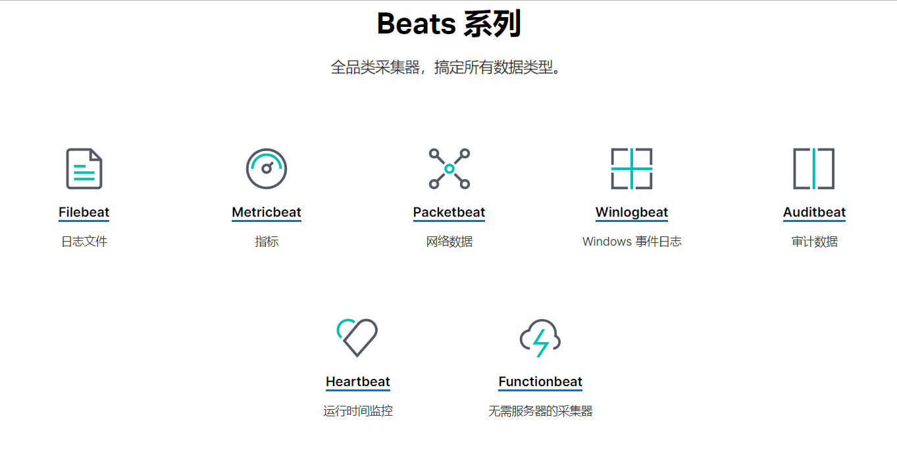
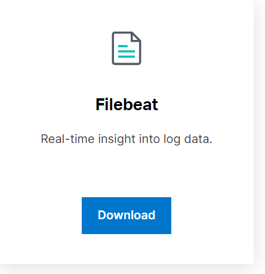
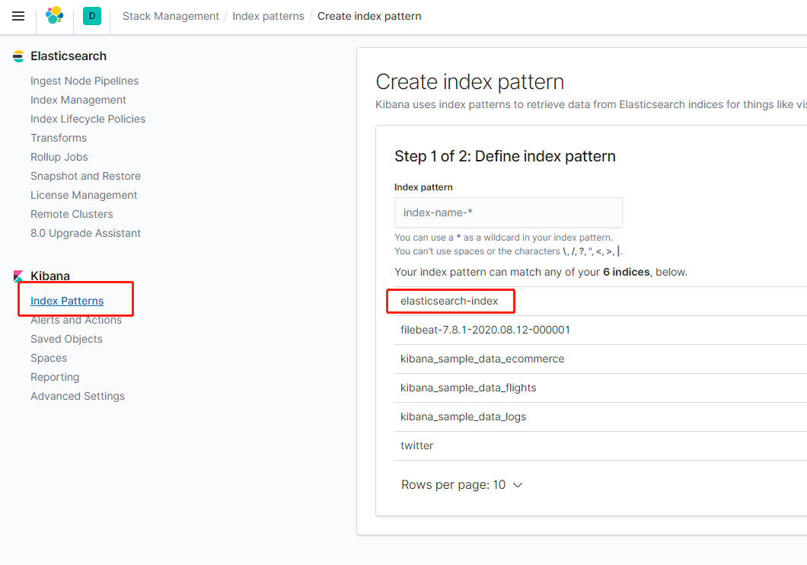
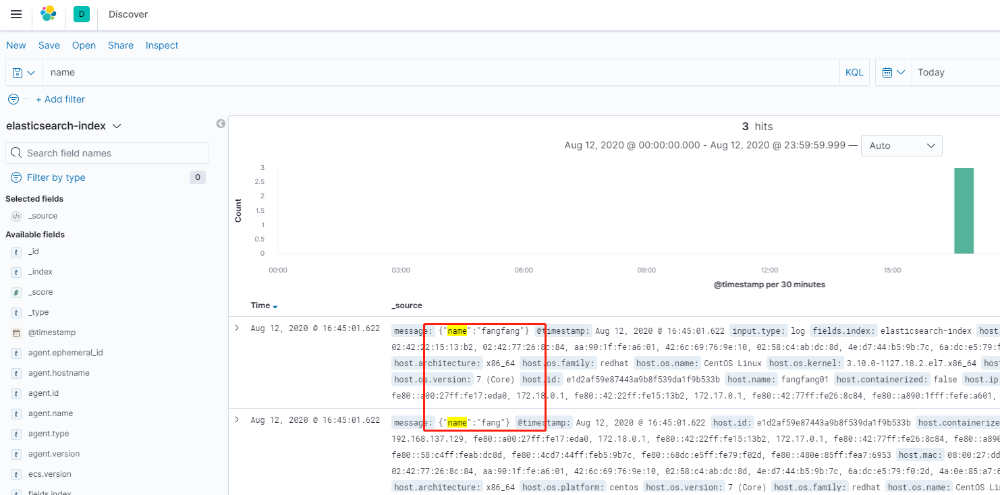

# [beats](https://www.elastic.co/cn/products/beats)

- [https://www.elastic.co/cn/products/beats](https://www.elastic.co/cn/products/beats)
- [https://github.com/elastic/beats](https://github.com/elastic/beats)

## 轻量型数据采集器

Beats 平台集合了多种单一用途数据采集器。它们从成百上千或成千上万台机器和系统向 Logstash 或 Elasticsearch 发送数据。

收集端logstash替换为beats，更灵活，消耗资源更少，扩展性更强

## Beats 系列



### [filebeat](https://www.elastic.co/cn/products/beats/filebeat)轻量型日志采集器

当您要面对成百上千、甚至成千上万的服务器、虚拟机和容器生成的日志时，请告别 SSH 吧。 filebeat将为您提供一种轻量型方法，用于转发和汇总日志与文件，让简单的事情不再繁杂。




`Filebeat` 内置有多种模块（auditd、Apache、NGINX、System、MySQL 等等），可针对常见格式的日志大大简化收集、解析和可视化过程，只需一条命令即可。

输送至 `Elasticsearch` 或 `Logstash`。在`Kibana`中实现可视化。
`Filebeat` 是 `Elastic Stack` 的一部分，因此能够与 `Logstash`、`Elasticsearch` 和 `Kibana` 无缝协作。无论您要使用 `Logstash` 转换或充实日志和文件，还是在 `Elasticsearch` 中随意处理一些数据分析，亦或在 `Kibana` 中构建和分享仪表板，`Filebeat` 都能轻松地将您的数据发送至最关键的地方。

### 下载filebeat

```bash
tar -zvxf filebeat-7.2.0-linux-x86_64.tar.gz
filebeat-7.2.0-linux-x86_64
```

### [配置Filebeat](https://www.elastic.co/guide/en/beats/filebeat/current/filebeat-configuration.html)

配置文件：`filebeat.yml`

为了配置Filebeat：

#### 定义日志文件路径

```yaml
#=========================== Filebeat inputs =============================

filebeat.inputs:

# Each - is an input. Most options can be set at the input level, so
# you can use different inputs for various configurations.
# Below are the input specific configurations.

- type: log

  # Change to true to enable this input configuration.
  enabled: true

  # Paths that should be crawled and fetched. Glob based paths.
  paths:
    - /home/elasticsearch/elasticsearch-7.8.1/logs/*.log
    #- c:\programdata\elasticsearch\logs\*
  tags: ["elasticsearch-log"]
  fields:
    index: 'elasticsearch-index'

# 设置输出目录到Elasticsearch
#================================ Outputs =====================================

# Configure what output to use when sending the data collected by the beat.

# ---------------------------- Elasticsearch Output ----------------------------
output.elasticsearch:
  # Array of hosts to connect to.
  hosts: ["192.168.137.129:9200"]
  indices:
    - index: "elasticsearch-index-%{+yyyy.MM}"
      when.contains:
        fields:
          index: 'elasticsearch-index'
  # Optional protocol and basic auth credentials.
  #protocol: "https"
  #username: "elastic"
  #password: "changeme"

#============================== Kibana =====================================

# Starting with Beats version 6.0.0, the dashboards are loaded via the Kibana API.
# This requires a Kibana endpoint configuration.
setup.kibana:

  # Kibana Host
  # Scheme and port can be left out and will be set to the default (http and 5601)
  # In case you specify and additional path, the scheme is required: http://localhost:5601/path
  # IPv6 addresses should always be defined as: https://[2001:db8::1]:5601
  host: "192.168.137.128:5601"

# Filebeat Processors 删除特定字段，添加各种元数据
# ================================= Processors =================================

# Configure processors to enhance or manipulate events generated by the beat.

processors:
  - drop_fields:
      fields: ["ecs","agent"]
  # - add_host_metadata: ~
  # - add_cloud_metadata: ~
  # - add_docker_metadata: ~
  # - add_kubernetes_metadata: ~

```

### 加入`systemctl`服务

```bash
vi /lib/systemd/system/filebeat.service
```

```conf
[Unit]
Description=filebeat Service 01
After=network.target
After=network-online.target
Wants=network-online.target

[Service]
Type=simple
User=elasticsearch
Group=elasticsearch
LimitNOFILE=65536
LimitNPROC=65536
ExecStart=/home/elasticsearch/filebeat-7.8.1-linux-x86_64/filebeat -environment systemd -c /home/elasticsearch/filebeat-7.8.1-linux-x86_64/filebeat.yml
Restart=always

[Install]
WantedBy=multi-user.target
```

```bash
systemctl daemon-reload
systemctl enable filebeat
systemctl start filebeat
```

## 添加elasticsearch Index

`Stack Management -> Index patterns -> Create index pattern`




