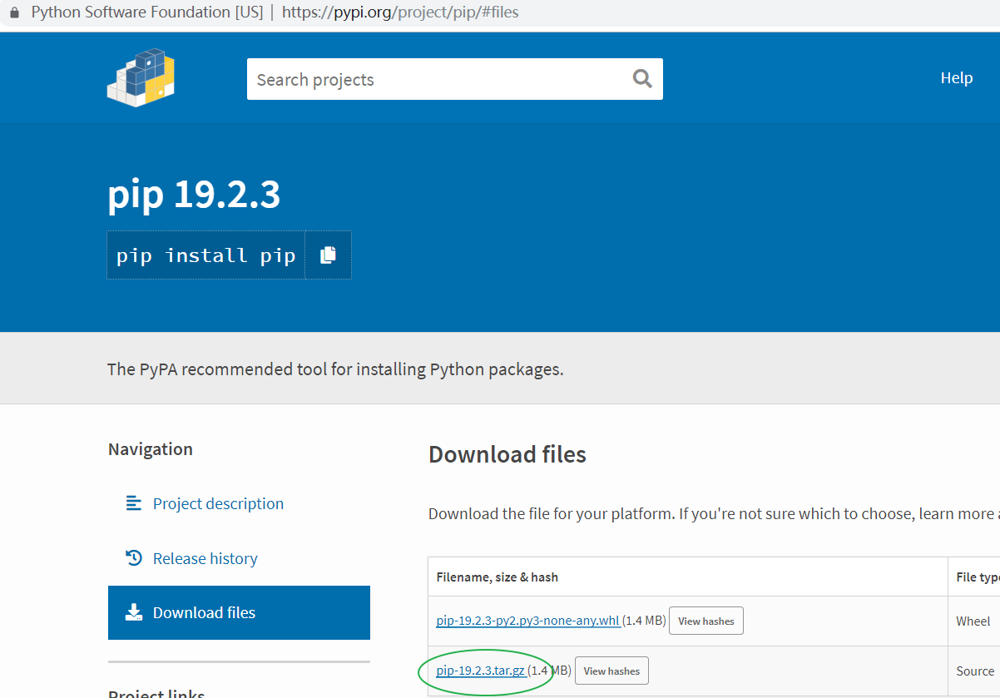
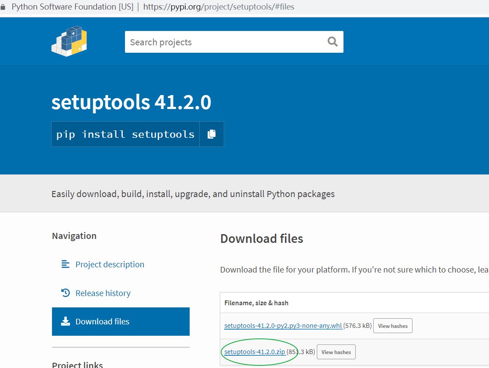

# 参考

## 下载pip

从[https://pypi.org/project/pip/](https://pypi.org/project/pip/#files)下载`pip3`文件



## 安装pip

解压pip-10.0.1.tar.gz文件，

```bash
tar -zvxf pip-19.2.3.tar.gz
cd pip-19.2.3
# 找到setup.py文件
python setup.py install
```

## 配置pip3镜像

```bash
#Linux 修改~/.pip/pip.conf文件
#windows 修改~/pip/pip.ini文件

[global]
index-url = https://mirrors.aliyun.com/pypi/simple/

[install]
trusted-host=mirrors.aliyun.com
```

## 安装setuptools

```bash
pip install --upgrade setuptools
```



```bash
wget https://files.pythonhosted.org/packages/d9/ca/7279974e489e8b65003fe618a1a741d6350227fa2bf48d16be76c7422423/setuptools-41.2.0.zip

unzip setuptools-41.2.0.zip
cd setuptools-41.2.0

python setup.py install
```

## 查看pip列表

```bash
pip list
Package    Version
---------- -------
pip        19.2.3
setuptools 41.2.0
```
