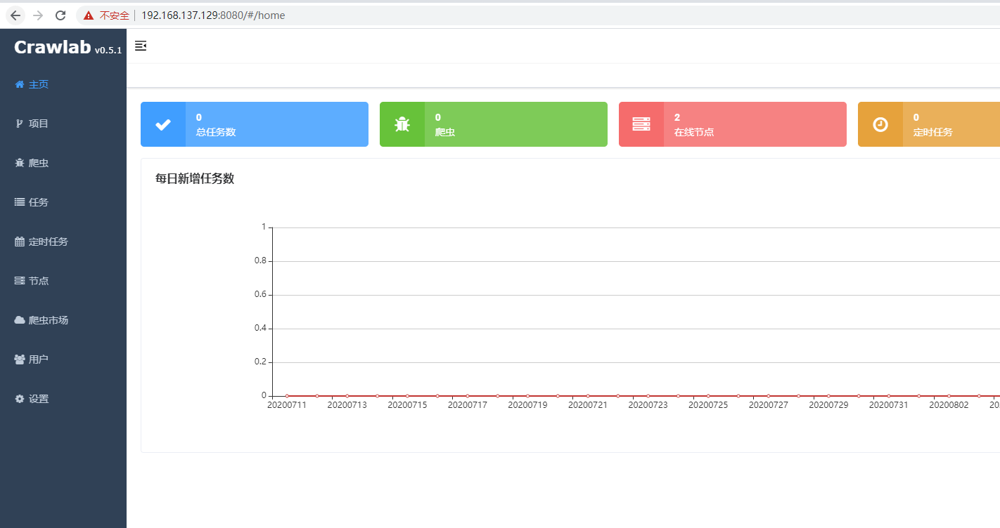
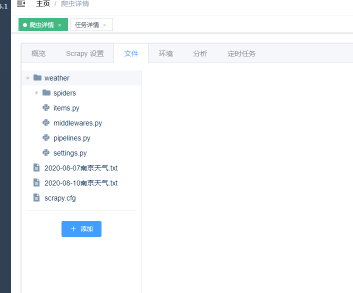

# 安装crawlab

## 参考

- [https://docs.crawlab.cn/zh/Installation/Docker.html](https://docs.crawlab.cn/zh/Installation/Docker.html)
- [CentOS安装docker](../../docker/CentOS安装docker.md)
- [docker-compose安装](../../docker/docker-compose安装.md)
  
## 简介

> 基于Golang的分布式爬虫管理平台，支持多种编程语言以及多种爬虫框架.

## 检查环境

```conf
➜  ~ uname -a
Linux fangfang01 3.10.0-1062.4.3.el7.x86_64 #1 SMP Wed Nov 13 23:58:53 UTC 2019 x86_64 x86_64 x86_64 GNU/Linux
➜  ~ docker version
Client: Docker Engine - Community
 Version:           19.03.5
 API version:       1.40
 Go version:        go1.12.12
 Git commit:        633a0ea
 Built:             Wed Nov 13 07:25:41 2019
 OS/Arch:           linux/amd64
 Experimental:      false

Server: Docker Engine - Community
 Engine:
  Version:          19.03.5
  API version:      1.40 (minimum version 1.12)
  Go version:       go1.12.12
  Git commit:       633a0ea
  Built:            Wed Nov 13 07:24:18 2019
  OS/Arch:          linux/amd64
  Experimental:     false
 containerd:
  Version:          1.2.10
  GitCommit:        b34a5c8af56e510852c35414db4c1f4fa6172339
 runc:
  Version:          1.0.0-rc8+dev
  GitCommit:        3e425f80a8c931f88e6d94a8c831b9d5aa481657
 docker-init:
  Version:          0.18.0
  GitCommit:        fec3683

➜  ~ docker-compose version
docker-compose version 1.26.2, build eefe0d31
docker-py version: 4.2.2
CPython version: 3.7.7
OpenSSL version: OpenSSL 1.1.0l  10 Sep 2019
```

## 安装并启动 Crawlab

Crawlab的docker-compose.yml定义如下。

```yml
version: '3.3'
services:
  master: 
    image: tikazyq/crawlab:latest
    container_name: master
    environment:
      # CRAWLAB_API_ADDRESS: "https://<your_api_ip>:<your_api_port>"  # backend API address 后端 API 地址. 适用于 https 或者源码部署
      CRAWLAB_SERVER_MASTER: "Y"  # whether to be master node 是否为主节点，主节点为 Y，工作节点为 N
      CRAWLAB_MONGO_HOST: "mongo"  # MongoDB host address MongoDB 的地址，在 docker compose 网络中，直接引用服务名称
      # CRAWLAB_MONGO_PORT: "27017"  # MongoDB port MongoDB 的端口
      # CRAWLAB_MONGO_DB: "crawlab_test"  # MongoDB database MongoDB 的数据库
      # CRAWLAB_MONGO_USERNAME: "username"  # MongoDB username MongoDB 的用户名
      # CRAWLAB_MONGO_PASSWORD: "password"  # MongoDB password MongoDB 的密码
      # CRAWLAB_MONGO_AUTHSOURCE: "admin"  # MongoDB auth source MongoDB 的验证源
      CRAWLAB_REDIS_ADDRESS: "redis"  # Redis host address Redis 的地址，在 docker compose 网络中，直接引用服务名称
      # CRAWLAB_REDIS_PORT: "6379"  # Redis port Redis 的端口
      # CRAWLAB_REDIS_DATABASE: "1"  # Redis database Redis 的数据库
      # CRAWLAB_REDIS_PASSWORD: "password"  # Redis password Redis 的密码
      # CRAWLAB_LOG_LEVEL: "info"  # log level 日志级别. 默认为 info
      # CRAWLAB_LOG_ISDELETEPERIODICALLY: "N"  # whether to periodically delete log files 是否周期性删除日志文件. 默认不删除
      # CRAWLAB_LOG_DELETEFREQUENCY: "@hourly"  # frequency of deleting log files 删除日志文件的频率. 默认为每小时
      # CRAWLAB_SERVER_REGISTER_TYPE: "mac"  # node register type 节点注册方式. 默认为 mac 地址，也可设置为 ip（防止 mac 地址冲突）
      # CRAWLAB_SERVER_REGISTER_IP: "127.0.0.1"  # node register ip 节点注册IP. 节点唯一识别号，只有当 CRAWLAB_SERVER_REGISTER_TYPE 为 "ip" 时才生效
      # CRAWLAB_TASK_WORKERS: 8  # number of task executors 任务执行器个数（并行执行任务数）
      # CRAWLAB_RPC_WORKERS: 16  # number of RPC workers RPC 工作协程个数
      # CRAWLAB_SERVER_LANG_NODE: "Y"  # whether to pre-install Node.js 预安装 Node.js 语言环境
      # CRAWLAB_SERVER_LANG_JAVA: "Y"  # whether to pre-install Java 预安装 Java 语言环境
      # CRAWLAB_SETTING_ALLOWREGISTER: "N"  # whether to allow user registration 是否允许用户注册
      # CRAWLAB_SETTING_ENABLETUTORIAL: "N"  # whether to enable tutorial 是否启用教程
      # CRAWLAB_NOTIFICATION_MAIL_SERVER: smtp.exmaple.com  # STMP server address STMP 服务器地址
      # CRAWLAB_NOTIFICATION_MAIL_PORT: 465  # STMP server port STMP 服务器端口
      # CRAWLAB_NOTIFICATION_MAIL_SENDEREMAIL: admin@exmaple.com  # sender email 发送者邮箱
      # CRAWLAB_NOTIFICATION_MAIL_SENDERIDENTITY: admin@exmaple.com  # sender ID 发送者 ID
      # CRAWLAB_NOTIFICATION_MAIL_SMTP_USER: username  # SMTP username SMTP 用户名
      # CRAWLAB_NOTIFICATION_MAIL_SMTP_PASSWORD: password  # SMTP password SMTP 密码
    ports:    
      - "8080:8080" # frontend port mapping 前端端口映射
    depends_on:
      - mongo
      - redis
    # volumes:
    #   - "/var/crawlab/log:/var/logs/crawlab" # log persistent 日志持久化
  worker:
    image: tikazyq/crawlab:latest
    container_name: worker
    environment:
      CRAWLAB_SERVER_MASTER: "N"
      CRAWLAB_MONGO_HOST: "mongo"
      CRAWLAB_REDIS_ADDRESS: "redis"
    depends_on:
      - mongo
      - redis
    # environment:
    #   MONGO_INITDB_ROOT_USERNAME: username
    #   MONGO_INITDB_ROOT_PASSWORD: password
    # volumes:
    #   - "/var/crawlab/log:/var/logs/crawlab" # log persistent 日志持久化
  mongo:
    image: mongo:latest
    restart: always
    # volumes:
    #   - "/opt/crawlab/mongo/data/db:/data/db"  # make data persistent 持久化
    # ports:
    #   - "27017:27017"  # expose port to host machine 暴露接口到宿主机
  redis:
    image: redis:latest
    restart: always
    # command: redis-server --requirepass "password" # set redis password 设置 Redis 密码
    # volumes:
    #   - "/opt/crawlab/redis/data:/data"  # make data persistent 持久化
    # ports:
    #   - "6379:6379"  # expose port to host machine 暴露接口到宿主机
  # splash:  # use Splash to run spiders on dynamic pages
  #   image: scrapinghub/splash
  #   container_name: splash
  #   ports:
  #     - "8050:8050"
```

安装完 `docker-compose` 和定义好 `docker-compose.yml` 后，只需要运行以下命令就可以启动Crawlab。

```bash
docker-compose up -d
```

## 查看启动的容器

```bash
➜  ~ docker ps
CONTAINER ID        IMAGE                    COMMAND                  CREATED             STATUS              PORTS                              NAMES
894167d3e27c        tikazyq/crawlab:latest   "/bin/bash /app/dock…"   18 minutes ago      Up 18 minutes       8000/tcp, 8080/tcp                 worker
41deb1f6fa1c        tikazyq/crawlab:latest   "/bin/bash /app/dock…"   18 minutes ago      Up 18 minutes       8000/tcp, 0.0.0.0:8080->8080/tcp   master
438733f74c64        mongo:latest             "docker-entrypoint.s…"   18 minutes ago      Up 18 minutes       27017/tcp                          root_mongo_1
e48defb02c31        redis:latest             "docker-entrypoint.s…"   18 minutes ago      Up 18 minutes       6379/tcp                           root_redis_1
```

## 开放端口并访问

```bash
# 开放单个端口
firewall-cmd --zone=public --add-port=8080/tcp --permanent
# 重新载入防火墙配置，当前连接不中断
firewall-cmd --reload
# 查看开放的端口
firewall-cmd --zone=public --list-ports
```



## 运行测试爬虫



## [crawlab配置](https://docs.crawlab.cn/zh/Config/)
