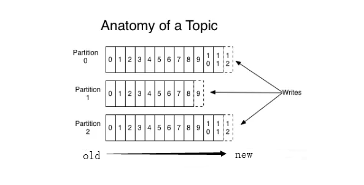
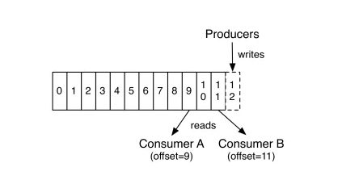

# [3台廉价机器每秒写入2百万！Kafka为什么那么快？](https://segmentfault.com/a/1190000022516124)

## 30秒简单回顾下kafka

`Kafka` 的消息是保存或缓存在磁盘上的，一般认为在磁盘上读写数据是会降低性能的，因为寻址会比较消耗时间，但是实际上，`Kafka` 的特性之一就是高吞吐率。即使是普通的服务器，`Kafka` 也可以轻松支持每秒百万级的写入请求，超过了大部分的消息中间件，这种特性也使得 `Kafka` 在日志处理等海量数据场景广泛应用。

一般配置很简单。生产者将记录发送到集群，将其记录，并将其交给消费者


`kafka`的重要抽象是主题。生产者将记录发布到主题，消费者订阅一个或多个主题。 Kafka主题只是一个分片上的的预写日志。生产者将记录附加到这些日志和消费者订阅更改。每条记录是一个键/值对。其中的key用于将记录分配给特定日志分区（除非发布者直接指定分区）。

这是一个简单的例子，单一的生产者和消费者从两个分区主题的读和写。


注意，与大多数消息系统不同，日志始终是持久的。`当收到消息时直接将其写入文件系统。消息在读取时不会被删除，但按照可配置的SLA保留（比如说几天或一周）`。这允许在数据消费者可能需要重新加载数据的情况下使用。`它还可以支持节省空间的发布订阅，因为无论消费者多少只有单一共享日志;在传统的消息系统中，通常每个消费者都有一个队列，所以添加一个消费者可以使你的数据量翻倍。这使得Kafka非常适合于正常消息系统外的事情，例如用作Hadoop等离线数据系统的管道`。这些离线系统只能作为周期性ETL周期的一部分间隔加载，或者可能会花费几个小时进行维护，在此期间，如果需要，Kafka能够缓冲TB级别未消耗数据。

Kafka还通过复制日志到多台服务器以进行容错。与其他消息传递系统相比，副本实现的一个重要架构是复制不需要复杂的配置，这些配置仅在非常特殊的情况下使用。假定复制是默认的：我们将未复制数据视为副本因子恰好为一个的特殊情况。

> 当生产者发布包含偏移的消息时，生产者会收到确认。发布到分区的第一条记录返回偏移量0，第二条记录1，并按照序列增长。消费者从偏移指定的位置消费数据，并通过定期提交将位置保存在日志中：保存该偏移量，以防消费者实例崩溃，另一个实例可以从偏移的位置恢复。

## 下面从数据写入和读取两方面分析，为什么 Kafka 速度这么快。

### 1.数据写入

Kafka 会把收到的消息都写入到硬盘中，它绝对不会丢失数据。为了优化写入速度 Kafka 采用了两个技术， 顺序写入和 MMFile（Memory Mapped File）。

### 2.顺序写入

磁盘读写的快慢取决于你怎么使用它，也就是顺序读写或者随机读写。在顺序读写的情况下，磁盘的顺序读写速度和内存持平。

因为硬盘是机械结构，每次读写都会寻址->写入，其中寻址是一个“机械动作”，它是最耗时的。

所以硬盘最讨厌随机 I/O，最喜欢顺序 I/O。为了提高读写硬盘的速度，Kafka 就是使用顺序 I/O。

而且 Linux 对于磁盘的读写优化也比较多，包括 read-ahead 和 write-behind，磁盘缓存等。

如果在内存做这些操作的时候，一个是 Java 对象的内存开销很大，另一个是随着堆内存数据的增多，Java 的 GC 时间会变得很长。

使用磁盘操作有以下几个好处：
磁盘顺序读写速度超过内存随机读写。
JVM 的 GC 效率低，内存占用大。使用磁盘可以避免这一问题。
系统冷启动后，磁盘缓存依然可用。
下图就展示了 `Kafka` 是如何写入数据的， 每一个 `Partition` 其实都是一个文件 ，收到消息后 `Kafka` 会把数据插入到文件末尾（虚框部分）：



这种方法有一个缺陷——没有办法删除数据 ，所以 Kafka 是不会删除数据的，它会把所有的数据都保留下来，每个消费者（Consumer）对每个 Topic 都有一个 Offset 用来表示读取到了第几条数据 。



### 两个消费者

Consumer1 有两个 `Offset` 分别对应 `Partition0`、`Partition1`（假设每一个 Topic 一个 Partition）。
Consumer2 有一个 `Offset` 对应 `Partition2`。
这个 Offset 是由客户端 SDK 负责保存的，Kafka 的 Broker 完全无视这个东西的存在。

一般情况下 SDK 会把它保存到 `Zookeeper` 里面，所以需要给 `Consumer` 提供 `Zookeeper` 的地址。

如果不删除硬盘肯定会被撑满，所以 `Kakfa` 提供了两种策略来删除数据：

- `基于时间`
- `基于 Partition 文件大小`

具体配置可以参看它的配置文档。

### 3.Memory Mapped Files

即便是顺序写入硬盘，硬盘的访问速度还是不可能追上内存。所以 `Kafka` 的数据并不是实时的写入硬盘 ，它充分利用了现代操作系统分页存储来利用内存提高 I/O 效率。

`Memory Mapped Files`(后面简称 mmap)也被翻译成`内存映射文件` ，在 64 位操作系统中一般可以表示 20G 的数据文件，它的工作原理是直接利用操作系统的 Page 来实现文件到物理内存的直接映射。

完成映射之后你对物理内存的操作会被同步到硬盘上（操作系统在适当的时候）。

通过 mmap，进程像读写硬盘一样读写内存（当然是虚拟机内存），也不必关心内存的大小，有虚拟内存为我们兜底。

使用这种方式可以获取很大的 I/O 提升，省去了用户空间到内核空间复制的开销。（调用文件的 Read 会把数据先放到内核空间的内存中，然后再复制到用户空间的内存中）

但也有一个很明显的缺陷——不可靠，写到 mmap 中的数据并没有被真正的写到硬盘，操作系统会在程序主动调用 Flush 的时候才把数据真正的写到硬盘。

Kafka 提供了一个参数 `producer.type` 来控制是不是主动 `Flush：`

- 如果 Kafka 写入到 mmap 之后就立即 `Flush`，然后再返回 Producer 叫同步 (Sync)。
- 如果 Kafka 写入 mmap 之后立即返回 `Producer` 不调用 Flush 叫异步 (Async)。

### 4.数据读取

Kafka 在读取磁盘时做了哪些优化？

`基于 Sendfile 实现Zero Copy`

传统模式下，当需要对一个文件进行传输的时候，其具体流程细节如下：

- 调用 `Read` 函数，文件数据被 `Copy` 到内核缓冲区。
- `Read` 函数返回，文件数据从内核缓冲区 `Copy` 到用户缓冲区
- `Write` 函数调用，将文件数据从用户缓冲区 `Copy` 到内核与 `Socket` 相关的缓冲区。
- 数据从 `Socket` 缓冲区 Copy 到相关协议引擎。

以上细节是传统 Read/Write 方式进行网络文件传输的方式，我们可以看到，在这个过程当中，文件数据实际上是经过了四次 Copy 操作：

`硬盘—>内核 buf—>用户 buf—>Socket 相关缓冲区—>协议引擎`

而 `Sendfile` 系统调用则提供了一种减少以上多次 `Copy`，提升文件传输性能的方法。

在内核版本 2.1 中，引入了 `Sendfile` 系统调用，以简化网络上和两个本地文件之间的数据传输。

`Sendfile` 的引入不仅减少了数据复制，还减少了上下文切换。

```c
sendfile(socket, file, len);
```

运行流程如下：

- `Sendfile` 系统调用，文件数据被 `Copy` 至内核缓冲区。
- 再从内核缓冲区 `Copy` 至内核中 `Socket` 相关的缓冲区。
- 最后再 `Socket` 相关的缓冲区 `Copy` 到协议引擎。

相较传统 Read/Write 方式，2.1 版本内核引进的 Sendfile 已经减少了内核缓冲区到 User 缓冲区，再由 User 缓冲区到 Socket 相关缓冲区的文件 Copy。

而在内核版本 2.4 之后，文件描述符结果被改变，Sendfile 实现了更简单的方式，再次减少了一次 Copy 操作。

在 Apache、Nginx、Lighttpd 等 Web 服务器当中，都有一项 Sendfile 相关的配置，使用 Sendfile 可以大幅提升文件传输性能。

Kafka 把所有的消息都存放在一个一个的文件中，当消费者需要数据的时候 Kafka 直接把文件发送给消费者，配合 mmap 作为文件读写方式，直接把它传给 Sendfile。

### 5.批量压缩

在很多情况下，系统的瓶颈不是 CPU 或磁盘，而是网络 IO，对于需要在广域网上的数据中心之间发送消息的数据流水线尤其如此。

进行数据压缩会消耗少量的 CPU 资源，不过对于 Kafka 而言，网络 IO 更应该考虑：

- 因为每个消息都压缩，但是压缩率相对很低，所以 Kafka 使用了批量压缩，即将多个消息一起压缩而不是单个消息压缩。
- Kafka 允许使用递归的消息集合，批量的消息可以通过压缩的形式传输并且在日志中也可以保持压缩格式，直到被消费者解压缩。
- Kafka 支持多种压缩协议，包括 Gzip 和 Snappy 压缩协议。

## 总结

Kafka 速度的秘诀在于，它把所有的消息都变成一个批量的文件，并且进行合理的批量压缩，减少网络 IO 损耗，通过 mmap 提高 I/O 速度。

写入数据的时候由于单个 `Partion` 是末尾添加，所以速度最优；读取数据的时候配合 `Sendfile` 直接暴力输出。
