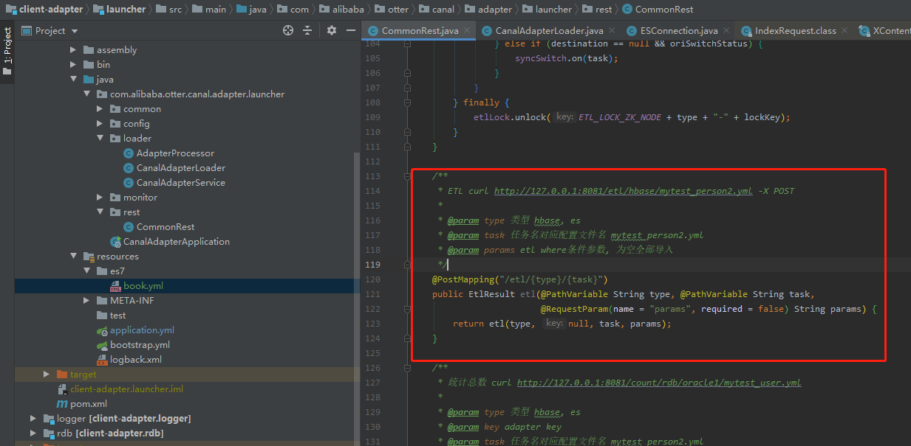

# canal

## 参考

- [Canal——Canal-Adapter源码在IDEA部署运行](https://www.cnblogs.com/caoweixiong/p/11961600.html)

## 下载源码

```bash
git clone git clone https://github.com/alibaba/canal.git
```

```bash
# 导入IDEA分别install下面模块
canal common module for otter
canal client module for otter
canal connector module for otter
canal protocol module for otter
canal client adapter module for otter

[INFO] canal client adapter module for otter 1.1.5-SNAPSHOT SUCCESS [  1.514 s]
[INFO] canal client adapter common module for otter 1.1.5-SNAPSHOT SUCCESS [ 12.679 s]
[INFO] canal client adapter logger example module for otter 1.1.5-SNAPSHOT SUCCESS [  1.099 s]
[INFO] canal client adapter hbase module for otter 1.1.5-SNAPSHOT SUCCESS [ 48.141 s]
[INFO] canal client adapter escore module for otter 1.1.5-SNAPSHOT SUCCESS [  2.223 s]
[INFO] canal client adapter es v6x module for otter 1.1.5-SNAPSHOT SUCCESS [ 34.388 s]
[INFO] canal client adapter es v7x module for otter 1.1.5-SNAPSHOT SUCCESS [ 44.896 s]
[INFO] canal client adapter rdb module for otter 1.1.5-SNAPSHOT SUCCESS [  6.586 s]
[INFO] canal client adapter launcher module for otter 1.1.5-SNAPSHOT SUCCESS [ 52.301 s]
[INFO] canal client adapter kudu module for otter 1.1.5-SNAPSHOT SUCCESS [  6.860 s]
[INFO] ------------------------------------------------------------------------
[INFO] BUILD SUCCESS
[INFO] ------------------------------------------------------------------------
[INFO] Total time:  03:31 min
[INFO] Finished at: 2020-08-17T10:52:08+08:00
[INFO] ------------------------------------------------------------------------
```

在`client-adapter -> launcher`项目中找到打包后的文件


## idea启动


## 全量更新

`launcher项目 -> rest包 -> CommonRest类`



`POST localhost:8081/etl/es7/book.yml`

```json
{
    "succeeded": true,
    "resultMessage": "导入ES 数据：27 条"
}
```

```log
2020-08-17 16:37:28.237 [http-nio-8081-exec-4] INFO  c.a.otter.canal.client.adapter.es7x.etl.ESEtlService - start etl to import data to index: book_index
2020-08-17 16:37:28.311 [http-nio-8081-exec-4] INFO  c.a.otter.canal.client.adapter.es7x.etl.ESEtlService - 数据全量导入完成, 一共导入 27 条数据, 耗时: 74
```

## linux启动`/bin/bash^M: bad interpreter`

```bash
vim bin/startup.sh
:set ff?
# 如果出现fileforma＝dos那么就基本可以确定是这个问题了。
:set fileformat=unix
:wq
```
