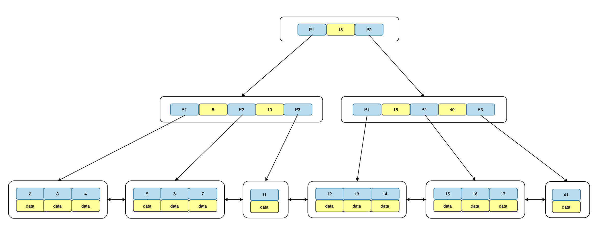
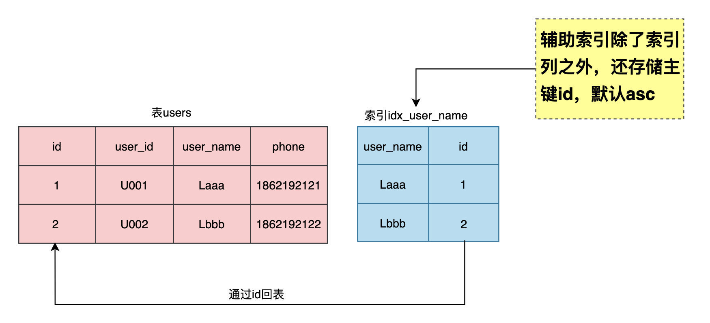

# 参考

- [mysql 索引](https://github.com/Snailclimb/JavaGuide/blob/master/docs/database/MySQL%20Index.md)
- [MySQL](https://github.com/Snailclimb/JavaGuide/blob/master/docs/database/MySQL.md)
- [阿里面试：MySQL如何设计索引更高效？](https://www.cnblogs.com/aobing/p/14260558.html)

`MySQL` 索引使用的数据结构主要有 `BTree` 索引 和 `哈希索引` 。对于哈希索引来说，底层的数据结构就是哈希表，因此在绝大多数需求为单条记录查询的时候，可以选择哈希索引，查询性能最快；其余大部分场景，建议选择 `BTree` 索引。

`MySQL` 的 `BTree` 索引使用的是 B 树中的 B+Tree，但对于主要的两种存储引擎的实现方式是不同的。

MyISAM: B+Tree 叶节点的 data 域存放的是数据记录的地址。在索引检索的时候，首先按照 B+Tree 搜索算法搜索索引，如果指定的 Key 存在，则取出其 data 域的值，然后以 data 域的值为地址读取相应的数据记录。这被称为“非聚簇索引”。
`InnoDB`: 其数据文件本身就是索引文件。相比 MyISAM，索引文件和数据文件是分离的，其表数据文件本身就是按 `B+Tree` 组织的一个索引结构，树的叶节点 data 域保存了完整的数据记录。这个索引的 key 是数据表的主键，因此 InnoDB 表数据文件本身就是主索引。这被称为“聚簇索引（或聚集索引）”。而其余的索引都作为辅助索引，辅助索引的 data 域存储相应记录主键的值而不是地址，这也是和 MyISAM 不同的地方。在根据主索引搜索时，直接找到 key 所在的节点即可取出数据；在根据辅助索引查找时，则需要先取出主键的值，再走一遍主索引。 因此，在设计表的时候，不建议使用过长的字段作为主键，也不建议使用非单调的字段作为主键，这样会造成主索引频繁分裂。

B+Tree由三部分组成：`根root`、`枝branch`以及`Leaf叶子`，其中root和branch不存储数据，只存储指针地址，数据全部存储在`Leaf Node`，同时`Leaf Node`之间用双向链表链接，结构如下：



## 查看索引引擎

```sql
mysql> SHOW ENGINES;
+--------------------+---------+----------------------------------------------------------------+--------------+------+------------+
| Engine             | Support | Comment                                                        | Transactions | XA   | Savepoints |
+--------------------+---------+----------------------------------------------------------------+--------------+------+------------+
| ARCHIVE            | YES     | Archive storage engine                                         | NO           | NO   | NO         |
| BLACKHOLE          | YES     | /dev/null storage engine (anything you write to it disappears) | NO           | NO   | NO         |
| MRG_MYISAM         | YES     | Collection of identical MyISAM tables                          | NO           | NO   | NO         |
| FEDERATED          | NO      | Federated MySQL storage engine                                 | NULL         | NULL | NULL       |
| MyISAM             | YES     | MyISAM storage engine                                          | NO           | NO   | NO         |
| PERFORMANCE_SCHEMA | YES     | Performance Schema                                             | NO           | NO   | NO         |
| InnoDB             | DEFAULT | Supports transactions, row-level locking, and foreign keys     | YES          | YES  | YES        |
| MEMORY             | YES     | Hash based, stored in memory, useful for temporary tables      | NO           | NO   | NO         |
| CSV                | YES     | CSV storage engine                                             | NO           | NO   | NO         |
+--------------------+---------+----------------------------------------------------------------+--------------+------+------------+
9 rows in set (0.00 sec)
```

## 聚集索引与非聚集索引

聚集（clustered）索引，也叫聚簇索引。

> 数据行的物理顺序与列值（一般是主键的那一列）的逻辑顺序相同，一个表中只能拥有一个聚集索引。

非聚集（unclustered）索引。

> 该索引中索引的逻辑顺序与磁盘上行的物理存储顺序不同，一个表中可以拥有多个非聚集索引。

MySQL中的表是IOT（Index Organization Table，索引组织表)，数据按照主键id顺序存储（逻辑上是连续，物理上不连续），而且`主键id是聚集索引（clustered index）`，存储着整行数据，如果没有显示的指定主键，MySQL会将所有的列组合起来构造一个row_id作为primary key，例如表users(id, user_id, user_name, phone, primary key(id))，`id是聚集索引`，存储了id, user_id, user_name, phone整行的数据。



辅助索引也称为二级索引，索引中除了存储索引列外，还存储了主键id，对于user_name的索引idx_user_name(user_name)而言，其实等价于idx_user_name(user_name, id)，MySQL会自动在辅助索引的最后添加上主键id，我们在创建辅助索引也可以显示添加主键id。

## 索引回表

上面证明了辅助索引包含主键id，如果通过辅助索引列去过滤数据有可能需要回表

## 最左前缀原则

MySQL 中的索引可以以一定顺序引用多列，这种索引叫作联合索引。如 User 表的**name 和 city**加联合索引就是**name,city**，而最左前缀原则指的是，如果查询的时候查询条件精确匹配索引的左边连续一列或几列，则此列就可以被用到。如下：

```sql
-- 可以命中索引
select * from user where name=xx and city=xx;
-- 可以命中索引
select * from user where name=xx;
-- 无法命中索引
select * from user where city=xx;
```

这里需要注意的是，查询的时候如果两个条件都用上了，但是顺序不同，如 `city= xx and name ＝xx`，那么现在的查询引擎会自动优化为匹配联合索引的顺序，这样是能够命中索引的。

由于最左前缀原则，在创建联合索引时，索引字段的顺序需要考虑字段值去重之后的个数，较多的放前面。ORDER BY 子句也遵循此规则。

## 注意避免冗余索引

冗余索引指的是索引的功能相同，能够命中 就肯定能命中 ，那么 就是冗余索引如**name,city**和**name**这两个索引就是冗余索引，能够命中后者的查询肯定是能够命中前者的 在大多数情况下，都应该尽量扩展已有的索引而不是创建新索引。

MySQL 5.7 版本后，可以通过查询 sys 库的 `schema_redundant_indexes` 表来查看冗余索引

```sql
select table_schema,table_name,redundant_index_name,redundant_index_columns,dominant_index_name,dominant_index_columns from sys.schema_redundant_indexes;
```

## 分页查询优化

业务要根据时间范围查询交易记录，接口原始的SQL如下：

```sql
select  * from trade_info where status = 0 and create_time >= '2020-10-01 00:00:00' and create_time <= '2020-10-07 23:59:59' order by id desc limit 102120, 20;
```

表`trade_info`上有索引`idx_status_create_time(status,create_time)`，通过上面分析知道，等价于索引`（status,create_time,id)`，对于典型的分页limit m, n来说，越往后翻页越慢，也就是m越大会越慢，因为要定位m位置需要扫描的数据越来越多，导致IO开销比较大，这里可以`利用辅助索引的覆盖扫描来进行优化，先获取id，这一步就是索引覆盖扫描，不需要回表`，然后通过id跟原表trade_info进行关联，改写后的SQL如下：

```sql
select * from trade_info a ,
(select  id from trade_info where status = 0 and create_time >= '2020-10-01 00:00:00' and create_time <= '2020-10-07 23:59:59' order by id desc limit 102120, 20) as b   //这一步走的是索引覆盖扫描，不需要回表
 where a.id = b.id;
```

很多同学只知道这样写效率高，但是未必知道为什么要这样改写，理解索引特性对编写高质量的SQL尤为重要。

## Mysql 如何为表字段添加索引

```sql
-- 添加PRIMARY KEY（主键索引）
ALTER TABLE `table_name` ADD PRIMARY KEY (`column`);

-- 添加UNIQUE(唯一索引)
ALTER TABLE `table_name` ADD UNIQUE (`column`);

-- 添加INDEX(普通索引)
ALTER TABLE `table_name` ADD INDEX index_name (`column`);

-- 添加FULLTEXT(全文索引)
ALTER TABLE `table_name` ADD FULLTEXT (`column`);

-- 添加多列索引
ALTER TABLE `table_name` ADD INDEX index_name (`column1`, `column2`, `column3`);
```

