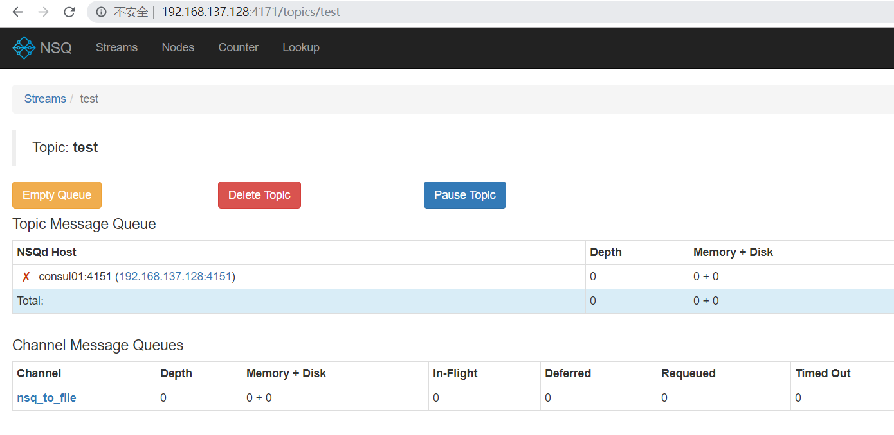
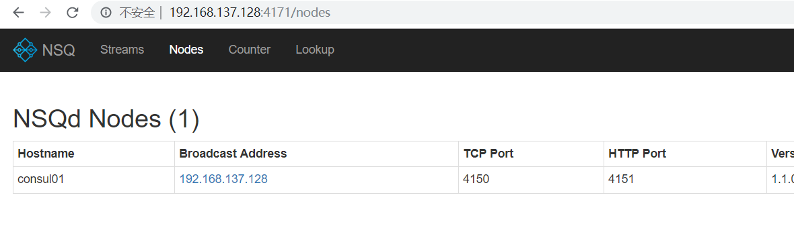

# 参考

- [https://github.com/nsqio/nsq](https://github.com/nsqio/nsq)
- [https://nsq.io/](https://nsq.io/)

## 下载

```bash
# nsq-1.1.0.linux-amd64.go1.10.3.tar.gz
tar -zvxf nsq-1.1.0.linux-amd64.go1.10.3.tar.gz
mv nsq-1.1.0.linux-amd64.go1.10.3 /usr/local/nsq

vi /etc/profile
export NSQ_HOME=/usr/local/nsq/bin
export PATH=$NSQ_HOME:$PATH
source /etc/profile

ls bin
nsqadmin  nsqd  nsqlookupd  nsq_stat  nsq_tail  nsq_to_file  nsq_to_http  nsq_to_nsq  to_nsq
```

## 后台启动三个服务

NSQ is composed of 3 daemons:

- `nsqd` is the daemon that receives, queues, and delivers messages to clients.
- `nsqlookupd` is the daemon that manages topology information and provides an eventually consistent discovery service.
- `nsqadmin` is a web UI to introspect the cluster in realtime (and perform various administrative tasks).

### nsqlookupd

```bash
➜  ~ nsqlookupd -broadcast-address=192.168.137.128
[nsqlookupd] 2019/08/11 06:22:28.857272 INFO: nsqlookupd v1.1.0 (built w/go1.10.3)
[nsqlookupd] 2019/08/11 06:22:28.857858 INFO: HTTP: listening on [::]:4161
[nsqlookupd] 2019/08/11 06:22:28.857860 INFO: TCP: listening on [::]:4160
```

### nsqd

```bash
➜  ~ nsqd --lookupd-tcp-address=0.0.0.0:4160 -broadcast-address=192.168.137.128
[nsqd] 2019/08/11 06:24:27.259557 INFO: nsqd v1.1.0 (built w/go1.10.3)
[nsqd] 2019/08/11 06:24:27.259759 INFO: ID: 33
[nsqd] 2019/08/11 06:24:27.259791 INFO: NSQ: persisting topic/channel metadata to nsqd.dat
[nsqd] 2019/08/11 06:24:27.261776 INFO: HTTP: listening on [::]:4151
[nsqd] 2019/08/11 06:24:27.262012 INFO: TCP: listening on [::]:4150
[nsqd] 2019/08/11 06:24:27.262224 INFO: LOOKUP(0.0.0.0:4160): adding peer
[nsqd] 2019/08/11 06:24:27.262324 INFO: LOOKUP connecting to 0.0.0.0:4160
[nsqd] 2019/08/11 06:24:27.264706 INFO: LOOKUPD(0.0.0.0:4160): peer info {TCPPort:4160 HTTPPort:4161 Version:1.1.0 BroadcastAddress:consul01}
```

- `-broadcast-address` string
    address that will be registered with lookupd (defaults to the OS hostname) (default "consul01")
- `-data-path` string
    path to store disk-backed messages
- `-http-address` string
    `<addr>:<port>` to listen on for HTTP clients (default "0.0.0.0:4151")
- `-lookupd-tcp-address` value
    lookupd TCP address (may be given multiple times)

### nsqadmin

```bash
➜  ~ nsqadmin --lookupd-http-address=0.0.0.0:4161
[nsqadmin] 2019/08/11 06:28:31.758907 INFO: nsqadmin v1.1.0 (built w/go1.10.3)
[nsqadmin] 2019/08/11 06:28:31.759845 INFO: HTTP: listening on [::]:4171
```

```bash
nohup ./nsqlookupd > /dev/null 2>&1 &
nohup ./nsqd --lookupd-tcp-address=127.0.0.1:4160 > /dev/null 2>&1 &
nohup ./nsqadmin --lookupd-http-address=127.0.0.1:4161 > /dev/null 2>&1 &
```

### publish an initial message (creates the topic in the cluster, too):

```bash
➜  ~ curl -d 'hello world 1' 'http://127.0.0.1:4151/pub?topic=test'
http 'http://127.0.0.1:4151/pub?topic=test' 'hello world 1'
# finally, in another shell, start nsq_to_file:

$ nsq_to_file --topic=test --output-dir=~/tmp --lookupd-http-address=192.168.137.128:4161
```



