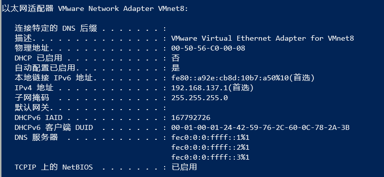
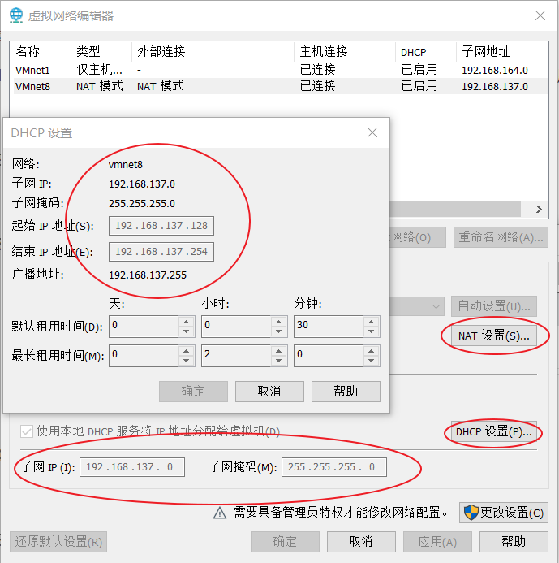
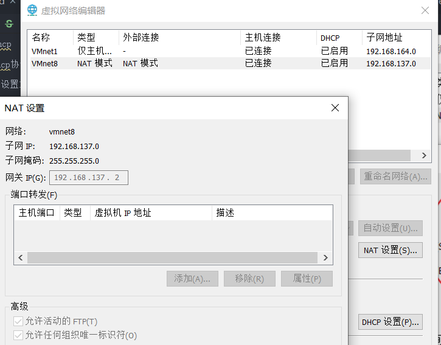

# 1.修改 DNS

```bash
#修改对应网卡的DNS的配置文件
vi /etc/resolv.conf
#添加域名服务器
nameserver 223.5.5.5 #阿里的DNS
nameserver 223.6.6.6
nameserver 8.8.8.8 #google的DNS
nameserver 8.8.4.4
#如果resolv.conf文件Generated by NetworkManager
#在/etc/sysconfig/network-scripts/ifcfg-eth0添加DNS1、DNS2
```

## 2. 设置网卡

```bash
vi /etc/sysconfig/network-scripts/ifcfg-ens33
```

文件说明

```bash
DEVICE=eth0  #网卡对应的设备别名
HWADDR=00:50:56:B6:C1:3A #网卡Mac地址
ONBOOT=yes   #系统启动时是否激活此设备
BOOTPROTO=dhcp  #网卡获得ip地址的方式
#dhcp 通过dhcp协议自动获取ip
#static 手动设置IP地址
```

## 3.修改静态 IP 配置

### 3.1windows 查看 VM 虚拟网卡信息

```bash
ipconfig /all
```



### 3.2 查看 VM 虚拟网络 DHCP 设置

`VM编辑菜单 -> 虚拟网络编辑器 -> DHCP设置`



### 3.3 查看 VM 虚拟网络 NAT 设置

`VM编辑菜单 -> 虚拟网络编辑器 -> NAT设置`



### 3.4 设置静态 IP

```bash
vi /etc/sysconfig/network-scripts/ifcfg-ens33
```

```bash
BOOTPROTO=static
IPADDR=192.168.137.128
NETMASK=255.255.255.0
# 虚拟网卡地址
GATEWAY=192.168.137.1
DNS1=233.5.5.5
DNS2=8.8.8.8
```

### 3.5 设置静态 IP 后 ssh 访问慢的解决方法

```bash
vi /etc/ssh/sshd_config
#找到如下配置节点：
#UseDNS yes
#改为
UseDNS no
#启ssh服务：
systemctl restart sshd
```

## 4.防火墙设置

```bash
vi /etc/sysconfig/iptables
#添加80端口访问权限
firewall-cmd --zone=public --add-port=80/tcp --permanent
#添加ssh端口访问权限
firewall-cmd --zone=public --add-port=22/tcp --permanent
# 重新载入防火墙配置，当前连接不中断
firewall-cmd --reload
```
