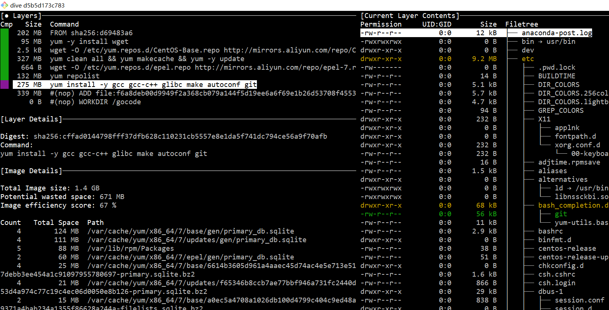

#### 1. 简介
- [https://github.com/wagoodman/dive](https://github.com/wagoodman/dive)

>  dive可以查看docker镜像分层内容,用于减少docker镜像大小

> Docker 设计时，就充分利用 Union FS 的技术，将其设计为分层存储的架构。
镜像构建时，会一层层构建，前一层是后一层的基础。
每一层构建完就不会再发生改变，后一层上的任何改变只发生在自己这一层。
可以用git commit来理解。

#### 2. [安装dive](https://github.com/wagoodman/dive/releases)
```
# download dive_0.7.2_linux_amd64.tar.gz
tar zxf dive_0.7.2_linux_amd64.tar.gz
mv dive /usr/local/bin/dive
source /etc/profile
```

#### 3.1 查看容器列表
```
➜  ~ docker images
REPOSITORY                      TAG                 IMAGE ID            CREATED             SIZE
my/golang                       v1.12.5             d5b5d173c783        42 minutes ago      1.37GB
```
#### 3.2 查看容器分层内容
```
dive d5b5d173c783
```

#### 4. 使用指南
#### 4.1 dive快捷键

Key Binding                                | Description
-------------------------------------------|---------------------------------------------------------
<kbd>Ctrl + C</kbd>                        | Exit
<kbd>Tab</kbd>                             | Switch between the layer and filetree views
<kbd>Ctrl + F</kbd>                        | Filter files
<kbd>PageUp</kbd>                          | Scroll up a page
<kbd>PageDown</kbd>                        | Scroll down a page
<kbd>Ctrl + A</kbd>                        | Layer view: see aggregated image modifications
<kbd>Ctrl + L</kbd>                        | Layer view: see current layer modifications
<kbd>Space</kbd>                           | Filetree view: collapse/uncollapse a directory
<kbd>Ctrl + Space</kbd>                    | Filetree view: collapse/uncollapse all directories
<kbd>Ctrl + A</kbd>                        | Filetree view: show/hide added files
<kbd>Ctrl + R</kbd>                        | Filetree view: show/hide removed files
<kbd>Ctrl + M</kbd>                        | Filetree view: show/hide modified files
<kbd>Ctrl + U</kbd>                        | Filetree view: show/hide unmodified files
<kbd>Ctrl + B</kbd>                        | Filetree view: show/hide file attributes

#### 