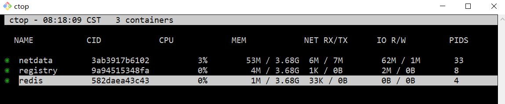
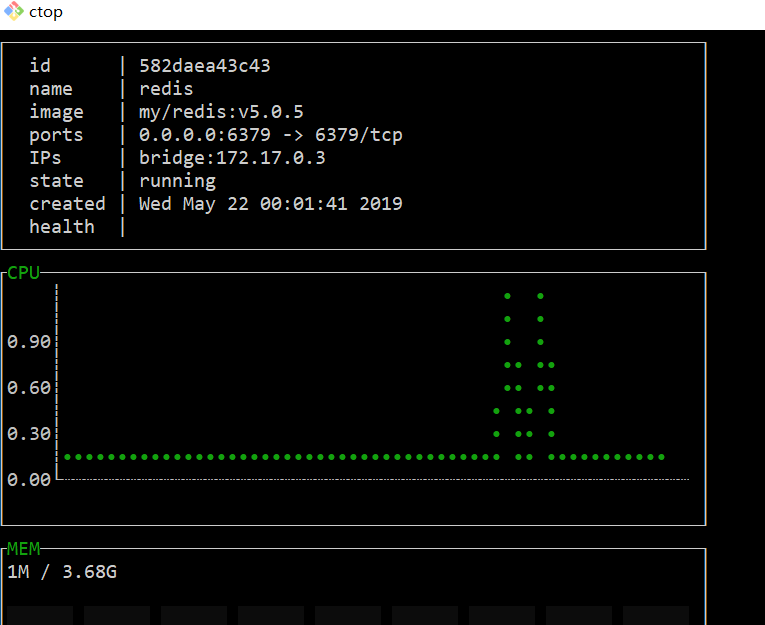
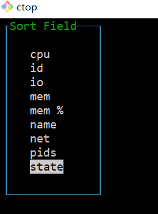

#### 1. [https://github.com/bcicen/ctop](https://github.com/bcicen/ctop)
> ctop是容器命令行管理工具
#### 2. 二进制下载
```
#download ctop-0.7.2-linux-amd64
mv ctop-0.7.2-linux-amd64 /usr/local/bin/ctop
chmod +x /usr/local/bin/ctop
source /etc/profile
```
#### 3.1 启动ctop
直接运行`ctop`启动

#### 3.2 管理容器
快捷键可以参考[Keybindings](#Keybindings)

`Enter`进入管理菜单


#### 3.3 查看容器详情
`Enter -> single view`


#### 3.4 对容器进行排序
`s`进入排序菜单


#### Keybindings
Key | Action
--- | ---
\<enter\> | Open container menu
a | Toggle display of all (running and non-running) containers
f | Filter displayed containers (`esc` to clear when open)
H | Toggle ctop header
h | Open help dialog
s | Select container sort field
r | Reverse container sort order
o | Open single view
l | View container logs (`t` to toggle timestamp when open)
e | Exec Shell
S | Save current configuration to file
q | Quit ctop