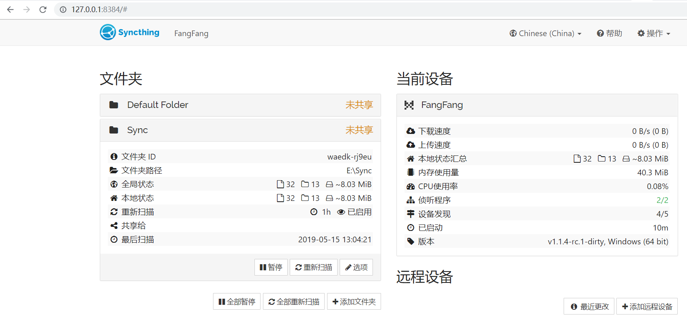
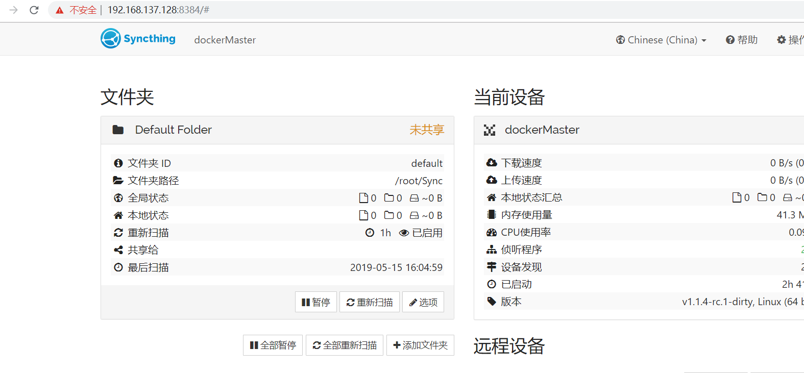
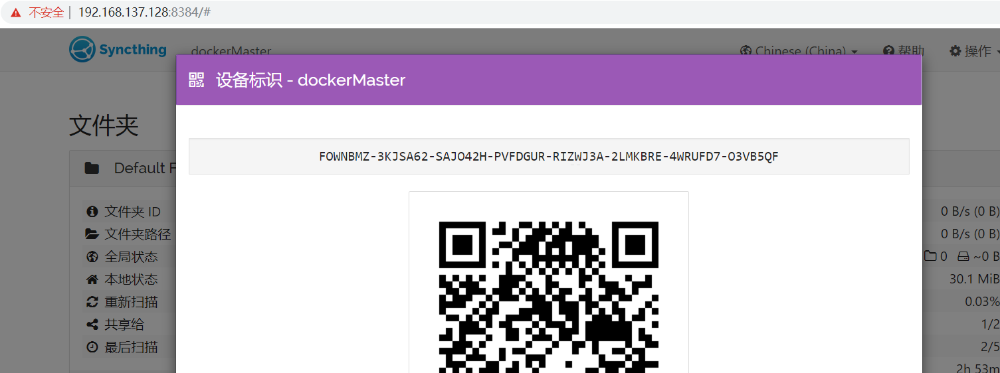
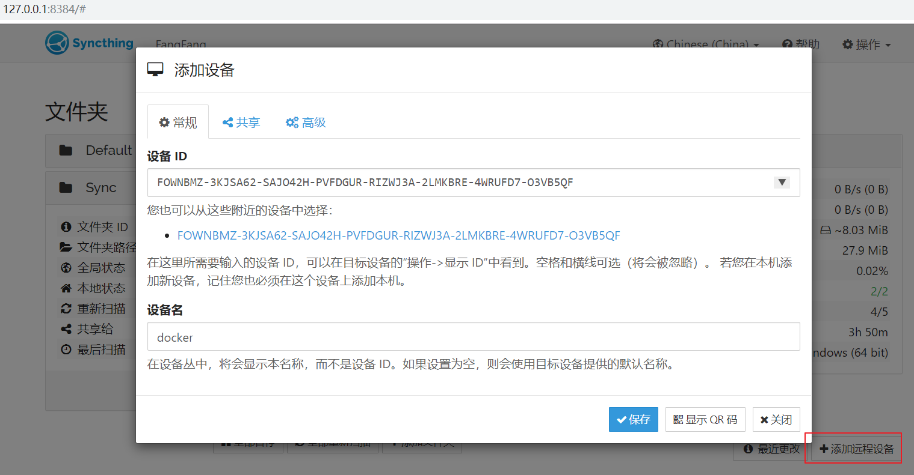
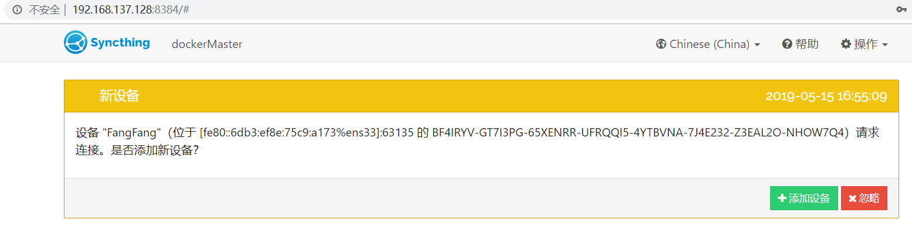
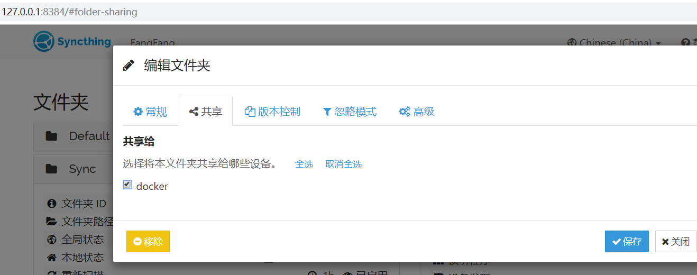
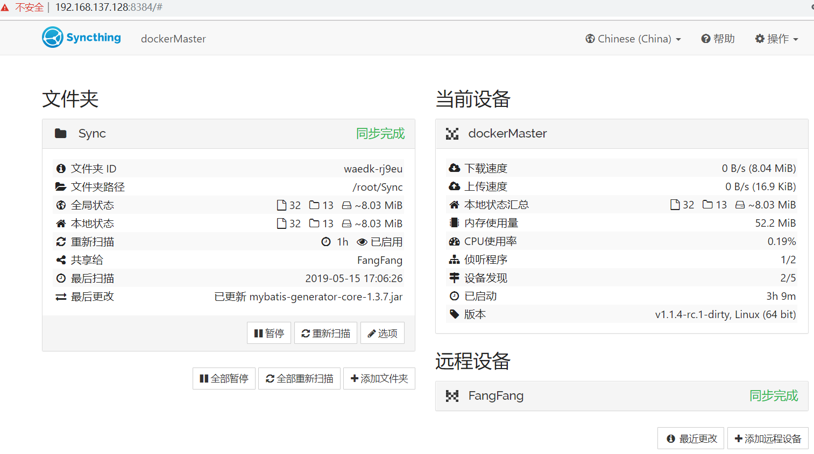

# [syncthing](https://github.com/syncthing/syncthing)

> Syncthing is a continuous file synchronization program. It synchronizes files between two or more computers.

## 1.1 Linux 编译安装

```bash
# This should output "go version go1.12" or higher.
$ go version

# Pick a place for your Syncthing source.
$ mkdir -p ~/dev
$ cd ~/dev

# Grab the code.
$ git clone https://github.com/syncthing/syncthing.git

# Now we have the source. Time to build!
$ cd syncthing

# You should be inside ~/dev/syncthing right now.
$ go run build.go
```

## 1.2 windows 编译安装

```bash
# This should output "go version go1.12" or higher.
> go version

# Grab the code.
> git clone https://github.com/syncthing/syncthing.git

# Now we have the source. Time to build!
> cd syncthing
> go run build.go
```

编译后可执行文件`syncthing`在`bin`目录

## 1.3 移动到 bin 目录

```bash
mv ./bin/syncthing /usr/local/bin/syncthing
source /etc/profile
```

## 2.1 启动 syncthing

```bash
[root@dockerMaster syncthing]# ./bin/syncthing
[monitor] 12:38:31 INFO: Starting syncthing
[start] 12:38:31 INFO: Generating ECDSA key and certificate for syncthing...
[FOWNB] 12:38:31 INFO: syncthing v1.1.4-rc.1-dirty "Erbium Earthworm" (go1.12.5 linux-amd64) root@dockerMaster 2019-05-12 19:17:55 UTC
[FOWNB] 12:38:31 INFO: My ID: FOWNBMZ-3KJSA62-SAJO42H-PVFDGUR-RIZWJ3A-2LMKBRE-4WRUFD7-O3VB5QF
[FOWNB] 12:38:32 INFO: Single thread SHA256 performance is 199 MB/s using crypto/sha256 (195 MB/s using minio/sha256-simd).
[FOWNB] 12:38:32 INFO: Default folder created and/or linked to new config
[FOWNB] 12:38:32 INFO: Default config saved. Edit /root/.config/syncthing/config.xml to taste (with Syncthing stopped) or use the GUI
[FOWNB] 12:38:32 INFO: Hashing performance is 162.40 MB/s
[FOWNB] 12:38:32 INFO: Starting deadlock detector with 20m0s timeout
[FOWNB] 12:38:32 INFO: No stored folder metadata for "default": recalculating
[FOWNB] 12:38:32 INFO: Ready to synchronize "Default Folder" (default) (sendreceive)
[FOWNB] 12:38:32 INFO: Overall send rate is unlimited, receive rate is unlimited
[FOWNB] 12:38:32 INFO: Using discovery server https://discovery-v4.syncthing.net/v2/?nolookup&id=LYXKCHX-VI3NYZR-ALCJBHF-WMZYSPK-QG6QJA3-MPFYMSO-U56GTUK-NA2MIAW
[FOWNB] 12:38:32 INFO: Using discovery server https://discovery-v6.syncthing.net/v2/?nolookup&id=LYXKCHX-VI3NYZR-ALCJBHF-WMZYSPK-QG6QJA3-MPFYMSO-U56GTUK-NA2MIAW
[FOWNB] 12:38:32 INFO: Using discovery server https://discovery.syncthing.net/v2/?noannounce&id=LYXKCHX-VI3NYZR-ALCJBHF-WMZYSPK-QG6QJA3-MPFYMSO-U56GTUK-NA2MIAW
[FOWNB] 12:38:32 INFO: TCP listener ([::]:22000) starting
[FOWNB] 12:38:32 INFO: Relay listener (dynamic+https://relays.syncthing.net/endpoint) starting
[FOWNB] 12:38:32 INFO: Completed initial scan of sendreceive folder "Default Folder" (default)
[FOWNB] 12:38:32 INFO: Anonymous usage reporting is always enabled for candidate releases.
[FOWNB] 12:38:32 INFO: Loading HTTPS certificate: open /root/.config/syncthing/https-cert.pem: no such file or directory
[FOWNB] 12:38:32 INFO: Creating new HTTPS certificate
[FOWNB] 12:38:32 INFO: GUI and API listening on 127.0.0.1:8384
[FOWNB] 12:38:32 INFO: Access the GUI via the following URL: http://127.0.0.1:8384/
```



## 2.2 后台运行 syncthing

## 3. 配置 syncthing

```bash
[root@dockerMaster ~]# ls ~/.config/syncthing/
cert.pem  config.xml  https-cert.pem  https-key.pem  index-v0.14.0.db  key.pem

[root@dockerMaster ~]# vi ~/.config/syncthing/config.xml
<configuration version="28">
...
    <gui enabled="true" tls="false" debugging="false">
        <address>127.0.0.1:8384</address>
        <apikey>eTdsTc34JoJktgEMvzadam6pNaLqpQRe</apikey>
        <theme>default</theme>
    </gui>
</configuration>
```

将`127.0.0.1:8384`改为`0.0.0.0:8384`,重启`syncthing`



## 4. 开放端口

```bash
iptables -A INPUT -p tcp --dport 8384 -j ACCEPT

iptables -A OUTPUT -p tcp --sport 8384 -j ACCEPT

iptables -A INPUT -p tcp --dport 22067 -j ACCEPT

iptables -A OUTPUT -p tcp --sport 22067 -j ACCEPT

iptables -A INPUT -p tcp --dport 22000 -j ACCEPT

iptables -A OUTPUT -p tcp --sport 22000 -j ACCEPT

service iptables save
#重启iptables
systemctl restart iptables
```

## 5. 共享文件

### 5.1 显示设备标识

`右上角的操作 -> 显示ID`


### 5.2 添加远程设备



### 5.3 接受远程设备连接



### 5.4 共享文件夹给远程



### 5.5 查看同步状态


