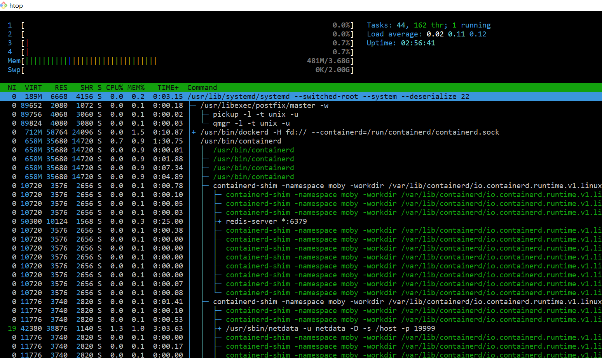
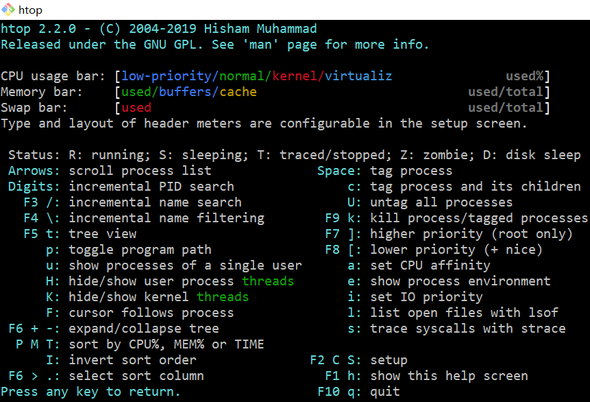
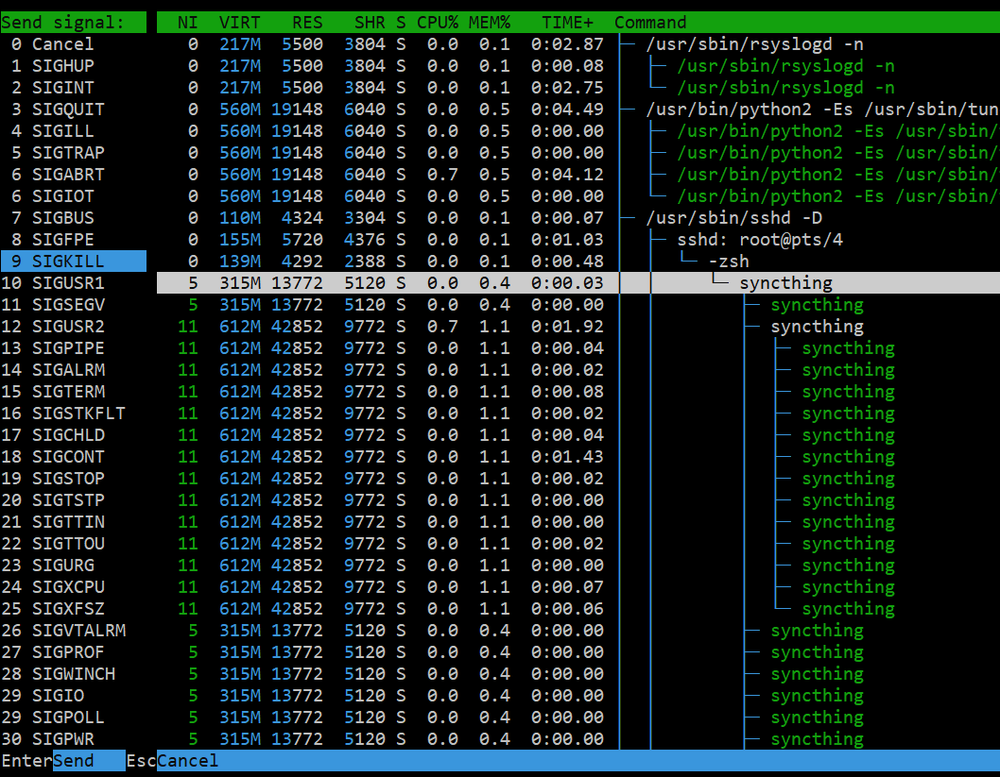

# [https://github.com/hishamhm/htop](https://github.com/hishamhm/htop)

## 1. htop 安装

```bash
yum install htop
```

## 2.1 htop 的使用

安装完成后，命令行中直接敲击 htop 命令，即可进入 htop 的界面



### 2.2 F1 查看帮助



### 2.3 常用快捷键

| 命令 | 说明                                                  |
| ---- | ----------------------------------------------------- |
| H    | 查看/隐藏进程的线程                                   |
| F1   | 查看帮助                                              |
| F3   | 搜索进程                                              |
| F4   | 过滤进程                                              |
| F5   | 以`树结构/根据排序`显示                               |
| F6   | `树结构显示`时折叠或者打开树,`排序显示`时选择排序方式 |
| F9   | 向进程发送信号, 9 是 kill 信号                        |


