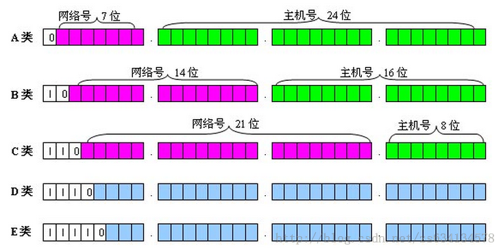

#### 1. ip地址划分
> 地址编址方案将IP地址空间划分为A、B、C、D、E五类，其中A、B、C是基本类，D、E类作为多播和保留使用。

| 类别 | 最大网络数 | ip地址范围　|　最大主机数　|私有IP地址范围|
|-----|-----|-----|-----|-----|
|A类 | 126（2^7-2)   | 0.0.0.0 ~ 127.255.255.255   |16777214(2^24 - 2)|10.0.0.0 ~ 10.255.255.255|
|B类 | 16384(2^14)   | 128.0.0.0 ~ 191.255.255.255 | 65534(2^16 - 2)|172.16.0.0 ~ 172.31.255.255 |
|C类 | 2097152(2^21) | 192.0.0.0 ~ 223.255.255.255 |254(2^8 - 2)| 192.168.0.0 ~ 192.168.255.255|

#### 2.内网保留地址
内网的计算机以NAT（网络地址转换）协议，通过一个公共的网关访问Internet。
Internet设计者保留了IPv4地址空间的一部份供专用地址使用,专用地址空间中的IPv4地址叫专用地址,
这些地址永远不会被当做公用地址来分配,所以专用地址永远不会与公用地址重复.

- A类地址: 10.0.0.0 ~ 10.255.255.255, 默认子网掩码:255.0.0.0
- B类地址：172.16.0.0 ~ 172.31.255.255 , 默认子网掩码:255.255.0.0
- C类地址：192.168.0.0 ~ 192.168.255.255 , 默认子网掩码:255.255.255.0

在一个局域网中，有两个IP地址比较特殊，一个是网络号，一个是广播地址。
网络号是用于三层寻址的地址，它代表了整个网络本身；另一个是广播地址，它代表了网络全部的主机。
例如在192.168.0.0，255.255.255.0这样的网段中，网络号是192.168.0.0，广播地址是192.168.0.255。
0.0.0.0表示本机网络，127.0.0.0~127.255.255.255用于本机回环地址，127.0.0.1用来测试本机的TCP/IP协议是否正确安装．

#### 3.子网划分
> A类网络有126个，每个A类网络可能有(2^24 - 2)台内网主机，而在同一广播域中有这么多结点是不可能的，网络会因为广播通信而饱和. 可以把基于每类的IP网络进一步分成更小的网络，每个子网由路由器界定并分配一个新的子网网络地址,子网地址是借用基于每类的网络地址的主机部分创建的。划分子网后，通过使用掩码，把子网隐藏起来，使得从外部看网络没有变化，这就是子网掩码。

子网掩码告知路由器，IP地址的前多少位是网络地址，后多少位（剩余位）是主机地址，使路由器正确判断任意IP地址是否是本网段的，从而正确地进行路由。

#### 以Ｃ类网络地址划分为例
| 划分子网数 | 子网位数| 子网掩码（二进制）| 子网掩码（十进制）|CIDR值| 每个子网主机数|
|---------------|-------------|-----------------------------|--------------------------|----------------------|---------------|
| 1～2 |1 | 11111111.11111111.11111111.10000000 |255.255.255.128|/25 | 126|
| 3～4 |2 | 11111111.11111111.11111111.11000000 | 255.255.255.192 |/26| 62|
| 5～8 | 3 | 11111111.11111111.11111111.11100000 | 255.255.255.224 |/27| 30|
| 9～16 | 4 | 11111111.11111111.11111111.11110000 | 255.255.255.240 |/28| 14|
| 17～32 | 5 | 11111111.11111111.11111111.11111000 | 255.255.255.248 |/29| 6|
| 33～64 | 6 | 11111111.11111111.11111111.11111100 | 255.255.255.252 |/30| 2|
由于主机位全0表示本网络，全1留作广播地址，这时子网实际没有可用主机地址，所以主机位至少应保留2位。
`Classless Inter-Domain Routing(CIDR)`, C类地址默认子网掩码为`255.255.255.0`.　子网掩码用CIDR表示为`/24`，二进制网址前24位为网络地址，后8位为主机地址．

例如，有两台主机，主机一的IP地址为192.168.0.10，子网掩码为255.255.255.128，主机二的IP地址为192.168.1.10，子网掩码为255.255.255.128。现在主机一要给主机二发送数据，先要判断两个主机是否在同一网段。
其中主机一192.168.0.10在192.168.0.0~192.168.0.127网段中，主机二192.168.0.73在192.168.0.128~192.168.0.255网段中，不在同一个网段中，如果要通信需要通过路由器转发。
#### 参照
 
- [百度百科－ip地址](http://baike.baidu.com/view/3930.htm)
- [百度百科－子网划分](http://baike.baidu.com/view/1023913.htm)
- [Ubuntu下Docker固定IP配置及桥接](http://www.linuxidc.com/Linux/2015-02/113783.htm)
- [VirtualBox的四种网络连接方式](http://www.cnblogs.com/adforce/archive/2013/10/11/3363373.html)
