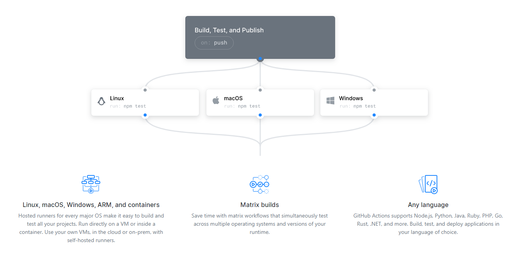

# 参考

- [https://github.com/features/actions](https://github.com/features/actions)
- [https://help.github.com/en/actions/automating-your-workflow-with-github-actions](https://help.github.com/en/actions/automating-your-workflow-with-github-actions)
- [https://github.com/actions](https://github.com/actions)
- [https://github.com/actions/setup-go](https://github.com/actions/setup-go)
- [https://github.com/actions/setup-java](https://github.com/actions/setup-java)
- [https://github.com/actions/cache](https://github.com/actions/cache)




## 创建`workflow`文件

在项目中创建`.github/workflows`目录,再添加`workflow`文件，`.github/workflows/continuous-integration-workflow.yml`

## [触发构建](https://help.github.com/en/actions/automating-your-workflow-with-github-actions/events-that-trigger-workflows#webhook-events)

`workflow`文件中`on`用于配置触发条件

```yaml
name: descriptive-workflow-name
on: push
```

```yaml
# cron语法, 每十五分钟构建一次
on:
  schedule:
    - cron: "*/15 * * * *"
```

```bash
┌───────────── minute (0 - 59)
│ ┌───────────── hour (0 - 23)
│ │ ┌───────────── day of the month (1 - 31)
│ │ │ ┌───────────── month (1 - 12 or JAN-DEC)
│ │ │ │ ┌───────────── day of the week (0 - 6 or SUN-SAT)
│ │ │ │ │
│ │ │ │ │
│ │ │ │ │
* * * * *
```

| Operator | Description          | Example                                                                                              |
| -------- | -------------------- | ---------------------------------------------------------------------------------------------------- |
| \*       | Any value            | \* \* \* \* \* runs every minute of every day.                                                       |
| ,        | Value list separator | 2,10 4,5 \* \* \* runs at minute 2 and 10 of the 4th and 5th hour of every day.                      |
| -        | Range of values      | 0 4-6 \* \* \* runs at minute 0 of the 4th, 5th, and 6th hour.                                       |
| /        | Step values          | 20/15 \* \* \* \* runs every 15 minutes starting from minute 20 through 59 (minutes 20, 35, and 50). |

## [选择虚拟环境](https://help.github.com/en/actions/automating-your-workflow-with-github-actions/virtual-environments-for-github-hosted-runners)

Each virtual machine has the same hardware resources available.

- 2-core CPU
- 7 GB of RAM memory
- 14 GB of SSD disk space

| Virtual environment    | YAML workflow label           |
| ---------------------- | ----------------------------- |
| Windows Server 2019    | windows-latest                |
| Ubuntu 18.04           | ubuntu-latest or ubuntu-18.04 |
| Ubuntu 16.04           | ubuntu-16.04                  |
| macOS X Catalina 10.15 | macos-latest                  |

### 显示构建状态

`https://github.com/<OWNER>/<REPOSITORY>/workflows/<WORKFLOW_NAME>/badge.svg`

#### 构建状态示例

[https://github.com/hua345/codegen/workflows/Go/badge.svg](https://github.com/hua345/codegen/workflows/Go/badge.svg)

#### 显示分支状态

[https://github.com/hua345/codegen/workflows/Go/badge.svg?branch=master](https://github.com/hua345/codegen/workflows/Go/badge.svg?branch=master)

### 定义 Job

Job 是一系列操作

```yaml
jobs:
  build:
    name: BuildJobName
```

### action 使用

- [https://github.com/actions/starter-workflows](https://github.com/actions/starter-workflows)
- [https://github.com/actions/checkout](https://github.com/actions/checkout)
- [https://github.com/actions/setup-go](https://github.com/actions/setup-go)
- [https://github.com/actions/setup-java](https://github.com/actions/setup-java)
- [https://github.com/actions/cache](https://github.com/actions/cache)
- [https://github.com/marketplace/actions/cache](https://github.com/marketplace/actions/cache)

- [maven](https://github.com/actions/starter-workflows/blob/master/ci/maven.yml)
- [https://github.com/actions/starter-workflows/blob/master/ci/go.yml](https://github.com/actions/starter-workflows/blob/master/ci/go.yml)

```yaml
name: Go
on: [push]
jobs:
  build:
    name: Build
    runs-on: ubuntu-latest
    steps:
      - name: Set up Go 1.13
        uses: actions/setup-go@v1
        with:
          go-version: 1.13
        id: go

      - name: Check out code into the Go module directory
        uses: actions/checkout@v1
        with:
          fetch-depth: 1

      - name: Get dependencies
        run: |
          go get github.com/go-bindata/go-bindata/... && go get -v -t -d ./...
          if [ -f Gopkg.toml ]; then
              curl https://raw.githubusercontent.com/golang/dep/master/install.sh | sh
              dep ensure
          fi
      - name: Build
        run: go env && export PATH=/home/runner/go/bin:$PATH && go generate && go build -v .
```
