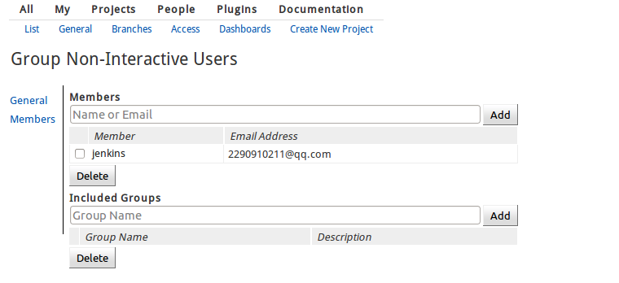
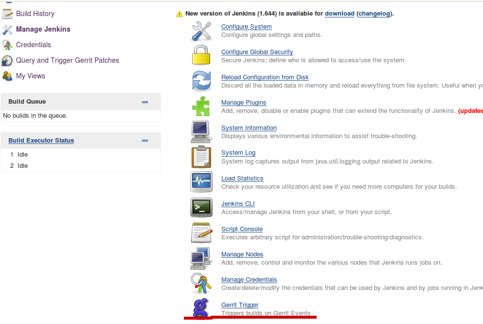
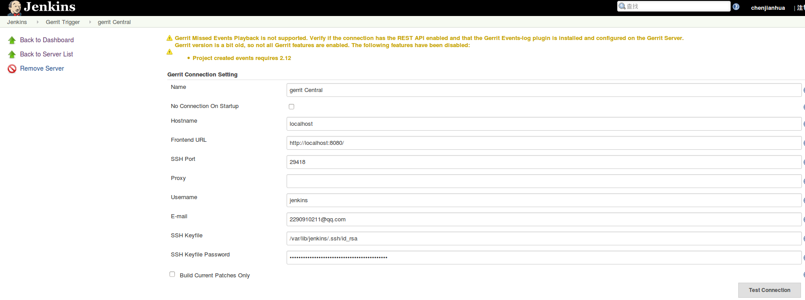
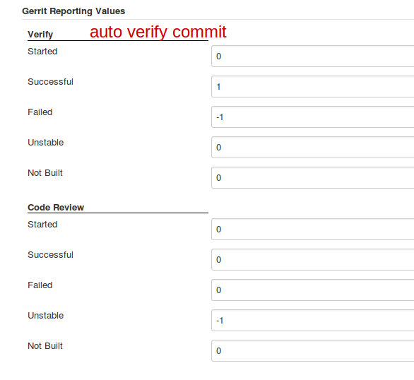
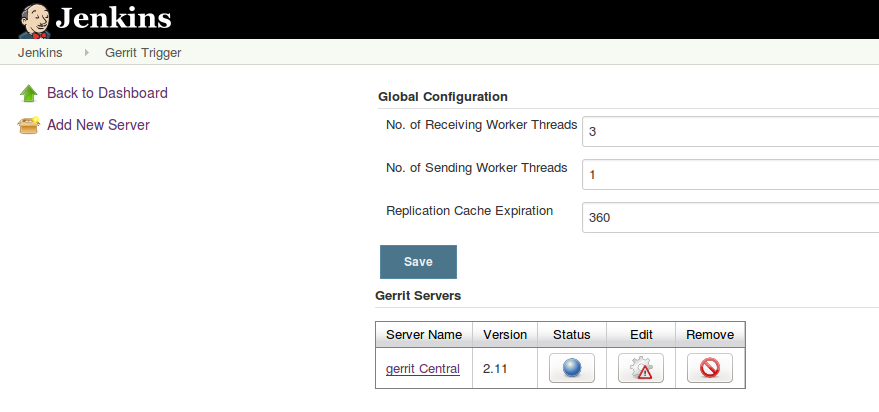
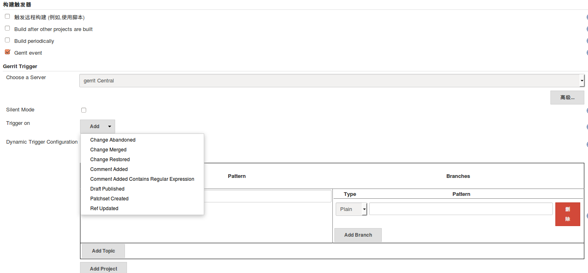
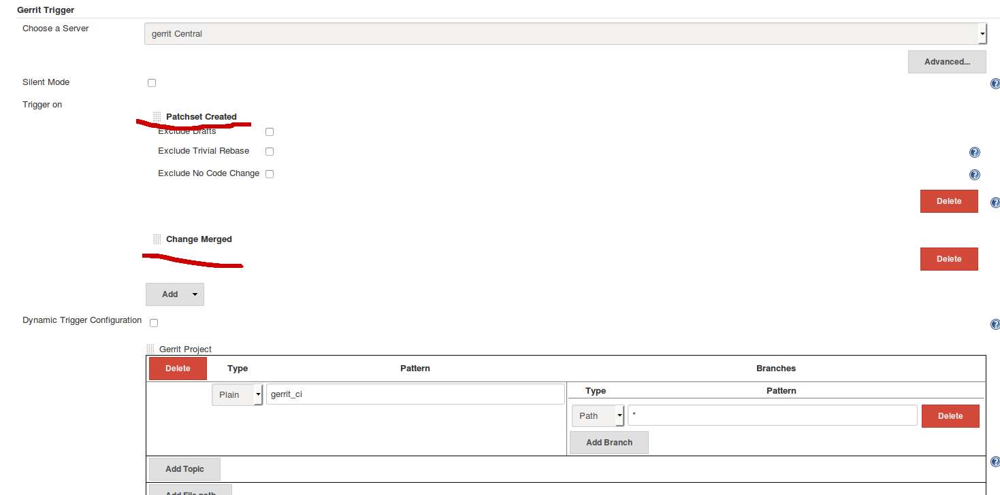
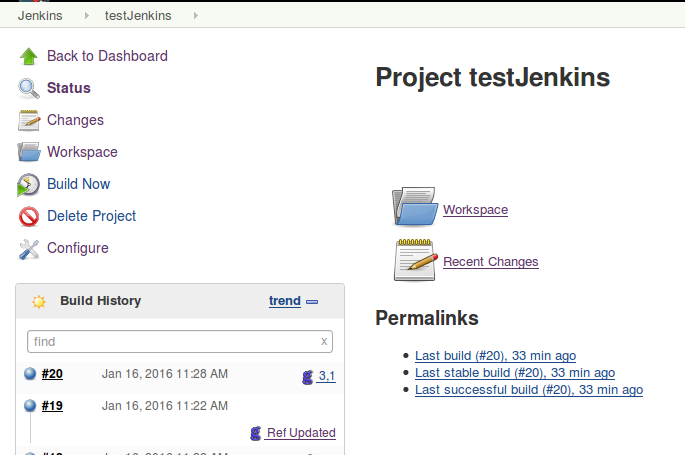
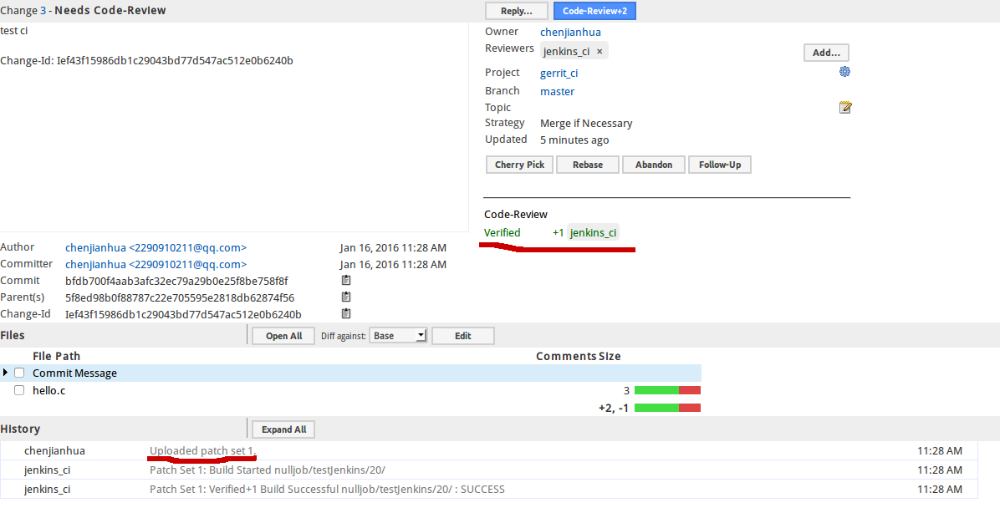
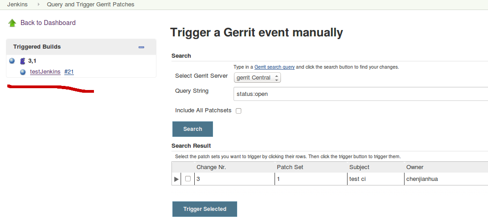

### 配置gerrit Trigger
#### 1. 生成SSH Key
```
#切换到jenkins用户,再生成密钥
sudo su  jenkins
ssh-keygen
Generating public/private rsa key pair.
Enter file in which to save the key (/var/lib/jenkins/.ssh/id_rsa):
#配置jenkins用户git信息
git config --global user.name "jenkins"
git config --global user.email "email"

```
#### 2. 添加jenkins用户, 并赋予管理员权限
```
#切换到gerrit用户
su gerrit
#添加jenkins账号
htpasswd -b ./review_site/etc/passwd jenkins yourpassword
#网页登录,添加邮箱(需要与git邮箱一致)和SSH公钥, 并测试ssh能否访问
git clone ssh://jenkins@localhost:29418/hello1
```
#### 3. 赋予jenkins用户`Stream Events`权限
否则会出现`User jenkins has no capability to connect to Gerrit event stream`错误

```bash
#管理员登录gerrit
Projects->List->All-Projects
Projects->Access -> > Edit
    #添加 jenkins 用户到 ‘Non-Interactive Users’ 组
    Global Capabilities->Stream Events 点击 Non-Interactive Users
    #分支权限
    Reference: refs/*
        Read: ALLOW for Non-Interactive Users
    Reference: refs/heads/*
        Label Code-Review: -1, +1 for Non-Interactive Users
        Label Verified: -1, +1 for Non-Interactive Users

```



#### 4. 配置gerrit Trigger参数
##### 4.1 Manage Jenkins -> Gerrit Trigger


##### 4.2 Fronted URL 是代理服务器地址, 点击`Test Connection`确保连接gerrit服务器正确


#### 4.3 自动验证


##### 4.4 查看gerrit服务器状态



编辑项目配置, 在`Trigger on`可以添加要触发的事件

- Patch set created: Trigger when a new change or patch set is uploaded (default). 当补丁集被创建时触发，开发者的代码需要先提交到refs/for/master分支上，补丁集被创建保存在 `refs/changes／＊` 命名空间下．
- Draft published: Trigger when a draft change or patch set is published (default, if available in Gerrit version)
- Change abandoned: Trigger when a change is abandoned
- Change merged: Trigger when a change is merged/submitted
- Change restored: Trigger when a change is restored
- Comment added: Trigger when a review comment is left with the indicated vote category and value
- Reference updated: Trigger when a reference (e.g., branch or tag) is updated



#### 4.5 添加触发事件，这里添加了Draft published和Change merged事件


#### 4.6 当提交审查代码后，发现真的触发了构建任务


#### 4.7 gerrit也被jenkins验证通过



#### 4.8 测试的时候可以通过Query and Trigger Gerrit Patches 来手动触发事件.



### 参照

- [http://jenkins-ci.org/](http://jenkins-ci.org/)
- [Gerrit+Trigger](https://wiki.jenkins-ci.org/display/JENKINS/Gerrit+Trigger#GerritTrigger-AdministrativeSettings)
- [http://mirrors.jenkins-ci.org/](http://mirrors.jenkins-ci.org/)
- [https://github.com/jenkinsci/gerrit-trigger-plugin](https://github.com/jenkinsci/gerrit-trigger-plugin)
- [jenkins-host-key-verification-failed](http://stackoverflow.com/questions/15174194/jenkins-host-key-verification-failed)
- [解决 Jenkins 没有权限监听 Gerrit 的 ‘Stream Events’的问题 ](http://blog.csdn.net/stwstw0123/article/details/47360189)
- [jenkins-gerrit-trigger-not-fetching-my-change-while-building](http://stackoverflow.com/questions/19060650/jenkins-gerrit-trigger-not-fetching-my-change-while-building)