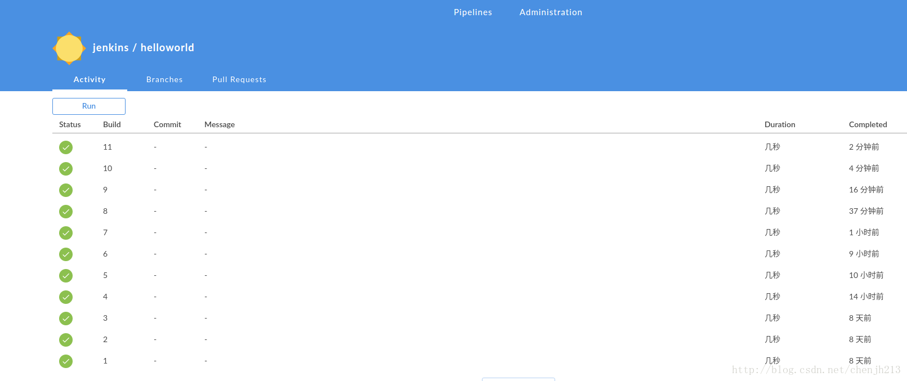
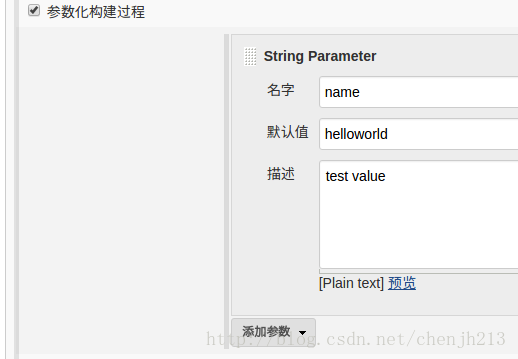
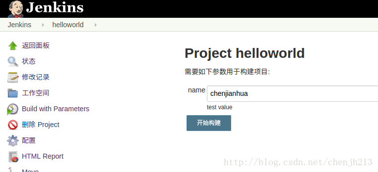
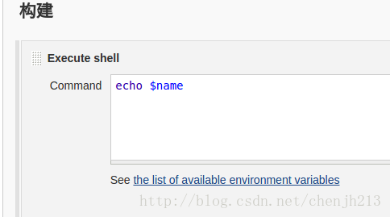
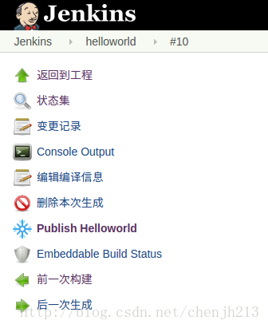
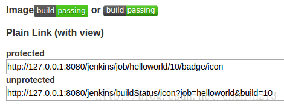
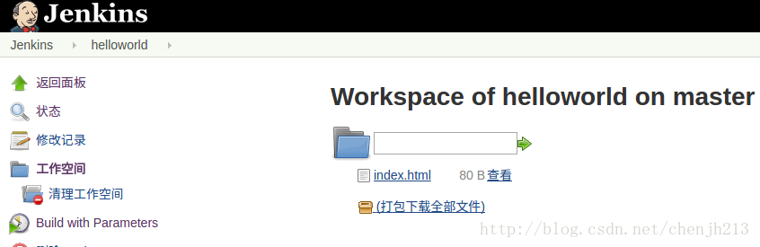
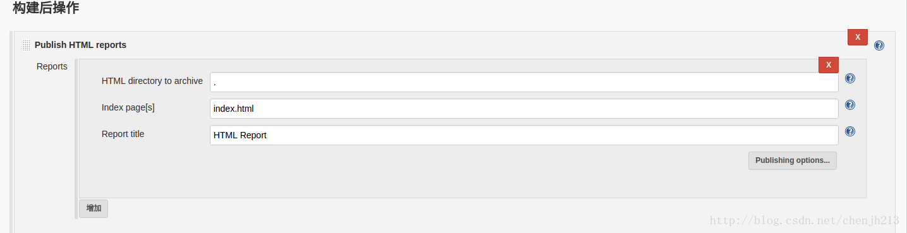
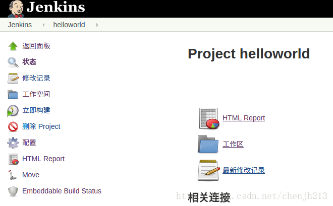

### Pipeline
`Pipeline as Code`是2.0的精髓所在，是帮助`Jenkins`实现`CI(Continuous Integration)`到`CD(Continuous Delivery)`华丽转身的关键推手。所谓`Pipeline`，简单来说，就是一套运行于`Jenkins`上的工作流框架，将原本独立运行于单个或者多个节点的任务连接起来，实现单个任务难以完成的复杂发布流程.
2.0还有一个比较有意思的改动，全局重命名`Slave`为`Agent`
#### Pipeline的使用
通常,`Pipeline as Code`会被写到`jenkinsfile`中，包含在项目源代码仓库中
```
Jenkinsfile (Pipeline Script)
node { // <1>
    stage('Build') { // <2>
        sh 'make' // <3>
    }

    stage('Test') {
        sh 'make check'
        junit 'reports/**/*.xml' // <4>
    }

    stage('Deploy') {
        sh 'make publish'
    }
}
```
`Stage`: 一个Pipeline可以划分为若干个Stage，每个Stage代表一组操作。注意，Stage是一个逻辑分组的概念，可以跨多个Node。

`Node`: 一个Node就是一个Jenkins节点，或者是Master，或者是Agent，是执行Step的具体运行期环境。

`Step`: Step是最基本的操作单元，小到创建一个目录，大到构建一个Docker镜像，由各类Jenkins Plugin提供。

`Jenkinsfile`: Pipeline的定义文件，由Stage，Node，Step组成，一般存放于代码库根目录下。

`Stage View`: Pipeline的视觉展现，类似于下图。


### 1.[BlueOcean](https://wiki.jenkins-ci.org/display/JENKINS/Blue+Ocean+Plugin)
`BlueOcean UI`用于提升用户体验全新界面,从`Jenkins Pipeline`和`Freestyle jobs`任务进行设计，降低工作流程的复杂度和提升工作流程的清晰度.

`BlueOcean`是目前为止还是作为一个插件，需要`Jenkins`版本`2.7.x`以上

`Jenkins --> 插件管理 --> 可选插件`搜索`BlueOcean beta`
插件安装完毕后点击`Use Blue Ocean`按钮.



### 2.[Build With Parameters Plugin](https://wiki.jenkins-ci.org/display/JENKINS/Build+With+Parameters+Plugin)







### 3.[embeddable-build-status-plugin](https://wiki.jenkins-ci.org/display/JENKINS/Embeddable+Build+Status+Plugin)





### 4.[HTML Publisher Plugin](https://wiki.jenkins-ci.org/display/JENKINS/HTML+Publisher+Plugin)







### 参考
#### [持续集成 Jenkins BlueOcean 初探](https://testerhome.com/topics/6700)