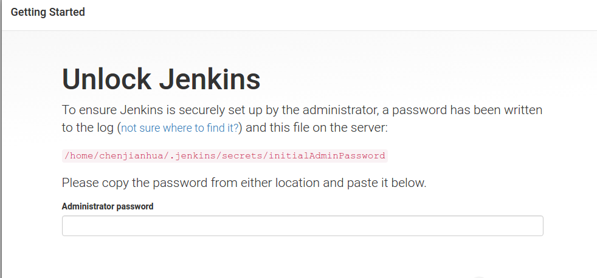
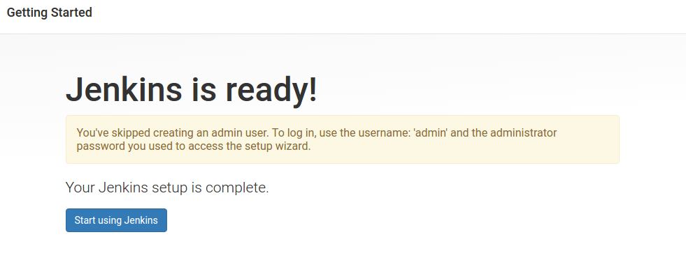
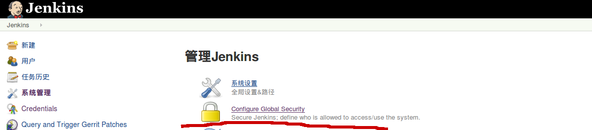
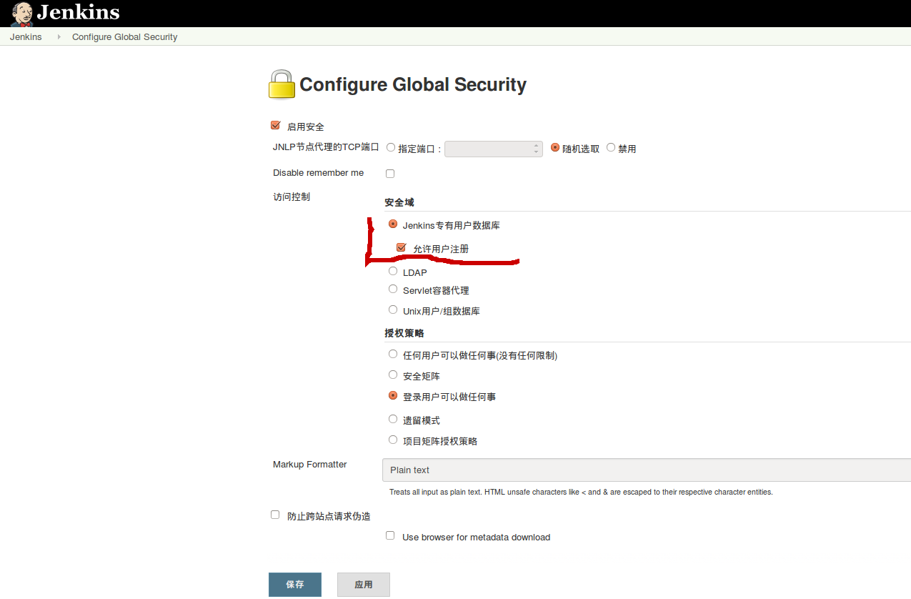
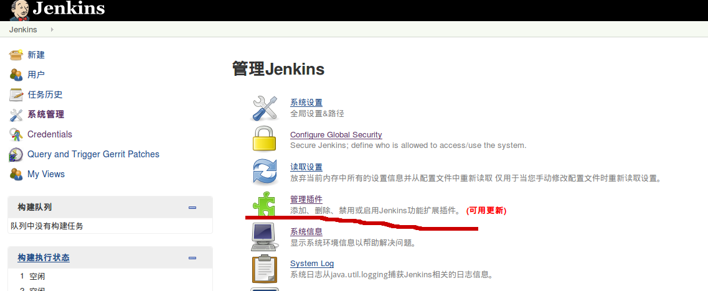
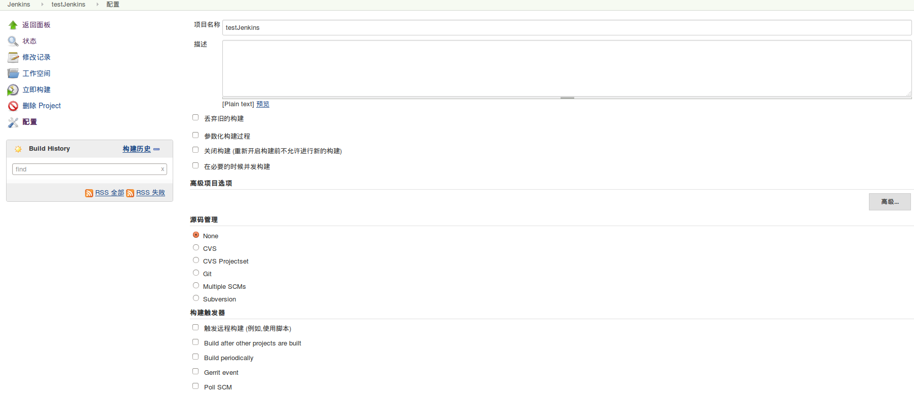
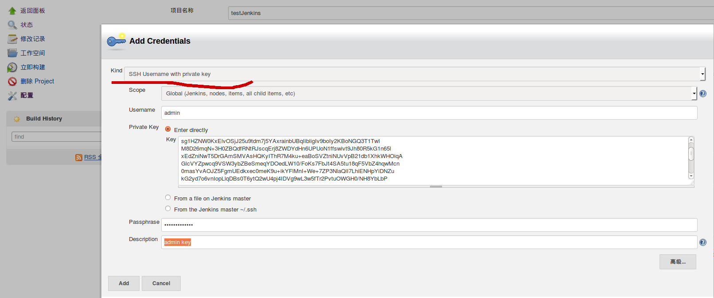
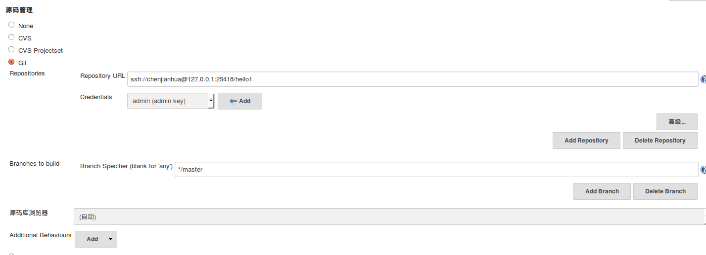
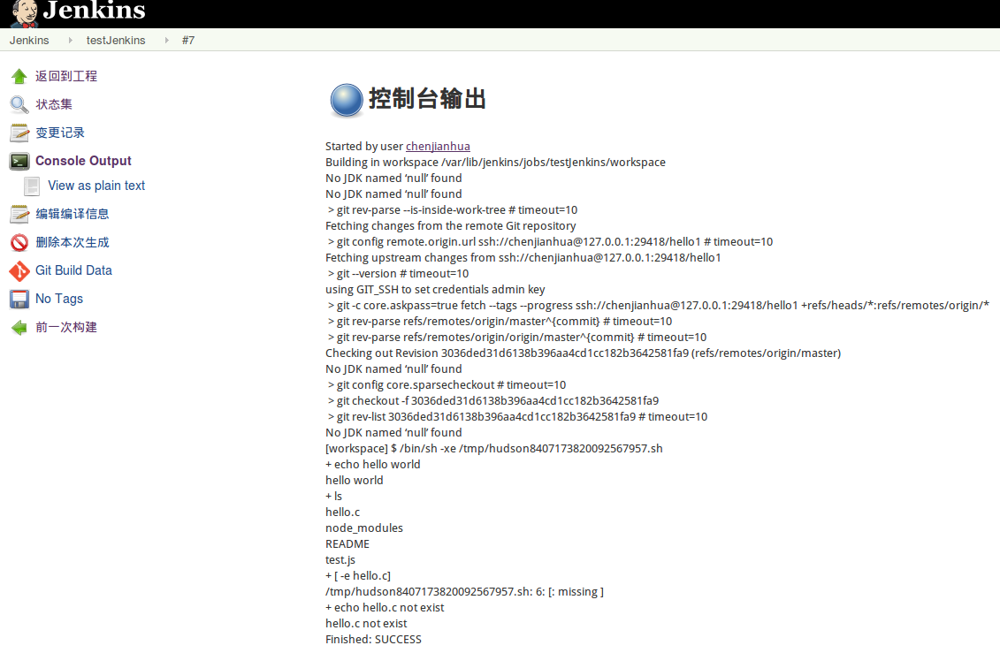

#### 1. 安装jenkins
下载载最新的版本, 官方网站[http://jenkins-ci.org/](http://jenkins-ci.org/)
```
#安装依赖
apt-get install daemon

#安装jenkins
dpkg -i jenkins_1.635_all.deb 

#修改jenkins 默认监听端口,  默认监听 8080 端口
vim /etc/default/jenkins

HTTP_PORT=9000
#重新 jenkins 服务
/etc/init.d/jenkins restart
#也可以将下载的war包放入tomcat中运行
```




### 2. 设置用户和权限




### 3. 安装插件



进入插件管理安装常用的插件,[Gerrit Trigger](https://github.com/jenkinsci/gerrit-trigger-plugin),[GitLab Plugin](https://github.com/jenkinsci/gitlab-plugin), [GIT plugin](https://github.com/jenkinsci/git-plugin), [Github Plugin](https://github.com/jenkinsci/github-plugin), [Multiple SCMs](https://github.com/jenkinsci/multiple-scms-plugin), [Git Client Plugin](https://github.com/jenkinsci/git-client-plugin)

### 4.  新建Git项目



为项目添加认证信息,ssh协议获取的Git仓库, `Credentials`选用`SSH Username with private key`方式
http协议, `Credentials`选用`Username with password`方式




添加shell脚本
```
echo "hello world"

if [ -e "hello.c" ] ; then
    g++ hello.c -o hello --std=c++11
    echo "complie hello.c ok!"
else
   echo "hello.c not exist"
fi
./hello
```
编辑hello.c文件,并提交
```
#include <iostream>
#include <functional>
int main(){
    auto func1 = [](int i) { return i+4; };
    std::cout << "func1: " << func1(6) << '\n';
    std::function<int(int)> func2 = [](int i) { return i+4; };
    std::cout << "func2: " << func2(6) << '\n';
}

```
构建输出结果



### 参照
- [http://jenkins-ci.org/](http://jenkins-ci.org/)