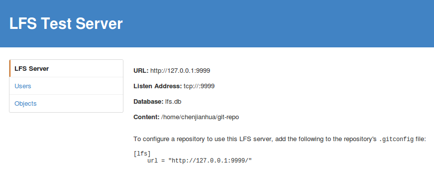

LFS Test Server 是一个实现了 Git LFS API 的服务器。它的目的是用于测试 Git LFS 客户端，而且它现在还不在生产就绪的状态。LFS Test Server 用 GO 语言写成，在 Mac、Windows、Linux 和 FreeBSD 的环境下可以预编译二进制文件。
### 1.安装lfs-test-server
#### [https://github.com/github/lfs-test-server](https://github.com/github/lfs-test-server)
```
mkdir lfs && cd lfs
sudo GOPATH=/home/chenjianhua/git-repo/lfs go get github.com/github/lfs-test-server
```
#### 2.1 启动lfs-test-server
服务默认监听地址为`localhost:8080`, 可以通过环境变量来设置
```
LFS_LISTEN      # The address:port the server listens on, default: "tcp://:8080"
LFS_HOST        # The host used when the server generates URLs, default: "localhost:8080"
LFS_METADB      # The database file the server uses to store meta information, default: "lfs.db"
LFS_CONTENTPATH # The path where LFS files are store, default: "lfs-content"
LFS_ADMINUSER   # An administrator username, default: unset
LFS_ADMINPASS   # An administrator password, default: unset
LFS_CERT        # Certificate file for tls
LFS_KEY         # tls key
LFS_SCHEME      # set to 'https' to override default http
```
#### 2.2 生成自签证证书
```
openssl req -x509 -sha256 -nodes -days 2100 -newkey rsa:2048 -keyout mine.key -out mine.crt
```
#### 2.3 启动脚本
```
#!/bin/bash

set -eu
set -o pipefail


LFS_LISTEN="tcp://:9999"
LFS_HOST="127.0.0.1:9999"
LFS_CONTENTPATH="content"
LFS_ADMINUSER="<cool admin user name>"
LFS_ADMINPASS="<better admin password>"
LFS_CERT="mine.crt"
LFS_KEY="mine.key"
LFS_SCHEME="https"

export LFS_LISTEN LFS_HOST LFS_CONTENTPATH LFS_ADMINUSER LFS_ADMINPASS LFS_CERT LFS_KEY LFS_SCHEME

./lfs-test-server
```
```
#Check the managment page
https://localhost:9999/mgmt
```



#### 源码安装git-lfs
没有帮助文档, 还是官方下载的好
```
mkdir git-lfs && cd git-lfs
sudo GOPATH=/home/chenjianhua/git-repo/git-lfs go get github.com/github/git-lfs
```
### 下载二进制文件
[https://git-lfs.github.com/](https://git-lfs.github.com/)
```
#第一次使用时需要初始化环境
git lfs install
```
### 配置仓库
如果服务器使用`lfs test server`,在仓库中添加 `.gitconfig`配置文件, 这样`.gitconfig`文件也能保存在仓库中, 其他人`clone`时就能自动下载大文件.
```
[lfs]
	url = "http://localhost:9999/"
#如果Https使用自签证证书
[lfs]
	url = "https://localhost:9999/"
[http]
	sslverify = false
```
### 使用git-lfs
git-lfs核心是取代存储大文件到Git的`blob对象`中，Git仓库只是存储一个指针到`blob对象`，而实际的文件存储在`Git LFS server`中.


```
#选择文件由Git LFS去管理(或者直接编辑.gitattributes). You can configure additional file extensions at anytime
git lfs track "*.psd"

#由Git LFS管理大文件后，和正常使用Git没什么区别
git add file.psd
git commit -m "Add design file"
git push origin master
```


```
git lfs <command> [<args>]

Git LFS is a system for managing and versioning large files in
association with a Git repository.  Instead of storing the large files
within the Git repository as blobs, Git LFS stores special "pointer
files" in the repository, while storing the actual file contents on a
Git LFS server.  The contents of the large file are downloaded
automatically when needed, for example when a Git branch containing
the large file is checked out.

Git LFS works by using a "smudge" filter to look up the large file
contents based on the pointer file, and a "clean" filter to create a
new version of the pointer file when the large file's contents change.
It also uses a pre-push hook to upload the large file contents to
the Git LFS server whenever a commit containing a new large file
version is about to be pushed to the corresponding Git server.

Commands
--------

Like Git, Git LFS commands are separated into high level ("porcelain")
commands and low level ("plumbing") commands.

High level commands 
--------------------

* git lfs env:
    Display the Git LFS environment.
* git lfs checkout:
    Populate working copy with real content from Git LFS files
* git lfs fetch:
    Download git LFS files from a remote
* git lfs fsck:
    Check GIT LFS files for consistency.
* git lfs install:
    Install Git LFS configuration.
* git lfs logs:
    Show errors from the git-lfs command.
* git lfs ls-files:
    Show information about Git LFS files in the index and working tree.
* git lfs pull:
    Fetch LFS changes from the remote & checkout any required working tree files
* git lfs push:
    Push queued large files to the Git LFS endpoint.
* git lfs status:
    Show the status of Git LFS files in the working tree.
* git lfs track:
    View or add Git LFS paths to Git attributes.
* git lfs untrack:
    Remove Git LFS paths from Git Attributes.
* git lfs update:
    Update Git hooks for the current Git repository.
  
Low level commands 
-------------------

* git lfs clean:
    Git clean filter that converts large files to pointers.
* git lfs pointer:
    Build and compare pointers.
* git lfs pre-push:
    Git pre-push hook implementation.
* git lfs smudge:
    Git smudge filter that converts pointer in blobs to the actual content.

```
### 参照

- [https://git-lfs.github.com/](https://git-lfs.github.com/)
- [https://github.com/github/git-lfs](https://github.com/github/git-lfs)
- [https://github.com/github/lfs-test-server](https://github.com/github/lfs-test-server)
- [https://github.com/github/git-lfs/blob/master/docs/spec.md](https://github.com/github/git-lfs/blob/master/docs/spec.md)
