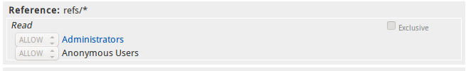
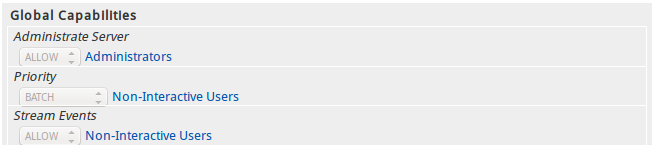
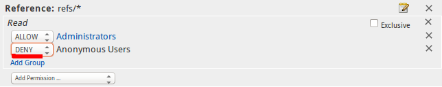
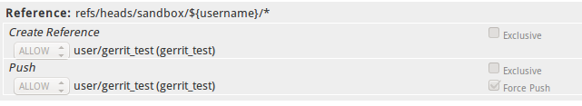
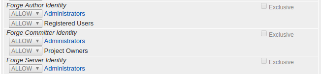
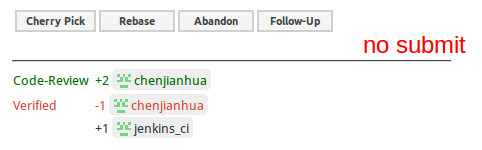
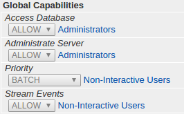

>Access controls in Gerrit are group based. Every user account is a member of one or more groups, and access and privileges are granted to those groups. Access rights cannot be granted to individual users.

在gerrit中权限控制是基于群组的. 每个用户有一个或者多个群组, 访问权限被赋予这些群组.访问权限不能赋予个人用户.
### 1.System Groups
在`Gerrit系统`自带下面的群组

- Anonymous Users
- Change Owner
- Project Owners
- Registered Users

#### 1.1 Anonymous Users
所有用户都是`匿名用户`成员, 所有用户都能继承`Anonymous Users`所有访问权限.
当前只有`Read access`权限值得赋予给`Anonymous Users`群组, 因为其他权限都需要认证.


#### 1.2 Project Owners
`Project Owners`的访问权限在`Project`范围内有效


#### 1.3 Change Owner
`Change Owner`的访问权限在`Change`范围内有效
#### 1.4 Registered Users
所有在页面上登录成功的用户都会自动注册为gerrit用户，属于`Registered Users`群组
`Registered Users`群组通常被赋予`Code-Review -1..+1`权限, 允许给需要审查代码投票, 但不会引起审查被批准和拒绝


### 2.1 Predefined Groups
`system groups`在Gerrit系统内部就定义好了, 而普通群组信息被保存在`ACCOUNT_GROUPS`表中,`Predefined groups`群组信息也保存在`ACCOUNT_GROUPS`表中. 
`Predefined groups`群组在Gerrit初始化时创建并且拥有唯一的`UUID`值
`All-Projects -> meta/config -> groups`文件内容
```
# UUID                                  	Group Name
#
5210215f92225c45a5ad123016c8706336f55a7d	Administrators
df9b717d413c614cb51e39525619b311f077ec15	Non-Interactive Users
global:Anonymous-Users                  	Anonymous Users
global:Project-Owners                   	Project Owners
global:Registered-Users                 	Registered Users
```
#### 2.2 `Gerrit`自带两个`predefined groups`:

- Administrators
- Non-Interactive Users


#### 2.2.1 Administrators
`Administrators`是`Gerrit root`角色, 在Gerrit初始化时`Administrate Server`权限被赋予给这个`Predefined Groups`群组.
在`Administrators`组的成员可以管理所有项目, 但是不意味着任何其他权限. `Administrators`组不会自动获得代码审查批准和提交权限.
#### 2.2.2 Non-Interactive Users
`Interactive Users`比如在web页面上审查代码, 在提交/获取代码的用户

`Non-Interactive Users`是可以通过Gerrit接口进行操作的组, 在Gerrit初始化时`Priority BATCH`和`Stream Events`权限被赋予给这个`Predefined Groups`组.

`Non-Interactive Users`和`Interactive Users`使用不同的线程池, 防止交互式用户抢占线程. 当系统资源紧张时确保了交互式的用户可以继续工作.
### 3. Project Access Control Lists
####  3.1 All Projects
在`All Projects`项目中的访问权限会自动被其他项目继承, 只有`Administrate Server capability`能够编辑`All-Projects`权限.

####  3.2 Per-Project
先计算子项目的访问权限, 再计算`All Projects`的访问权限, 允许一些权限可以被覆盖.
对一个群组赋予`DENY`限制时, 通常只对`READ`权限有效.


### 4. Special and magic references
` refs/heads/*`和`refs/tags/*`是Git常用的引用命名空间, 一个用来存储分支一个用来标签
在`refs/*`命名空间下的引用都是有效的,Gerrit在`refs/*`有一些特殊用处的命名空间和引用
#### 4.1 Special references
这些特殊的引用的内容由Gerrit生成或者包含重要的项目配置信息
```
refs/changes/*          #用于存储审查的补丁
#获取某个补丁集需要审查序号和补丁集序号
#'refs/changes/'<last two digits of change number>/ <change number>/ <patch set number>
refs/meta/config        #项目配置的分支
refs/meta/dashboards/*　　#
refs/notes/review       #保存代码审查信息的分支
```
#### 4.2 Magic references
```
refs/for/<branch ref>  #进行代码审查时需要提交代码到这个命名空间
refs/publish/*         #和refs/for/*命名空间作用一样
refs/drafts/*          #用于草案代码审查,和refs/for/*的区别在于只有部分人可见
```
#### 4.3 添加新的补丁
```
#审查者对代码进行修改, 审查的代码是修改后的补丁
git fetch ssh://admin@localhost:29418/gerrit_ci refs/changes/03/3/1
git branch fix_xxx FETCH_HEAD && git checkout fix_xxx
vi README
git add README
git commit --amend
git push origin HEAD:refs/for/master
```
#### 4.4 查看远程引用
```
git ls-remote ssh://admin@localhost:29418/gerrit_ci
61fd289472707d79f73289216a4c5f0ca4cee4e1	HEAD
eeaef9da4ea27d7c23bfb5f9a2ed1b5357ebbba8	refs/changes/01/1/1
5f8ed98b0f88787c22e705595e2818db62874f56	refs/changes/02/2/1
bfdb700f4aab3afc32ec79a29b0e25f8be758f8f	refs/changes/03/3/1
effa7b004eec0b85e722fe10be6468e4ed9b78d3	refs/changes/03/3/2
61fd289472707d79f73289216a4c5f0ca4cee4e1	refs/heads/master
9f282c08d5108c6817dd1504e8bec0e94ba59d47	refs/meta/config
405030285eed7406b1ac7cfa6a5211331165b8e2	refs/notes/review
```
#### 4.5 修改项目配置文件
```
git clone ssh://admin@localhost:29418/All-Projects && scp -p -P 29418 admin@localhost:hooks/commit-msg All-Projects/.git/hooks/

#refs/meta/config 是All-Projects的引用
git fetch origin refs/meta/config:refs/remotes/origin/meta/config
git checkout meta/config
#现在目录下有groups  project.config两个文件
#提交修改
git add .
git commit -m "modify config"
git push origin meta/config:meta/config
```
### 5. Access Categories
#### 5.1 Abandon 
代码审查时允许用户丢弃这个审查。如果对`change`有`push`权限，同时具有`push`,`abandon`,`restore`权限
#### 5.2 Create Reference
用户可以创建新的`references`, `branches or tags`, 创建时引用必须不存在，不能删除已经创建的引用
 如果仅仅推送标签,给`refs/tags/*`赋予`Create Reference `权限
 这个权限通常用在创建某个命名空间下的分支, 如:某个部门自由创建分支权限`refs/heads/hello/*`
 给某用户自由创建分支权限, 给`refs/heads/sandbox/${username}/*`赋予`Create Reference `权限
如果你这样赋予`Create Reference `权限，记得同时赋予`push force`权限, 这样拥有清理


#### 5.3 Forge Author && Forge Committer && Forge Server
查看提交中`Author`和`Committer`
```
git log --format=full
commit 2dfae738781a3ba641ee06c913fd51162335a941
Author: admin <c2290910211@163.com>
Commit: gerrit_test <c2290910211@aliyun.com>

    admin gerrit_test
    
    Change-Id: I0830cf061306101e977f9adf55270c9b3a3f59c4
```

- `Author`一般表示谁创建了这个提交，也可以用`git commit --amend --reset-author`等命令修改
- `Committer`一般表示谁修改了这个提交，在使用`git commit --amend`等命令时修改
通常Gerrit需要在`Author`和提交的`Committer`认证信息中至少一个，与`uploading user`注册过的邮箱地址匹配，`Forge Author`和` Forge Committer`允许用户绕过提交时的身份验证
- `Forge Author`允许提交中`Author`信息不经过验证, 这个权限在下面场景非常有效，通过邮件接收第三方补丁，`cherry-pick`其他人的分支提交，审查合并前修改其他人的一些次要问题.
默认在`All-Projects`赋予`Registered Users `组`Forge Author`权限.
- `Forge Committer`允许提交中`Committer`信息不经过验证和不验证匿名标签对象，通常在需要其他服务器自动提交时有用
- `Forge Server`允许在提交中`Committer`信息使用`Server`的用户名和邮箱. 这个权限在强制推送`git filter-branch`修改过信息的提交和由这个`Gerrit Code Review server`创建的合并提交时有用.
在`etc/gerrit.config`可以配置`Server`的用户名和邮箱，`user.name`默认值`Gerrit Code Review`, `user.email`默认值在启动时生成`gerrit@hostname`


#### 5.4 Owner
允许修改项目以下配置:

- 改变项目描述
- 通过SSH创建新的分支
- 通过Web界面创建和删除分支
- 赋予和撤销任何访问权限,包括`Owner`权限

子命名空间的所有权可以通过命名空间格式来委派. 要委派以`qa/`开始的所有分支权限给QA群组，给`refs/heads/qa/*`添加`Owner`权限。
QA小组的成员可以进一步细分访问权限，但只能对`refs/heads/qa/`开始的分支有效.
#### 6. Gerrit权限
#### 6.1 Push
这类分支控制用户如何上传提交到Gerrit. 根据命名空间赋予的`Push`权限, 可以允许绕过代码审查直接推送到分支, 也可以允许创建新的`change`进行代码审查.
#### 6.2.1 Direct Push
在`Direct Push`权限下,任何已经存在的分支都接收`fast-forward`提交，创建新的分支需要`Create Reference`权限. 删除已经存在的分支会被拒绝,因为在这个最安全的模式下, 提交不会被丢弃.
##### 6.2.2 Force选项
允许分支被删除. 由于`force push`实际上删除分支后会创建这个分支,但是这是个原子操作并且会被记录,也允许`force push`更新分支. 带有`force`选项会导致项目历史中的提交被丢弃.
`force`选项对只想使用Gerrit访问权限功能而不需要代码审查的项目有效, 对于需要进行代码审查的项目不应该分配这个权限.
#### 6.3 Upload To Code Review
`Upload To Code Review`权限授权在`refs/for/refs/heads/BRANCH`命名空间上,允许用户上传`non-merge`提交到`refs/for/BRANCH`命名空间,创建新的`change`进行代码审查.
用户在自己环境下提交代码需要`clone/fetch`项目代码，所以必须赋予`Read`权限
对于开源公开的Gerrit安装方式,`All-Projects`中`refs/for/refs/heads/*`通常给`Registered Users`赋予`Read`和`Push`权限. 很多私有安装, 通常`refs/for/refs/heads/*`通常给`all users`简单的赋予`Read`和`Push`权限.
`force`选项赋予`refs/for/refs/heads/*`命名空间没有作用.
#### 6.4 Push Merge Commits
`Push Merge Commits`权限允许用户上传`merge commits`.这是`Push`附加的访问权限,所以只赋予`Push Merge Commits`权限是不够的. 一些项目希望只能由Gerrit自动合并提交,　可以通过只赋予`Push`权限而不赋予`Push Merge Commit`权限. 
赋予`Push Merge Commit`权限通常必须以`refs/for/`为前缀,例如`refs/for/refs/heads/BRANCH`. `refs/heads/BRANCH`作为补充, 赋予`Read`权限后允许直接推送`non-merge`提交，赋予`Push Merge Commit`权限后也允许直接提交一个`merge`提交.
#### 6.5 Push Annotated Tag
允许推送`带注释的标签`到远程仓库, 标签必须带有`注释`.
```
#创建带注释的标签
git tag -a <tagname> -m <comment>
#提交标签到远程仓库
git push origin --tags
#获取标签
git fetch --tags
```
标签的`email`一定会与提交者的邮箱进行验证，如果推送其他人的标签需要同时赋予`Push Annotated Tag`和`Forge Committer Identity`权限.
```
git show v1.0
tag v1.0
Tagger: username <email>
```
如果需要推送`轻量级标签`(`不带注释`), 给`refs/tags/*`命名空间赋予` Create Reference`权限, 轻量级标签就像Git中的分支一样.

如果需要删除或者重写标签, 给`refs/tags/*`命名空间赋予`带force选项的Push`权限,删除标签需要和删除分支一样的权限.

#### 6.6 Push Signed Tag
允许推送`PGP签证`的标签到远程仓库
```
git tag -u "gpg-key-id" -m "tag comment" <tagname>
```
#### 6.7 Read
`Read`权限控制查看项目的`change`,`comment`,`code diff`和通过SSH或者HTTP协议访问仓库的权限
这个权限非常特殊, 先计算项目中的`Read`权限, 再计算`all-projects`的`Read`权限.
如果项目中赋予`DENY Read`权限,`all-projects`项目不管是否赋予`ALLOW READ`都将无效.这个权限对于隐藏一些项目非常有用.
#### 6.8 Rebase
允许用户在web页面上进行`rebase changes`, `change`作者和提交者可以通过页面进行`rebase changes`(尽管没有赋予`Rebase`权限)
#### 6.9 Remove Reviewer
允许用户从审查者列表中移除其他用户.
`Change owners`能够移除那些审查分数为0或者负数的审查者.(尽管没有赋予`Remove Reviewer`权限)
`Project owners`和`site administrators`能够移除任何审查者(尽管没有赋予`Remove Reviewer`权限)
其他用户只能将他们自己从审查者列表中移除.
#### 6.10 Review Labels
在项目中配置`label My-Name`,`label My-Name`和定义好的范围分数相关联. 同时也关联`labelAs-My-Name`权限, 可以允许编辑用户定义的`label`.
Gerrit带有配置好的`Code-Review`标签
```
[access "refs/heads/*"]
	label-Code-Review = -2..+2 group Administrators
	label-Code-Review = -2..+2 group Project Owners
	label-Code-Review = -1..+1 group Registered Users
[label "Code-Review"]
	function = MaxWithBlock
	defaultValue = 0
	copyMinScore = true
	copyAllScoresOnTrivialRebase = true
	value = -2 This shall not be merged
	value = -1 I would prefer this is not merged as is
	value =  0 No score
	value = +1 Looks good to me, but someone else must approve
	value = +2 Looks good to me, approved
```
#### 6.11 Submit
允许用户提交审查通过的提交. 提交审查代码后会合并到对应的分支上.
> The label that the reviewer selects determines what can happen next. The +1 and -1 level are just an opinion where as the +2 and -2 levels are allowing or blocking the change. In order for a change to be accepted it must have at least one +2 and no -2 votes. Although these are numeric values, they in no way accumulate; two +1s do not equate to a +2.

`Code-Review`标签`+2`是通过,`-2`是否定, `-1~+1`只是代表意见并不会影响投票,
 审查被通过至少需要一个`+2`投票并且没有`-2`投票. 两个`+1`并不会等于`+2`


```
[access "refs/heads/*"]
	submit = group Administrators
	submit = group Project Owners
```

#### 6.12 View Drafts
允许用户查看其他人提交的`draft changes`.
`draft changes`作者和添加为审查者都能看见`draft changes`(尽管没有赋予`View Drafts`权限)
#### 6.13 Publish Drafts
允许用户公开其他人提交的`draft changes`.
`draft changes`作者可以公开`draft changes`(尽管没有赋予`Publish Drafts`权限)
#### 6.14 Delete Drafts
允许用户删除其他人提交的`draft changes`.
`draft changes`作者可以删除`draft changes`(尽管没有赋予`Delete Drafts`权限)
#### 6.15 Edit Topic Name
允许修改`change`的主题`topic`
` change owner, branch owners, project owners, and site administrators`可以修改主题(尽管没有赋予`Edit Topic Name`权限)

### 7.1 Enforcing site wide access policies
通过赋予一个群组`Owner`访问权限在`refs/*`命名空间, Gerrit管理员可以委派这个项目的访问控制权限给这个群组.
如果需要没有一个人能更新或者删除标签, 连项目`owners`都没有权限. `ALLOW`和`DENY`规则并不能达到这样的目的, 因为项目`owners`可以赋予任何他们自己想要的访问权限. 覆盖任何从`All-Projects`或者其他父项目继承的权限是非常有效的方法.
在父项目中`BLOCK`权限,  使得就算是子项目`owners`也不能设置`block`权限为`ALLOW`. 尽管这样, 也应该保留`owners`所有`non-blocked`权限.

- Gerrit管理员能够集中精力管理`site wide`策略并且提供有意义的默认访问权限.
- 在不违反`site wide`策略的情况下, 项目`owners`可以管理他们自己项目的访问权限.
#### 7.2 'BLOCK' access rule
`BLOCK`规则是全局范围的权限. 子项目不能重载继承的`BLOCK`规则. 从父项目链表中搜索`BLOCK`规则, 忽略在访问区域中的独占(`Exclusive`)标志.
`push`权限赋予`BLOCK`规则, `push`和`force　push`等推送都将被阻塞. `force push`权限赋予`BLOCK`规则只有`force push`被阻塞, 但是如果`push`权限具有`ALLOW`规则的话可以进行`non-forced`提交.
`BLOCK`也可以赋予`label`投票范围. 下面的配置可以阻塞`group X`投`+2`和`-2`票，仍然可以投`-1 ~ +1`的票.
```
[access "refs/heads/*"]
  label-Code-Review = block -2..+2 group X
```
在这个阻塞规则`min..max`范围的目的是: 阻塞`-INFINITE..min`和`max..INFINITE`投票,也意味着`-1..+1`投票范围不受阻塞影响.
#### 7.3 BLOCK' and 'ALLOW' rules in the same access section
当相同访问区域同时包含`BLOCK`和`ALLOW`规则, `ALLOW`规则会重载`BLOCK`规则.
```
[access "refs/heads/*"]
  push = block group X
  push = group Y
```
如果群组`X`和群组`Y`都包含了同一个用户, 这个用户依然能够`push`到`refs/heads/*`命名空间.
在同一个项目的同一个访问区域,ALLOW`规则才会重载`BLOCK`规则.在同一个项目不同访问区域和子项目的同一个访问区域, ALLOW`规则不会重载`BLOCK`规则.
#### 7.4 `BLOCK`规则示例
####确保没有人能够更新或者删除tag
在`All-Projects`中阻塞`Anonymous Users`组的`push`权限
```
[access "refs/tags/*"]
  push = block group Anonymous Users
```
由于所有人都是`Anonymous Users`组成员, 所以可以阻塞所有人.
可能项目`owner`需要创建`tag`权限
```
[access "refs/tags/*"]
	push = block group Anonymous Users
	pushTag = group Project Owners
	pushSignedTag = group Project Owners
```
#### 7.5 某个命名空间只让一个特殊的群组投票
假设提交到发布分支`Release-Process`需要更为严格的过程, 假设我们需要确信只有`Release Engineers`群组可以投票，就算是项目`owner`权限也不可以投票.  在`All-Projects`我们定义下面的规则.
```
[access "refs/heads/stable*"]
	label-Release-Process = block -1..+1 group Anonymous Users
	label-Release-Process = -1..+1 group Release Engineers
```
### 8.1 Global Capabilities

#### 8.2 Access Database
允许用户通过`gsql`命令访问数据库, 以及包含代码审查信息的分支`refs/notes/review`
#### 8.3 Administrate Server
影响Gerrit中`owner`和`administrator`角色. 赋予`administrateServer`能力能够赋予任何群组访问权限.
#### 8.4 Priority
Gerrit中有两类线程池用来给`INTERACTIVE Users`和`Non-Interactive Users`使用，防止抢占线程.
允许其他用户使用`Non-Interactive Users`的保留线程池.

- 默认配置, 用户默认使用`INTERACTIVE`线程池
- BATCH, 赋予这个群组的用户使用独立的`Non-Interactive`线程池
- INTERACTIVE, 除非用户赋予了`BATCH`选项，否则使用`INTERACTIVE`线程池

#### 8.5 Stream Events 允许执行Gerrit触发的事件流.
获取`All-Projects`中`refs/meta/config`分支并修改权限配置
```
git clone ssh://admin@localhost:29418/All-Projects && scp -p -P 29418 admin@localhost:hooks/commit-msg All-Projects/.git/hooks/

#refs/meta/config 是All-Projects的引用
git fetch origin refs/meta/config:refs/remotes/origin/meta/config
git checkout meta/config
#现在目录下有groups  project.config两个文件
#groups文件包含project.config中需要的用户组和对应的UUID

#提交修改
git add .
git commit -m "modify config"
git push origin meta/config:meta/config
```
#### 在公司文档看到大神写的很不错的一小段话
> code review的目的是团队成员在一起共同学习，而不是相互"挑错".将code review称为`代码回顾`好一些, 如果大家放弃"挑错"来共同学习,那么代码回顾中学习什么呢?
> 代码回顾的学习重点是团队成员共同识别模式，这里的模式是指程序员编写代码的习惯,包括"好模式"和"反模式". 像富有表达力的命名, 单一职责的方法, 良好的格式缩进等,都是"好模式". 团队成员通过阅读最近编写的测试代码和生产代码来识别"好模式"和"反模式".既是团队成员之间相互学习的过程, 也是团队整体达成整洁代码共识的过程.
### 参照

- [http://localhost:8090/Documentation/error-invalid-committer.html](http://localhost:8090/Documentation/error--invalid-committer.html)
- [https://github.com/lovexiaov/blogs/blob/master/source/_posts/Gerrit-Access-Control.md](https://github.com/lovexiaov/blogs/blob/master/source/_posts/Gerrit-Access-Control.md)
- [Cannot push tags in Git](http://stackoverflow.com/questions/16465275/cannot-push-tags-in-git)
- [Gerrit configuration](http://stackoverflow.com/questions/11723605/gerrit-configuration/11726529#11726529)
