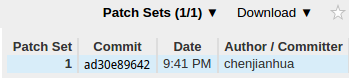
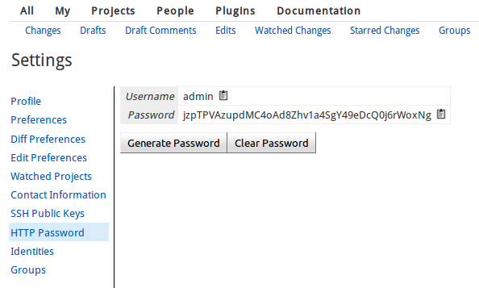
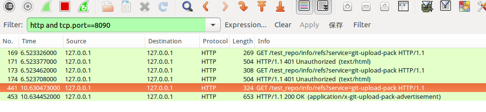
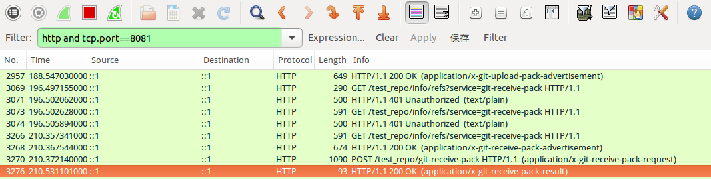
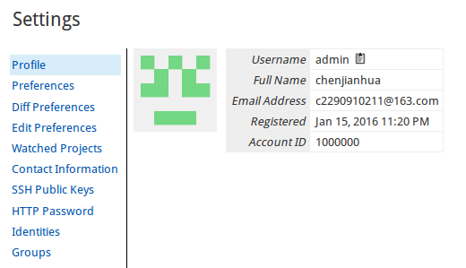
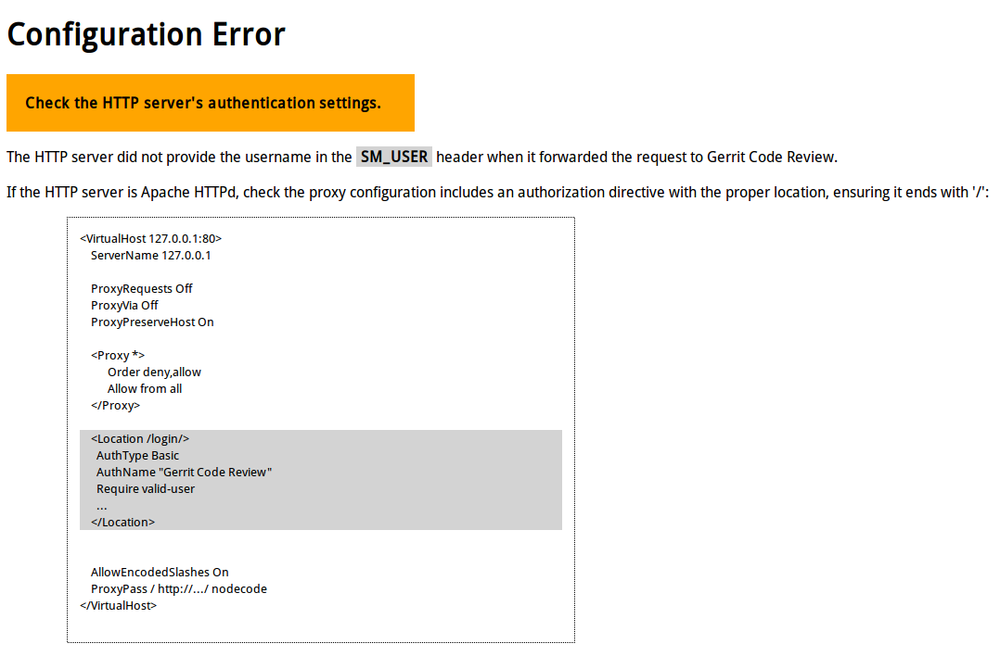

### 1. [download-commands插件配置](http://localhost:8090/Documentation/config-plugins.html)
```
[download]               
  scheme = ssh
  scheme = http　　　　　 #认证http下载
  scheme = anon_http   　#匿名http下载
  scheme = anon_git
  scheme = repo_download
```
If download.scheme is not specified, SSH, HTTP and Anonymous HTTP downloads are allowed.
### 2. reviewnotes插件
Stores review information for Gerrit changes in the refs/notes/review branch.
存储仓库审查信息在refs/notes/review分支中
```
git fetch origin refs/notes/review:refs/remotes/origin/notes/review
git checkout notes/review
git log  #查看审查记录
```
### 3. singleusergroup插件
This plugin provides a group per user. This is useful to assign access rights directly to a single user, since in Gerrit access rights can only be assigned to groups.
#### 3.1 [refs/meta/config分支](http://localhost:8090/Documentation/access-control.html#_all_projects)
任何项目默认继承All-Projects权限,refs/meta/config是项目管理访问控制分支
```
git clone ssh://admin@localhost:29418/All-Projects && scp -p -P 29418 admin@localhost:hooks/commit-msg All-Projects/.git/hooks/

#refs/meta/config 是All-Projects的引用
git fetch origin refs/meta/config:refs/remotes/origin/meta/config
git checkout meta/config
#现在目录下有groups  project.config两个文件
#groups文件包含project.config中需要的用户组和对应的UUID

#提交修改
git add .
git commit -m "modify config"
git push origin meta/config:meta/config
```
### 4. [命令行工具](http://localhost:8090/Documentation/config-plugins.html)
```
ssh -p 29418 admin@localhost gerrit --help
apropos              Search in Gerrit documentation
ban-commit           Ban a commit from a project's repository
close-connection     Close the specified SSH connection
create-account       Create a new batch/role account
create-branch        Create a new branch
create-group         Create a new account group
create-project       Create a new project and associated Git repository
flush-caches         Flush some/all server caches from memory
gc                   Run Git garbage collection
gsql                 Administrative interface to active database
index                
logging              
ls-groups            List groups visible to the caller
ls-members           List the members of a given group
ls-projects          List projects visible to the caller
ls-user-refs         List refs visible to a specific user
plugin               
query                Query the change database
receive-pack         Standard Git server side command for client side git push
rename-group         Rename an account group
review               Apply reviews to one or more patch sets
set-account          Change an account's settings
set-head             Change HEAD reference for a project
set-members          Modify members of specific group or number of groups
set-project          Change a project's settings
set-project-parent   Change the project permissions are inherited from
set-reviewers        Add or remove reviewers on a change
show-caches          Display current cache statistics
show-connections     Display active client SSH connections
show-queue           Display the background work queues
stream-events        Monitor events occurring in real time
test-submit          
version              Display gerrit version

#查看各个命令帮助
ssh -p 29418 admin@localhost gerrit <command> --help

#查看缓存
ssh -p 29418 admin@localhost gerrit show-caches 
#在一些项目/用户权限修改时，清除缓存
ssh -p 29418 admin@localhost gerrit flush-caches --all

#通过gerrit登录数据库
ssh -p 29418 admin@localhost gerrit gsql
fatal: admin does not have "Access Database" capability.
#修改All-Projects的refs/meta/config分支下project.config文件
[capability]
       accessDatabase = group Administrators

#查看可见的群组
ssh -p 29418 admin@localhost gerrit ls-groups 
#创建新的项目,--owner需要的群组必须要在Gerrit已经定义好的
ssh -p 29418 admin@localhost gerrit create-project "test/helloworld" --description "'Tools used by build system'" --owner "user/admin" --parent "All-Projects"
#修改项目配置
ssh -p 29418 admin@localhost gerrit set-project "repo_name" --project-state ACTIVE --submit-type FAST_FORWARD_ONLY
#设置继承项目
ssh -p 29418 admin@localhost gerrit set-project-parent "repo_name" --parent "parent_repo"
#自动审查打分
ssh -p 29418 admin@localhost gerrit review {COMMITID | CHANGEID,PATCHSET} --verified +1 --code-review +1 --message "review from ssh"
```



可以是`COMMITID格式`:`ad30e89642`,也可以是`CHANGEID,PATCHSET格式`:`12,1`
### 5. [Searching Changes](http://localhost:8090/Documentation/user-search.html)
Searching Changes 可以通过搜索栏搜索，也可以通过ssh命令行搜索


|Description	|Default Query|
|----|----|
|All > Open | status:open '(or is:open)'|
|All > Merged | status:merged|
|All > Abandoned | status:abandoned|
|My > Drafts | owner:self is:draft|
|My > Watched Changes | status:open is:watched| 
| My > Starred Changes | is:starred |
| My > Draft Comments | has:draft |
| Open changes in Foo| status:open project:Foo |
```
#查看myProject项目status:open状态的补丁
ssh -p 29418 admin@localhost gerrit query --format=JSON status:open project:myProject limit:2
```
#### 6. gerrit配置认证方式为HTTP，`认证过程由代理服务器完成`，提交代码使用ssh协议更方便
配置认证方式为`ldap`, gerrit提示用户输入用户名和密码，
然后它通过对配置的ldap.server执行一个简单的绑定验证，`代理服务器不在参与认证过程`



如果使用http提交，修改远程的地址为gerrit监听地址，提交时输入生成的密码

```
git remote -v
git remote remove origin
git remote add origin http://admin@localhost:8081/myProject
```
#### 7.gerrit http的URL
```
#fetch
/test_repo/info/refs?service=git-upload-pack HTTP/1.1
#push
/test_repo/info/refs?service=git-receive-pack HTTP/1.1
```




### 8. 导入git仓库到gerrit
gerrit在启动或者清除缓存的时候会检测仓库路径的仓库
1. 如果导入的git仓库是gerrit bare仓，直接复制到gerrit仓库目录下，或者重新指定gerrit仓库路径
```
#复制bare仓到gerrit仓库路径
#更新缓存
ssh -p 29418 admin@localhost gerrit flush-caches --all
```
2. 如果导入的git仓库不是bare仓，在gerrit中新建一个project,不要做init commit,修改本地仓库远程地址后push到gerrit
```
ssh -p 29418 admin@localhost gerrit create-project tools/gerrit.git --description "'Tools used by build system'"
```
### 9. 下载更新正常，提交时出现下面错误
```
git push origin HEAD:refs/for/master
remote: Unauthorized
fatal: Authentication failed for 'http://chenjianhua@localhost:8090/test_repo/'

#直接向8081端口提交
git push http://chenjianhua@localhost:8090/test_repo/ HEAD:refs/for/master
Total 3 (delta 0), reused 0 (delta 0)
remote: Processing changes: new: 1, refs: 1, done    
remote: 
remote: New Changes:
remote:   http://localhost:8090/3 modify hello.c
remote: 
To http://chenjianhua@localhost:8081/test_repo/
 * [new branch]      HEAD -> refs/for/master
```
可以clone的原因是默认支持匿名下载，但是上传不可以.
估计跟代理服务器配置有关，改用haproxy代理了. 
### 10. [avatars/external插件][gerrit_ci]
```
#图片地址: https://avatars1.githubusercontent.com/u/3890847?v=3&s=140
#必须带有参数${user}
[plugin "avatars-external"]
	url = https://avatars1.githubusercontent.com/u/3890847?v=3&s=140&no_use=${user}
```





### 11.修改gerrit数据库
注册不了邮箱,只能手动添加邮箱进行测试了
```
#停止gerrit
./bin/gerrit.sh stop

java -jar bin/gerrit.war gsql
Type '\h' for help.  Type '\r' to clear the buffer.

gerrit> \h
General
  \q        quit

Informational
  \d        list all tables
  \d NAME   describe table
#查询账号信息
SELECT * FROM ACCOUNTS;
#更新邮箱
UPDATE ACCOUNTS SET PREFERRED_EMAIL='email' WHERE ACCOUNT_ID = '1000000';
UPDATE ACCOUNT_EXTERNAL_IDS SET EMAIL_ADDRESS='2290910211@qq.com' WHERE ACCOUNT_ID = '1000000';
```
### 12. 遇见的问题
#### 12.1. Cannot initialize schema
```
Exception in thread "main" com.google.gwtorm.server.OrmException: Cannot initialize schema
	at com.google.gerrit.server.schema.SchemaUpdater.update(SchemaUpdater.java:101)
	at com.google.gerrit.pgm.init.BaseInit$SiteRun.upgradeSchema(BaseInit.java:339)
	at com.google.gerrit.pgm.init.BaseInit.run(BaseInit.java:120)
```
输入的仓库目录中已经有了`All-Projects.git`,`All-Users.git`仓库

#### 12.2. not provide the username in the SM_USER header



安装时`Get username from custom HTTP header`选择`No`

### 参照

[gerrit_ci]:https://gerrit-ci.gerritforge.com/

- [https://gerrit-ci.gerritforge.com/][gerrit_ci]
- [https://gerrit.googlesource.com/](https://gerrit.googlesource.com/)
- [http://localhost:8090/Documentation/access-control.html#_all_projects](http://localhost:8090/Documentation/access-control.html#_all_projects)
- [RestAPI](http://localhost:8090/Documentation/rest-api.html)
- [dev-design](http://localhost:8090/Documentation/dev-design.html)
- [config-plugins](http://localhost:8090/Documentation/config-plugins.html)
- [http://blog.bruin.sg/2013/04/how-to-edit-the-project-config-for-all-projects-in-gerrit/](http://blog.bruin.sg/2013/04/how-to-edit-the-project-config-for-all-projects-in-gerrit/)
- [import-repository-from-git-to-gerrit](http://stackoverflow.com/questions/14789666/import-repository-from-git-to-gerrit)
