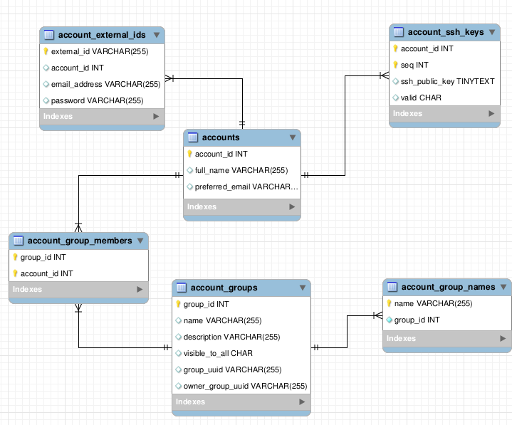

gerrit的数据库类型可以是mysql，postgresql和自带的H2数据库. 这里使用的是postgresql数据库.
### 连接数据库
```
#直接连postgresql
psql -U postgres -d postgres -h 127.0.0.1 -p 5432
#通过gerrit登录数据库
ssh -p 29418 admin@localhost gerrit gsql
fatal: admin does not have "Access Database" capability.
#修改All-Projects的refs/meta/config分支下project.config文件
[capability]
       accessDatabase = group Administrators
```
```
                    List of relations
 Schema |            Name             |   Type   | Owner  
--------+-----------------------------+----------+--------
 public | account_diff_preferences    | table    | gerrit
 public | account_external_ids        | table    | gerrit
 public | account_group_by_id         | table    | gerrit
 public | account_group_by_id_aud     | table    | gerrit
 public | account_group_id            | sequence | gerrit
 public | account_group_members       | table    | gerrit
 public | account_group_members_audit | table    | gerrit
 public | account_group_names         | table    | gerrit
 public | account_groups              | table    | gerrit
 public | account_id                  | sequence | gerrit
 public | account_patch_reviews       | table    | gerrit
 public | account_project_watches     | table    | gerrit
 public | account_ssh_keys            | table    | gerrit
 public | accounts                    | table    | gerrit
 public | change_id                   | sequence | gerrit
 public | change_message_id           | sequence | gerrit
 public | change_messages             | table    | gerrit
 public | changes                     | table    | gerrit
 public | patch_comments              | table    | gerrit
 public | patch_set_ancestors         | table    | gerrit
 public | patch_set_approvals         | table    | gerrit
 public | patch_sets                  | table    | gerrit
 public | schema_version              | table    | gerrit
 public | starred_changes             | table    | gerrit
 public | submodule_subscriptions     | table    | gerrit
 public | system_config               | table    | gerrit
```
```
#gerrit数据库表表名命名的很好,
accounts和account_groups分别存储用户信息和分组信息,主键分别为account_id和qroup_id
account_group_members存储群组成员, 外键为account_id和qroup_id
account_group_names表存储群组名字, 主键为name, 外键为qroup_id
account_ssh_keys表存储用户SSH公钥, 外键为account_id
account_external_ids表存储用户敏感信息, 主键为external_id, 外键为account_id
schema_version主要存储gerrit schema版本号
system_config主要存储site_path，如/home/gerrit/review_site
＃schema_version和system_config在多个gerrit共享数据库时需要注意
```
```
SELECT * FROM account_external_ids;
 account_id |    email_address    | password |        external_id         
------------+---------------------+----------+----------------------------
    1000000 |                     |          | gerrit:admin
    1000000 |                     |          | username:admin
    1000001 |                     |          | gerrit:jenkins
    1000001 |                     |          | username:jenkins
    1000001 | my_email@qq.com     |          | mailto:my_email@qq.com
    1000000 | my_email@163.com     |          | mailto:my_email@163.com
```
```
account_external_ids表中主键为external_id
gerrit:<username>　#This is the username to sign in into the Gerrit WebUI.
#用于web页面登录
username:<username> #This is the username used for the SSH authentication.
#用于fetch/push代码, SSH认证由用户保存的公钥验证，所以不需要密码
mailto:<email>
#Scheme used to represent only an email address
#格式用于存储email地址
#如果配置认证方式为ldap, gerrit提示用户输入用户名和密码，然后它通过对配置的ldap.server执行一个简单的绑定验证，这个时候gerrit不需要存储密码
#如果配置认证方式为HTTP, 使用gerrit最方便的协议是SSH,如果使用HTTP协议，需要Settings -> HTTP Password生成认证密码，提交代码时不通过代理服务器，直接连接监听地址

#密码保存在external_id格式为username:<username>的记录下
#所以external_id格式为username:<username>用于提交代码时HTTP和SSH认证
```

### 验证
```
#配置禁止匿名下载
All-Projects/Project -> refs/* ->read权限的Anonymous Users用户组
#删除username:admin记录
delete from account_external_ids where external_id='username:admin';
#由于gerrit缓存了用户信息, 所以这个时候还可以通过SSH清除缓存
ssh -p 29418 admin@localhost gerrit flush-caches --all
#web页面依然可以登录，username有关的信息没有了,下面两种方式都不能够下载
git clone ssh://admin@localhost:29418/repo_name
git clone http://admin@localhost:8081/repo_name
#恢复username:admin记录
insert into account_external_ids (account_id,external_id) values (1000000, 'username:admin');
#admin账号不能从SSH登录，也就不能清除缓存了, 重启gerrit.

#删除gerrit:admin记录,在隐身的浏览器中确实打不开
```
### 参照

- [What is external_id in account_external_ids?](https://groups.google.com/forum/#!topic/repo-discuss/b_enE_dXrOI)
