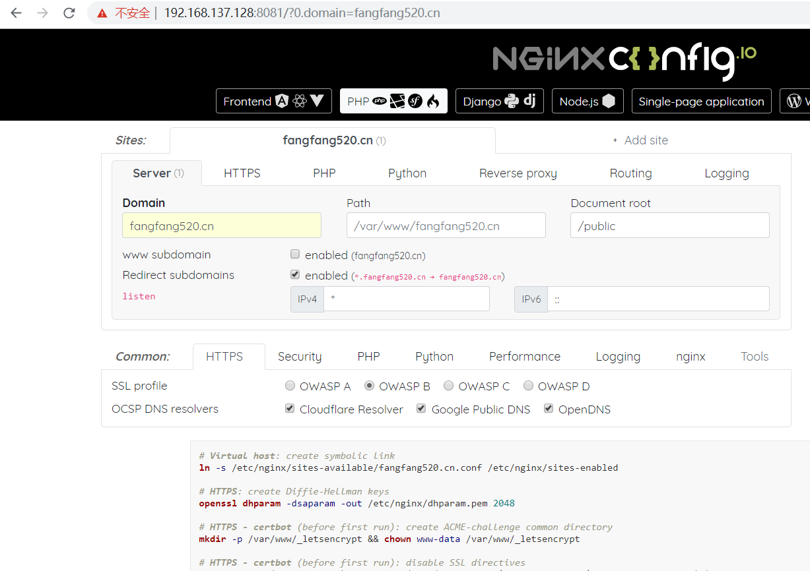

#### [nginxconfig.io](https://github.com/valentinxxx/nginxconfig.io)
`nginxconfig.io`是`nginx`配置生成器

#### 安装nodejs
```
yum install nodejs
npm install -g cnpm --registry=https://registry.npm.taobao.org
```
#### npm依赖包下载
```
git clone --depth 1 https://github.com/valentinxxx/nginxconfig.io.git
cnpm install
```
#### 启动服务
```
[root@dockerMaster nginxconfig.io]# npm start

> nginxconfig.io@1.0.0 start /root/nginxconfig.io
> npm run build && http-server


> nginxconfig.io@1.0.0 build /root/nginxconfig.io
> npm run build:scss


> nginxconfig.io@1.0.0 build:scss /root/nginxconfig.io
> node-sass --source-map=public/assets/css/app.min.css.map resources/scss/app.scss public/assets/css/app.min.css

Rendering Complete, saving .css file...
Wrote CSS to /root/nginxconfig.io/public/assets/css/app.min.css
Wrote Source Map to /root/nginxconfig.io/public/assets/css/app.min.css.map
Starting up http-server, serving ./public
Available on:
  http://127.0.0.1:8081
  http://192.168.137.128:8081
  http://172.17.0.1:8081
Hit CTRL-C to stop the server
```

