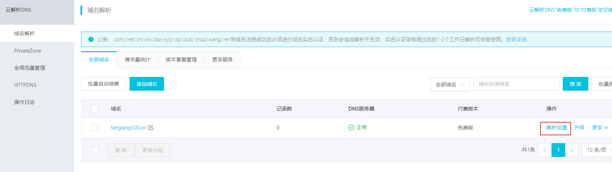
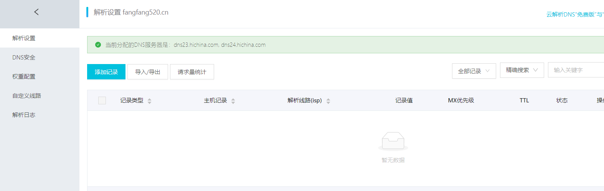
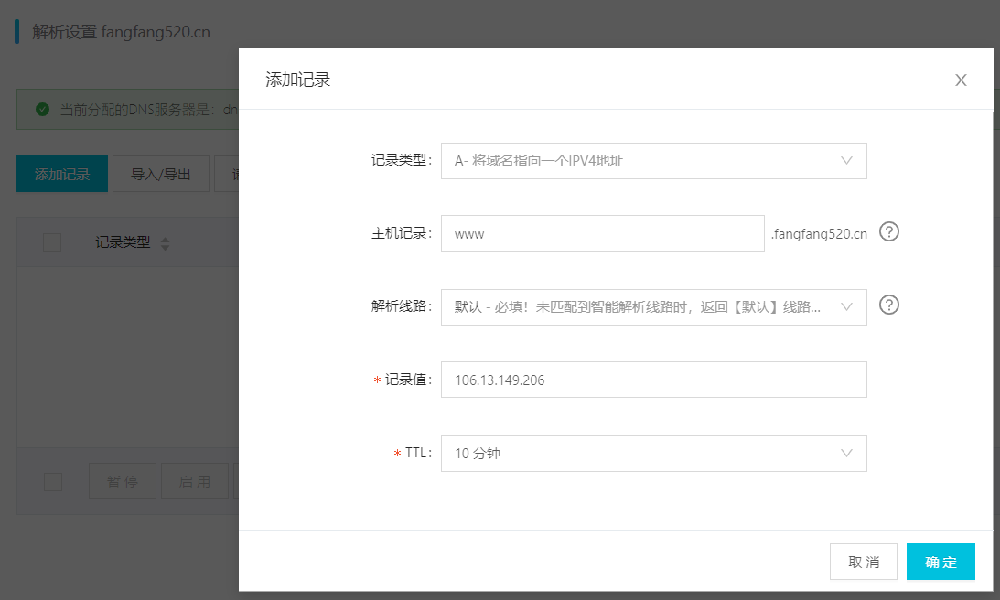
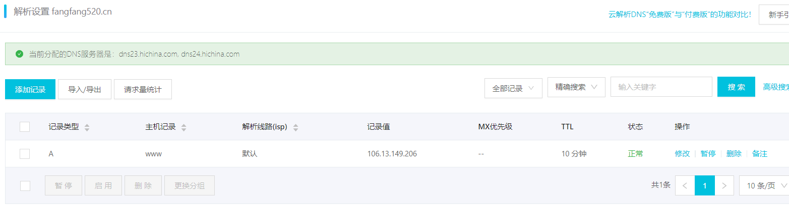
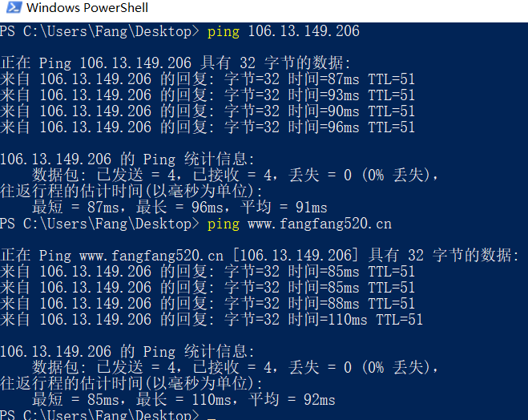

#### 1. 环境
- 公网云服务器IP: 106.13.149.206
- 域名: fangfang520.cn

#### 2. 解析设置

#### 3. 添加记录
主机记录就是域名前缀，常见用法有：
- www：解析后的域名为www.aliyun.com。
- @：直接解析主域名 aliyun.com。
- *：泛解析，匹配其他所有域名 *.aliyun.com。
- mail：将域名解析为mail.aliyun.com，通常用于解析邮箱服务器。
- 二级域名：如：abc.aliyun.com，填写abc。
- 手机网站：如：m.aliyun.com，填写m。

#### 4. 查看记录

#### 5. 本地ping

