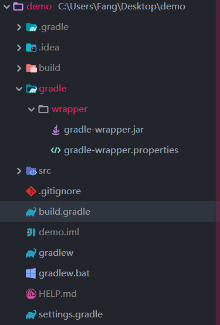

# Gradle

## 参考

- [https://gradle.org/](https://gradle.org/)
- [https://github.com/gradle/gradle](https://github.com/gradle/gradle)
- [gradle_wrapper](https://docs.gradle.org/current/userguide/gradle_wrapper.html)
- [gradle guide](https://docs.gradle.org/current/userguide/userguide_single.html)
- [spring gradle-plugin](https://docs.spring.io/spring-boot/docs/current/gradle-plugin/reference/html/)

## 1. Gradle 简介


> Accelerate developer productivity

官网上可以看到 gradle 设计目标是提升开发者效率

## 2. Gradle 安装

java 环境需要 JDK/JRE 版本 1.8 或者以上

```bash
$ java -version
java version "1.8.0_191"
```

在官网上下载安装包[gradle](https://gradle.org/install/)
加入到环境变量中

```bash
export gradle_HOME=/usr/local/gradle-5.4.1
export PATH=$PATH:$gradle_HOME\bin
```

```bash
$ gradle -v

Welcome to Gradle 5.4.1!
```

windows需要`windows + R`启动命令行或者重启

### 3.1 Hello world

你可以通过在命令行运行`gradle`命令来执行构建，
`gradle`命令会从当前目录下寻找`build.gradle`文件来执行构建。
我们称`build.gradle`文件为构建脚本。

编辑`build.gradle`文件

```bash
task hello {
    doLast {
        println 'Hello world!'
    }
}
```

### 3.2 [添加依赖任务](https://docs.gradle.org/current/userguide/userguide_single.html#tutorial_using_tasks)

```bash
task taskX {
    dependsOn 'taskY'
    doLast {
        println 'taskX'
    }
}
task taskY {
    doLast {
        println 'taskY'
    }
}
```

```bash
$ gradle -q taskX
taskY
taskX
```

### 3.3 构建脚本添加依赖

```bash
import org.apache.commons.codec.binary.Base64

buildscript {
    repositories {
        mavenCentral()
    }
    dependencies {
        classpath group: 'commons-codec', name: 'commons-codec', version: '1.2'
    }
}

task encode {
    doLast {
        def byte[] encodedString = new Base64().encode('hello world\n'.getBytes())
        println new String(encodedString)
    }
}
```

```bash
$ gradle -q encode
aGVsbG8gd29ybGQK
```

## 4. 常用插件

### 4.1.1 [Java 插件](https://docs.gradle.org/current/userguide/userguide_single.html#java_plugin)

```bash
plugins {
    id 'java'
}

sourceCompatibility = '1.8'
targetCompatibility = '1.8'
version = '1.2.1'
```

### 4.1.2 Java 插件中的任务

| 任务名称             | 依赖的任务                            | 说明                                                                                                   |
| -------------------- | ------------------------------------- | ------------------------------------------------------------------------------------------------------ |
| compileJava          |                                       | Compiles production Java source files using the JDK compiler.                                          |
| processResources     |                                       | Copies production resources into the production resources directory.                                   |
| classes              | compileJava, processResources         | This is an aggregate task that just depends on other tasks.                                            |
| compileTestJava      | classes                               | Compiles test Java source files using the JDK compiler.                                                |
| processTestResources |                                       | Copies test resources into the test resources directory.                                               |
| testClasses          | compileTestJava, processTestResources | This is an aggregate task that just depends on other tasks.                                            |
| jar                  | classes                               | Assembles the production JAR file, based on the classes and resources attached to the main source set. |
| javadoc              | classes                               | Generates API documentation for the production Java source using Javadoc.                              |
| test                 | testClasses                           | Runs the unit tests using JUnit or TestNG.                                                             |
| clean                |                                       | Deletes the project build directory.                                                                   |

### 4.1.3 Java 插件中的工程的生命周期

`java`插件添加的这些任务组成了工程的生命周期。

| 生命周期名称 | 依赖的任务      | 说明                                                                        |
| ------------ | --------------- | --------------------------------------------------------------------------- |
| assemble     | jar             | Aggregate task that assembles all the archives in the project.              |
| check        | test            | Aggregate task that performs verification tasks, such as running the tests. |
| build        | check, assemble | Aggregate tasks that performs a full build of the project.                  |


### 4.1.4 Java 插件中默认项目结构

约定大于配置，通常 java 约定项目结构如下

| 目录               | 说明                                                    |
| ------------------ | ------------------------------------------------------- |
| src/main/java      | Production Java source.                                 |
| src/main/resources | Production resources, such as XML and properties files. |
| src/test/java      | Test Java source.                                       |
| src/test/resources | Test resources.                                         |

### 4.1.5 Java 插件中依赖管理

| 依赖名称                                                                      | 说明                                                                                    |
| ----------------------------------------------------------------------------- | --------------------------------------------------------------------------------------- |
| compile(Deprecated)                                                           | Compile time dependencies. Superseded by implementation.                                |
| implementation extends compile                                                | Implementation only dependencies.                                                       |
| compileOnly                                                                   | Compile time only dependencies, not used at runtime.                                    |
| compileClasspath extends compile, compileOnly, implementation                 | Compile classpath, used when compiling source. Used by task compileJava.                |
| annotationProcessor                                                           | Annotation processors used during compilation.                                          |
| runtime(Deprecated) extends compile                                           | Runtime dependencies. Superseded by runtimeOnly.                                        |
| runtimeOnly                                                                   | Runtime only dependencies.                                                              |
| testCompile(Deprecated) extends compile                                       | Additional dependencies for compiling tests. Superseded by testImplementation.          |
| testImplementation extends testCompile, implementation                        | Implementation only dependencies for tests.                                             |
| testCompileOnly                                                               | Additional dependencies only for compiling tests, not used at runtime.                  |
| testCompileClasspath extends testCompile, testCompileOnly, testImplementation | Test compile classpath, used when compiling test sources. Used by task compileTestJava. |
| testRuntime(Deprecated) extends runtime, testCompile                          | Additional dependencies for running tests only. Superseded by testRuntimeOnly.          |
| testRuntimeOnly extends runtimeOnly                                           | Runtime only dependencies for running tests.                                            |
| testRuntimeClasspath extends testRuntimeOnly, testRuntime, testImplementation | Runtime classpath for running tests. Used by task test.                                 |


### 4.1.6 依赖仓库

```gradle
repositories {
    mavenLocal()
    maven { url 'http://maven.aliyun.com/nexus/content/groups/public/' }
    mavenCentral()
    maven { url "http://repo.spring.io/release" }
}
```

#### 4.2 `io.spring.dependency-management`插件

> 当应用`io.spring.dependency-management`插件的时候，
> `org.springframework.boot`插件将自动从使用的`org.springframework.boot`版本导入`spring-boot-dependencies`，
> 你可以省略声明依赖的版本号。

```bash
dependencies {
	implementation 'org.springframework.boot:spring-boot-starter-web'
	testImplementation 'org.springframework.boot:spring-boot-starter-test'
}
```

### 5. [start.spring.io](https://start.spring.io/)生成的`build.gradle`文件

```bash
plugins {
	id 'org.springframework.boot' version '2.1.5.RELEASE'
	id 'java'
}

apply plugin: 'io.spring.dependency-management'

group = 'com.example'
version = '0.0.1-SNAPSHOT'
sourceCompatibility = '1.8'

configurations {
	compileOnly {
		extendsFrom annotationProcessor
	}
}

repositories {
	mavenCentral()
}

dependencies {
	implementation 'org.springframework.boot:spring-boot-starter-web'
	compileOnly 'org.projectlombok:lombok'
	runtimeOnly 'mysql:mysql-connector-java'
	annotationProcessor 'org.projectlombok:lombok'
	testImplementation 'org.springframework.boot:spring-boot-starter-test'
}
```

#### 6. Idea


### 7. Gradle Wrapper


#### 7.1 给项目添加`gradle wrapper`

```bash
$ gradle wrapper

BUILD SUCCESSFUL in 4s
1 actionable task: 1 executed
```

`gradle wraper`会在工程上添加`gradle`目录、`gradlew`和`gradlew.bat`文件



- `build`目录是`gradle`构建生成的目录，编译好的 jar 包在`build/libs`目录
- `gradle-wrapper.jar`用于下载 Gradle 文件。
- `Gradle Wrapper`的作用是简化 Gradle 本身的安装、部署。不同版本的项目可能需要不同版本的 Gradle，
  手工部署的话比较麻烦，而且可能产生冲突，所以需要`Gradle Wrapper`帮你搞定这些事情。
  `Gradle Wrapper`是 Gradle 项目的一部分。
- `gradlew与gradlew.bat`: `gradlew`为 Linux 下的 shell 脚本，`gradlew.bat`是 Windows 下的批处理文件。
  `gradlew`是`gradle wrapper`的缩写，也就是说它对 gradle 的命令进行了包装

> Gradle 对应版本下载完成之后，Gradle Wrapper 的使命基本完成了，Gradle 会读取 build.gradle 文件

`gradle/wrapper/gradle-wrapper.properties`文件内容

```conf
distributionBase=GRADLE_USER_HOME
distributionPath=wrapper/dists
distributionUrl=https\://services.gradle.org/distributions/gradle-5.4.1-bin.zip
zipStoreBase=GRADLE_USER_HOME
zipStorePath=wrapper/dists
```

其中`GRADLE_USER_HOME`一般指`~/.gradle`,从配置文件中可以知道我要使用 gradle-5.4.1 版本，
从`https\://services.gradle.org/distributions/gradle-5.4.1-bin.zip`下载，下载到本地的`~/.gradle/wrapper/dists`目录

#### 7.2 升级工程的 gradle 版本

```bash
$ ./gradlew wrapper --gradle-version 5.4.1

BUILD SUCCESSFUL in 4s
1 actionable task: 1 executed
```
