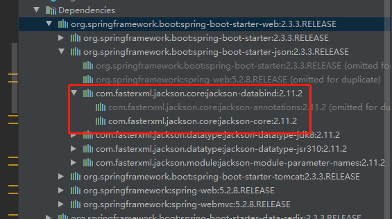

# [jackson](https://github.com/FasterXML/jackson-databind)

- [https://github.com/FasterXML/jackson-databind](https://github.com/FasterXML/jackson-databind)

## 简介

`jackson` 是当前用的比较广泛的，用来序列化和反序列化 json 的 Java 的开源框架。`jackson`社区相对比较活跃，更新速度也比较快。

`spring-boot-starter-web`已经包含了`spring-boot-starter-json`也包含了`Jackson`。

`jackson` 的`1.x`版本的包名是 `org.codehaus.jackson` ，当升级到`2.x`版本时，包名变为 `com.fasterxml.jackson`。



- `jackson-core`，核心包，提供基于"`流模式`"解析的相关 API，它包括 `JsonPaser` 和 `JsonGenerator。` `Jackson` 内部实现正是通过高性能的流模式 API 的 `JsonGenerator` 和 `JsonParser` 来生成和解析 `json。`
- `jackson-annotations`，注解包，提供标准注解功能；
- `jackson-databind` ，数据绑定包， 提供基于`对象绑定`解析的相关 API(`ObjectMapper`)和`树模型`解析的相关 API(`JsonNode`)基于"对象绑定" 解析的 API 和"树模型"解析的 API 依赖基于"流模式"解析的 API。

## ObjectMapper 使用

`Jackson` 最常用的 API 就是基于`对象绑定`的 `ObjectMapper`

```java
@Slf4j
public class JsonUtil {
    private static volatile JsonUtil instance = null;
    private static ObjectMapper mapper = null;

    private JsonUtil() {
        mapper = new ObjectMapper().setVisibility(PropertyAccessor.FIELD, JsonAutoDetect.Visibility.ANY);
        mapper.setDateFormat(new SimpleDateFormat("yyyy-MM-dd HH:mm:ss"));
        mapper.configure(DeserializationFeature.ACCEPT_EMPTY_STRING_AS_NULL_OBJECT, true);
        mapper.configure(DeserializationFeature.ACCEPT_SINGLE_VALUE_AS_ARRAY, true);
        mapper.configure(DeserializationFeature.FAIL_ON_UNKNOWN_PROPERTIES, false);
        //允许无引号包括的字段
        mapper.configure(JsonParser.Feature.ALLOW_UNQUOTED_FIELD_NAMES, true);
        //允许单引号
        mapper.configure(JsonParser.Feature.ALLOW_SINGLE_QUOTES, true);
    }

    public static ObjectMapper getInstance() {
        if (instance == null) {
            synchronized (JsonUtil.class) {
                if (instance == null) {
                    instance = new JsonUtil();
                }
            }
        }
        return mapper;
    }

    /**
     * 将java对象转换成json字符串
     */
    public static String toJSONString(Object obj) {
        try {
            ObjectMapper objectMapper = getInstance();
            String json = objectMapper.writeValueAsString(obj);
            return json;
        } catch (Exception e) {
            log.error("JsonUtil toJSONString error", e);
        }
        return null;
    }

    /**
     * 将java对象转换成json字符串
     */
    public static String toPrettyJSONString(Object obj) {
        try {
            ObjectMapper objectMapper = getInstance();
            String json = objectMapper.writerWithDefaultPrettyPrinter().writeValueAsString(obj);
            return json;
        } catch (Exception e) {
            log.error("JsonUtil toJSONString error", e);
        }
        return null;
    }
    /**
     * 将json字符串转换成java对象
     */
    public static <T> T toBean(String json, Class<T> cls) {
        try {
            ObjectMapper objectMapper = getInstance();
            T vo = objectMapper.readValue(json, cls);
            return vo;
        } catch (Exception e) {
            log.error("JsonUtil String toBean error Json: {}", json, e);
        }
        return null;
    }
}
```

## [`Jackson`的常用注解](https://github.com/FasterXML/jackson-databind/wiki/JacksonFeatures)

| 注解          | 用法                                                   |
| ------------- | ------------------------------------------------------ |
| @JsonProperty | 用于属性，把属性的名称序列化时转换为另外一个名称       |
| @JsonFormat   | 用于属性或者方法，把属性的格式序列化时转换成指定的格式 |
| @JsonIgnore   | Json 序列化和解析时忽略                                |

```java
@Slf4j
@Data
public class Book {
    @JsonProperty("BookName")
    private String bookName;
    @JsonFormat(timezone = "GMT+8", pattern = "yyyy-MM-dd HH:mm")
    private Date bookDate;
    @JsonIgnore
    private int num;

    public static void main(String[] args) {
        Book book = new Book();
        book.setBookName("刻意练习");
        book.setBookDate(new Date());
        book.setNum(2);
        String jsonString = JsonUtil.toPrettyJSONString(book);
        List<Book> books = new LinkedList<>();
        books.add(book);
        log.info("book:{}", jsonString);
        log.info("books:{}", JsonUtil.toPrettyJSONString(books));
        Book deserializeBook = JsonUtil.toBean(jsonString, Book.class);
        log.info(JsonUtil.toJSONString(deserializeBook));
    }
}
```

```log
2020-09-07 11:22:31 [main] INFO  com.github.spring.boot.idleaf.utils.Book - book:{
  "bookDate" : "2020-09-07 11:22",
  "BookName" : "刻意练习"
}
2020-09-07 11:22:31 [main] INFO  com.github.spring.boot.idleaf.utils.Book - books:[ {
  "bookDate" : "2020-09-07 11:22",
  "BookName" : "刻意练习"
} ]
2020-09-07 11:22:31 [main] INFO  com.github.spring.boot.idleaf.utils.Book - {"bookDate":"2020-09-07 11:22","BookName":"刻意练习"}
```
