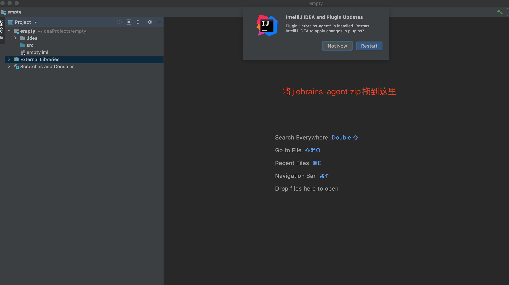
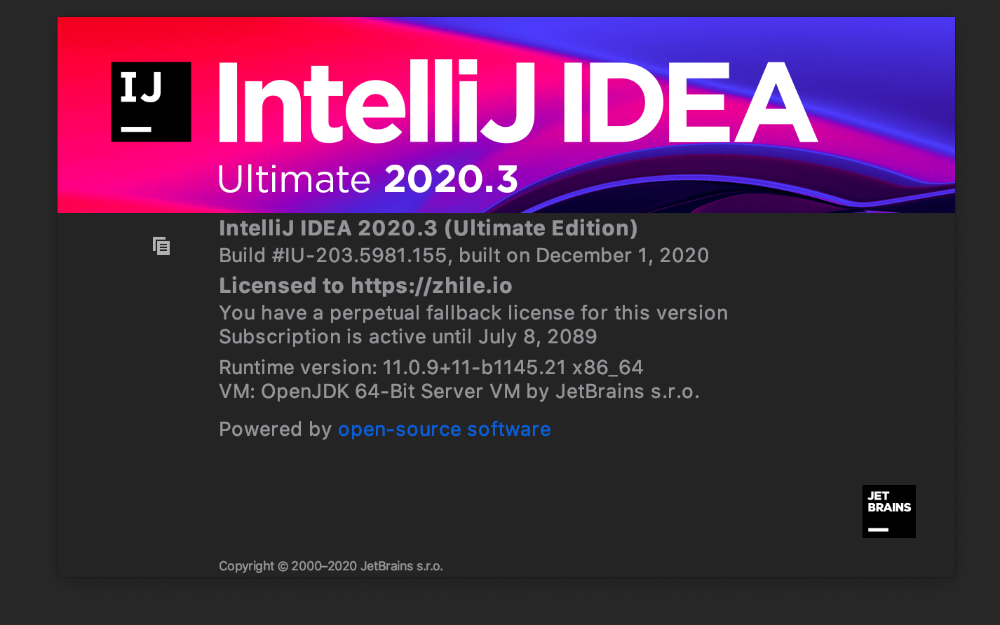

# idea 2020.3 破解

## 1.下载[jetbrains-agent-2020.3.zip](./jetbrains-agent-2020.3.zip)

将`jetbrains-agent-2020.3.zip`拖到`Project`右边的区域



## 2.重启 idea


## 3.选择默认的 `Activation Code`，通过注册码来激活,如下:

```
f9fF1I/ygZI7Ff14sigGMZmZ7KJkhsM364o6exiukAqGORVXN1e4Fk4B8+hGSl5B+iLp9nIA2pSNhNGlxnDgSV3xC85CGVvWY9SWa+ECeWhJZ1+hitDPCNw5lKaRBnxIKhAfQ3aJl4S5WmrOkfKoIuz3UXVoX7hZGxofqQtzfuc
```


## 4.查看`idea`到期时间


