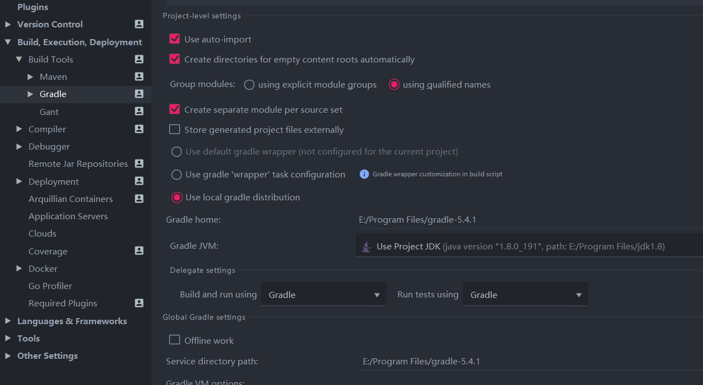

#### 1.安装插件

`File -> Settings -> Plugins`

| 插件                           | 说明                                    |
| ------------------------------ | --------------------------------------- |
| Translation                    | 中英文翻译                              |
| Lombok                         | 支持 Lombok 注解                        |
| Alibaba Java Coding Guidelines | `Tools -> 阿里编码规约 -> 编码规约扫描` |
| GsonFormat                     | 将`json`转换为实体类字段(快捷键`alt+s`) |
| Rainbow Brackets               | 彩虹括号                                |
| MybatisX                       | mybatis XML 和 java 方法之间快速跳转    |
| Material Theme UI              | 扁平化风格界面                          |
| Markdown Navigator             | Markdown 文档                           |
| Protobuf Support               | Protobuf 支持                           |
| Mybatis-log-plugin             | Mybatis 日志参数格式化                  |

#### 2.idea 配置

`File -> Other Settings -> Settings for New Projects`

打开新项目时的默认设置


Tab -> 右键 -> Editor Tabs

#### 2.1 设置`maven`中`Maven home directory`路径


#### 2.2 设置`gradle`中路径

`File -> Other Settings -> Settings for New Projects`


#### 2.3 设置项目 SDK

`File -> Other Settings -> Project Structure for New Projects -> Project`

设置`Project SDK`和`Project language level`


#### 2.4 设置文件作者

`File -> Other Settings -> File and Code Templates -> File Header`

```java
/**
 * @author chenjianhua
 * @date ${DATE}
 */
```


#### 2.5 设置上一步快捷键

`File -> Settings -> Keymap -> Main menu -> Navigate -> Back`

将`Ctrl + Alt + 左箭头`换成`Ctrl + 左箭头`


或者清除 windows`ctrl+alt+左箭头`桌面旋转问题

`桌面右键 -> 图形属性 -> 选项和支持 -> 快捷键管理器 -> 禁用快捷键`


### 3.idea 常用快捷键

| 快捷键           | 说明                                 |
| ---------------- | ------------------------------------ |
| Ctrl+N           | 查找类                               |
| Ctrl+Shift+N     | 查找文件                             |
| Ctrl+Alt+L       | 格式化代码                           |
| Ctrl ＋ F12      | 可以显示当前文件的结构               |
| Alt+F1           | 查找代码所在位置                     |
| Shift+F6         | 重命名                               |
| Ctrl ＋ E        | 可以显示最近编辑的文件列表           |
| Ctrl + 左/右箭头 | 移动光标到上一个/下一个单词          |
| Ctrl ＋ Alt ＋ T | 可以把代码包在一块内，例如 try/catch |
| Shift ＋ Click   | 可以关闭文件                         |
| Ctrl+R           | 替换文本                             |
| Ctrl+F           | 查找文本                             |
| Alt+1            | 显示项目侧边栏                       |
| Alt+7            | 显示文件结构                         |

### 4. 单元测试设置

- `settings -> Gradle -> 勾选Create directories for empty content roots automatically`
- `Build and run using`选择`gradle`
- `Run tests using`选择`gradle`



### 设置缓存目录

找到 idea 安装位置`bin`目录下的`idea.properties`配置文件

1、将用户目录的`.IntelliJIdea2019.2`目录拷贝至自定义位置；
2、修改`idea.properties`配置文件，将所有的`${user.home}`替换为自定义位置

```conf
# Use ${idea.home.path} macro to specify location relative to IDE installation home.
# Use ${xxx} where xxx is any Java property (including defined in previous lines of this file) to refer to its value.
# Note for Windows users: please make sure you're using forward slashes (e.g. c:/idea/system).

#---------------------------------------------------------------------
# Uncomment this option if you want to customize path to IDE config folder. Make sure you're using forward slashes.
#---------------------------------------------------------------------
# idea.config.path=${user.home}/.IntelliJIdea/config
idea.config.path=D:/Program File/ideaCache/.IntelliJIdea/config
#---------------------------------------------------------------------
# Uncomment this option if you want to customize path to IDE system folder. Make sure you're using forward slashes.
#---------------------------------------------------------------------
# idea.system.path=${user.home}/.IntelliJIdea/system
idea.system.path=D:/Program File/ideaCache/.IntelliJIdea/system
```

启动`Idea`，选择 previous 配置（即自定义位置）

### 5. 遇到的问题

#### 5.1 Unable to import maven project: See logs for details

查看 IDEA 错误日志：`Help -> show log in explorer -> 打开idea.log文件`

```log
2019-10-25 14:49:15,694 [ 728217]  ERROR -      #org.jetbrains.idea.maven - com.google.inject.CreationException: Unable to create injector, see the following errors:

1) No implementation for org.apache.maven.model.path.PathTranslator was bound.
  while locating org.apache.maven.model.path.PathTranslator
    for field at org.apache.maven.model.interpolation.AbstractStringBasedModelInterpolator.pathTranslator(Unknown Source)
  at org.codehaus.plexus.DefaultPlexusContainer$1.configure(DefaultPlexusContainer.java:350)

2) No implementation for org.apache.maven.model.path.UrlNormalizer was bound.
  while locating org.apache.maven.model.path.UrlNormalizer
    for field at org.apache.maven.model.interpolation.AbstractStringBasedModelInterpolator.urlNormalizer(Unknown Source)
  at org.codehaus.plexus.DefaultPlexusContainer$1.configure(DefaultPlexusContainer.java:350)
```

- maven 版本兼容性问题，回退到`3.6.1`就好了，原因肯能是`3.6.2的model builder 使用了JSR 330进行依赖注入`，不再使用 plexus
- 使用最新的 idea

#### 3.2 error in opening zip file

```log
Error reading file E:\mavenRepo\org\springframework\boot\spring-boot\2.1.4.RELEASE\spring-boot-2.1.4.RELEASE.jar: error in opening zip file
```

jar 包损坏，删除`org/springframework`目录，重新`mvn clean install`
