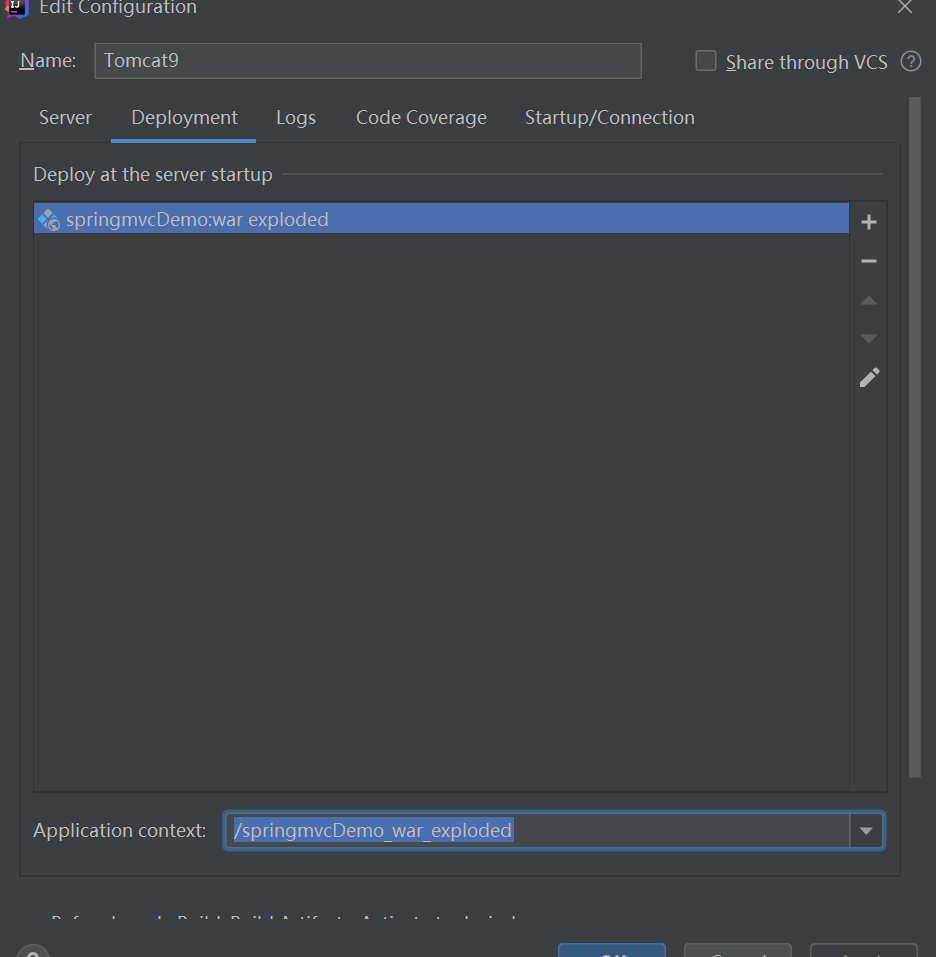
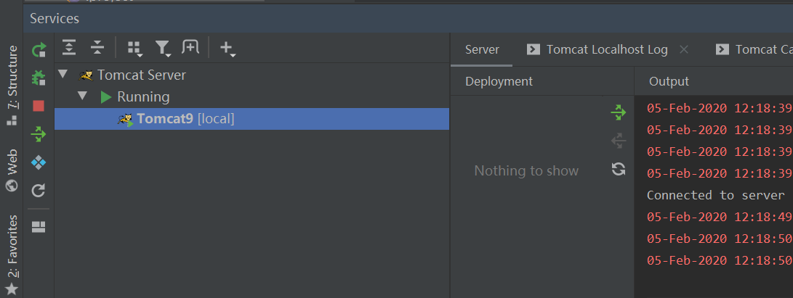

# idea配置tomcat启动

## 下载tomcat

[https://tomcat.apache.org/](https://tomcat.apache.org/)

## tomcat配置

`manager-gui` - allows access to the HTML GUI and the status pages

```xml
<role rolename="manager-gui"/>
<user username="tomcat" password="tomcat" roles="manager-gui"/>
```

## 配置idea

选择`Add Configuration -> Tomcat Server -> Local`添加配置


选择`Server -> Configure`配置tomcat路径


选择`Deployment -> + 对应项目的exploded`,访问路径是`/springmvcDemo_war_exploded`



启动项目

