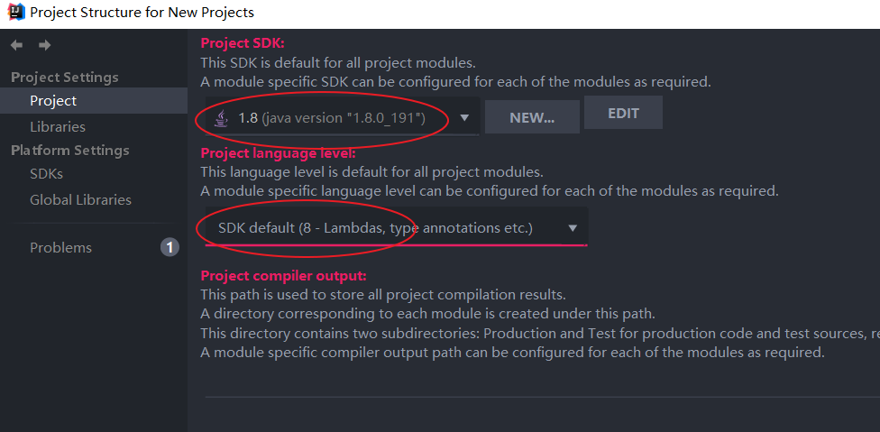
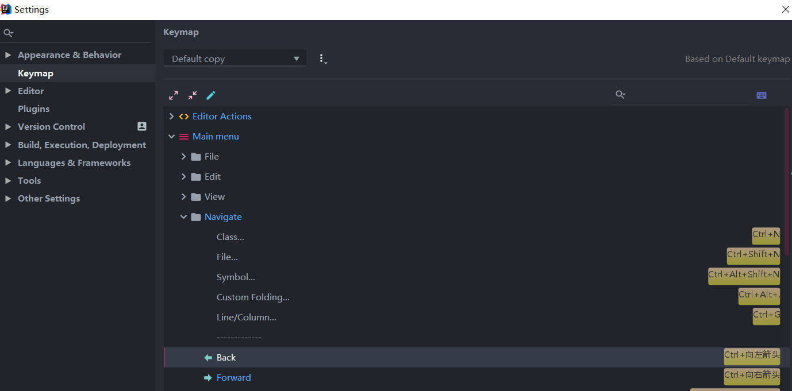
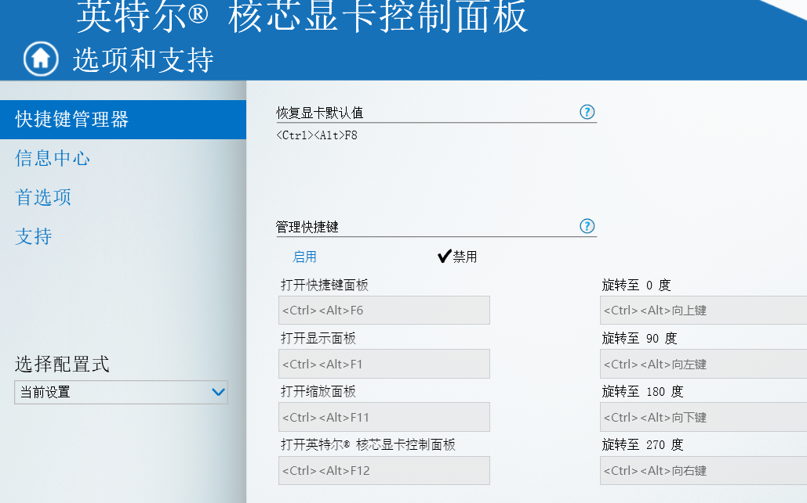

#### 1.安装插件

`File -> Settings -> Plugins`

| 插件                           | 说明                               |
| ------------------------------ | ---------------------------------- |
| Translation                    | 中英文翻译                         |
| Lombok                         | 支持Lombok注解                     |
| Markdown Navigator             | Markdown文档                       |
| Protobuf Support               | Protobuf支持                       |
| Alibaba Java Coding Guidelines | 阿里编码规范                       |
| GsonFormat                     | 将json转换为实体类字段             |
| MybatisX                       | mybatis XML和java 方法之间快速跳转 |
| Material Theme UI              | 扁平化风格界面                     |

#### 2.idea配置

`File -> Other Settings -> Settings for New Projects`

打开新项目时的默认设置

#### 2.1设置`maven`中`Maven home directory`路径


#### 2.2 设置`gradle`中路径

`File -> Other Settings -> Settings for New Projects`


#### 2.3设置项目SDK

`File -> Other Settings -> Project Structure for New Projects -> Project`

设置`Project SDK`和`Project language level`



#### 2.4设置文件作者

`File -> Other Settings -> File and Code Templates -> File Header`

```java
/**
 * @author chenjianhua
 * @date ${DATE} ${TIME}
 */
```


#### 2.5 设置上一步快捷键

`File -> Settings -> Keymap -> Main menu -> Navigate -> Back`

将`Ctrl + Alt + 左箭头`换成`Ctrl + 左箭头`



或者清除windows`ctrl+alt+左箭头`桌面旋转问题

`桌面右键 -> 图形属性 -> 选项和支持 -> 快捷键管理器 -> 禁用快捷键`



### 3.idea常用快捷键

| 快捷键           | 说明                                |
| ---------------- | ----------------------------------- |
| Ctrl+N           | 查找类                              |
| Ctrl+Shift+N     | 查找文件                            |
| Ctrl+Alt+L       | 格式化代码                          |
| Ctrl＋F12        | 可以显示当前文件的结构              |
| Alt+F1           | 查找代码所在位置                    |
| Shift+F6         | 重命名                              |
| Ctrl＋E          | 可以显示最近编辑的文件列表          |
| Ctrl + 左/右箭头 | 移动光标到上一个/下一个单词         |
| Ctrl＋Alt＋T     | 可以把代码包在一块内，例如try/catch |
| Shift＋Click     | 可以关闭文件                        |
| Ctrl+R           | 替换文本                            |
| Ctrl+F           | 查找文本                            |
| Alt+1            | 显示项目侧边栏                      |
| Alt+7            | 显示文件结构                        |

### 4. 单元测试设置

- `settings -> Gradle -> 勾选Create directories for empty content roots automatically`
- `Build and run using`选择`gradle`
- `Run tests using`选择`gradle`


### 设置缓存目录

找到idea安装位置`bin`目录下的`idea.properties`配置文件

1、将用户目录的`.IntelliJIdea2019.2`目录拷贝至自定义位置；
2、修改`idea.properties`配置文件，将所有的`${user.home}`替换为自定义位置

```conf
# Use ${idea.home.path} macro to specify location relative to IDE installation home.
# Use ${xxx} where xxx is any Java property (including defined in previous lines of this file) to refer to its value.
# Note for Windows users: please make sure you're using forward slashes (e.g. c:/idea/system).

#---------------------------------------------------------------------
# Uncomment this option if you want to customize path to IDE config folder. Make sure you're using forward slashes.
#---------------------------------------------------------------------
# idea.config.path=${user.home}/.IntelliJIdea/config
idea.config.path=D:/Program File/ideaCache/.IntelliJIdea/config
#---------------------------------------------------------------------
# Uncomment this option if you want to customize path to IDE system folder. Make sure you're using forward slashes.
#---------------------------------------------------------------------
# idea.system.path=${user.home}/.IntelliJIdea/system
idea.system.path=D:/Program File/ideaCache/.IntelliJIdea/system
```

启动`Idea`，选择previous配置（即自定义位置）

### goland激活

下载[jetbrains-agent.jar](./img/jetbrains-agent.jar)

1. `Help -> Edit Custom VM Options`
2. 编辑`goland64.exe.vmoptions`文件,末尾行添加`-javaagent:E:\GoLand 2019.2.3\jetbrains-agent.jar`
3. 修改完配置文件之后重启GoLand
4. `Help -> Register`，添加[激活码](#goland激活码)
5. `Help->About`查看注册信息

### 5. 遇到的问题

#### 5.1 Unable to import maven project: See logs for details

查看IDEA错误日志：`Help -> show log in explorer -> 打开idea.log文件`

```log
2019-10-25 14:49:15,694 [ 728217]  ERROR -      #org.jetbrains.idea.maven - com.google.inject.CreationException: Unable to create injector, see the following errors:

1) No implementation for org.apache.maven.model.path.PathTranslator was bound.
  while locating org.apache.maven.model.path.PathTranslator
    for field at org.apache.maven.model.interpolation.AbstractStringBasedModelInterpolator.pathTranslator(Unknown Source)
  at org.codehaus.plexus.DefaultPlexusContainer$1.configure(DefaultPlexusContainer.java:350)

2) No implementation for org.apache.maven.model.path.UrlNormalizer was bound.
  while locating org.apache.maven.model.path.UrlNormalizer
    for field at org.apache.maven.model.interpolation.AbstractStringBasedModelInterpolator.urlNormalizer(Unknown Source)
  at org.codehaus.plexus.DefaultPlexusContainer$1.configure(DefaultPlexusContainer.java:350)
```

- maven版本兼容性问题，回退到`3.6.1`就好了，原因肯能是`3.6.2的model builder 使用了JSR 330进行依赖注入`，不再使用plexus
- 使用最新的idea

#### 3.2 error in opening zip file

```log
Error reading file E:\mavenRepo\org\springframework\boot\spring-boot\2.1.4.RELEASE\spring-boot-2.1.4.RELEASE.jar: error in opening zip file
```

jar包损坏，删除`org/springframework`目录，重新`mvn clean install`

#### goland激活码

```yaml
520E5894E2-eyJsaWNlbnNlSWQiOiI1MjBFNTg5NEUyIiwibGljZW5zZWVOYW1lIjoicGlnNiIsImFzc2lnbmVlTmFtZSI6IiIsImFzc2lnbmVlRW1haWwiOiIiLCJsaWNlbnNlUmVzdHJpY3Rpb24iOiJVbmxpbWl0ZWQgbGljZW5zZSB0aWxsIGVuZCBvZiB0aGUgY2VudHVyeS4iLCJjaGVja0NvbmN1cnJlbnRVc2UiOmZhbHNlLCJwcm9kdWN0cyI6W3siY29kZSI6IklJIiwicGFpZFVwVG8iOiIyMDg5LTA3LTA3In0seyJjb2RlIjoiUlMwIiwicGFpZFVwVG8iOiIyMDg5LTA3LTA3In0seyJjb2RlIjoiV1MiLCJwYWlkVXBUbyI6IjIwODktMDctMDcifSx7ImNvZGUiOiJSRCIsInBhaWRVcFRvIjoiMjA4OS0wNy0wNyJ9LHsiY29kZSI6IlJDIiwicGFpZFVwVG8iOiIyMDg5LTA3LTA3In0seyJjb2RlIjoiREMiLCJwYWlkVXBUbyI6IjIwODktMDctMDcifSx7ImNvZGUiOiJEQiIsInBhaWRVcFRvIjoiMjA4OS0wNy0wNyJ9LHsiY29kZSI6IlJNIiwicGFpZFVwVG8iOiIyMDg5LTA3LTA3In0seyJjb2RlIjoiRE0iLCJwYWlkVXBUbyI6IjIwODktMDctMDcifSx7ImNvZGUiOiJBQyIsInBhaWRVcFRvIjoiMjA4OS0wNy0wNyJ9LHsiY29kZSI6IkRQTiIsInBhaWRVcFRvIjoiMjA4OS0wNy0wNyJ9LHsiY29kZSI6IkdPIiwicGFpZFVwVG8iOiIyMDg5LTA3LTA3In0seyJjb2RlIjoiUFMiLCJwYWlkVXBUbyI6IjIwODktMDctMDcifSx7ImNvZGUiOiJDTCIsInBhaWRVcFRvIjoiMjA4OS0wNy0wNyJ9LHsiY29kZSI6IlBDIiwicGFpZFVwVG8iOiIyMDg5LTA3LTA3In0seyJjb2RlIjoiUlNVIiwicGFpZFVwVG8iOiIyMDg5LTA3LTA3In1dLCJoYXNoIjoiODkwNzA3MC8wIiwiZ3JhY2VQZXJpb2REYXlzIjowLCJhdXRvUHJvbG9uZ2F0ZWQiOmZhbHNlLCJpc0F1dG9Qcm9sb25nYXRlZCI6ZmFsc2V9-DZ/oNHBfyho0XrrCJJvAOKg5Q1tLBgOdbCmzCKwkuM+Yryce0RoOi3OOmH6Ba/uTcCh/L37meyD0FJdJIprv59y4+n+k2kIeF/XKrKqg0dEsDUQRw0lUqqMt99ohqa+zmbJ44Yufdwwx/F1CtoRGvEQ2Mn0QjuqRoZJZ3wiT5Am22JiJW8MaNUl3wg9YPj+OPGARKKJUdUJ0NGUDQBcBAv5ds8LhbSbJSbPkbkwH/a1QMz4nEdn6lRDKI1aFIn43QhBSCFqvUq6TPJlbIJ0ZjE+PyZjHFBKCgkry0DHPXU2BbtIZPsksQnN3fx240a9K6sN7peZnLpEoMoq23FEz4g==-MIIElTCCAn2gAwIBAgIBCTANBgkqhkiG9w0BAQsFADAYMRYwFAYDVQQDDA1KZXRQcm9maWxlIENBMB4XDTE4MTEwMTEyMjk0NloXDTIwMTEwMjEyMjk0NlowaDELMAkGA1UEBhMCQ1oxDjAMBgNVBAgMBU51c2xlMQ8wDQYDVQQHDAZQcmFndWUxGTAXBgNVBAoMEEpldEJyYWlucyBzLnIuby4xHTAbBgNVBAMMFHByb2QzeS1mcm9tLTIwMTgxMTAxMIIBIjANBgkqhkiG9w0BAQEFAAOCAQ8AMIIBCgKCAQEA5ndaik1GD0nyTdqkZgURQZGW+RGxCdBITPXIwpjhhaD0SXGa4XSZBEBoiPdY6XV6pOfUJeyfi9dXsY4MmT0D+sKoST3rSw96xaf9FXPvOjn4prMTdj3Ji3CyQrGWeQU2nzYqFrp1QYNLAbaViHRKuJrYHI6GCvqCbJe0LQ8qqUiVMA9wG/PQwScpNmTF9Kp2Iej+Z5OUxF33zzm+vg/nYV31HLF7fJUAplI/1nM+ZG8K+AXWgYKChtknl3sW9PCQa3a3imPL9GVToUNxc0wcuTil8mqveWcSQCHYxsIaUajWLpFzoO2AhK4mfYBSStAqEjoXRTuj17mo8Q6M2SHOcwIDAQABo4GZMIGWMAkGA1UdEwQCMAAwHQYDVR0OBBYEFGEpG9oZGcfLMGNBkY7SgHiMGgTcMEgGA1UdIwRBMD+AFKOetkhnQhI2Qb1t4Lm0oFKLl/GzoRykGjAYMRYwFAYDVQQDDA1KZXRQcm9maWxlIENBggkA0myxg7KDeeEwEwYDVR0lBAwwCgYIKwYBBQUHAwEwCwYDVR0PBAQDAgWgMA0GCSqGSIb3DQEBCwUAA4ICAQBonMu8oa3vmNAa4RQP8gPGlX3SQaA3WCRUAj6Zrlk8AesKV1YSkh5D2l+yUk6njysgzfr1bIR5xF8eup5xXc4/G7NtVYRSMvrd6rfQcHOyK5UFJLm+8utmyMIDrZOzLQuTsT8NxFpbCVCfV5wNRu4rChrCuArYVGaKbmp9ymkw1PU6+HoO5i2wU3ikTmRv8IRjrlSStyNzXpnPTwt7bja19ousk56r40SmlmC04GdDHErr0ei2UbjUua5kw71Qn9g02tL9fERI2sSRjQrvPbn9INwRWl5+k05mlKekbtbu2ev2woJFZK4WEXAd/GaAdeZZdumv8T2idDFL7cAirJwcrbfpawPeXr52oKTPnXfi0l5+g9Gnt/wfiXCrPElX6ycTR6iL3GC2VR4jTz6YatT4Ntz59/THOT7NJQhr6AyLkhhJCdkzE2cob/KouVp4ivV7Q3Fc6HX7eepHAAF/DpxwgOrg9smX6coXLgfp0b1RU2u/tUNID04rpNxTMueTtrT8WSskqvaJd3RH8r7cnRj6Y2hltkja82HlpDURDxDTRvv+krbwMr26SB/40BjpMUrDRCeKuiBahC0DCoU/4+ze1l94wVUhdkCfL0GpJrMSCDEK+XEurU18Hb7WT+ThXbkdl6VpFdHsRvqAnhR2g4b+Qzgidmuky5NUZVfEaZqV/g==
```
