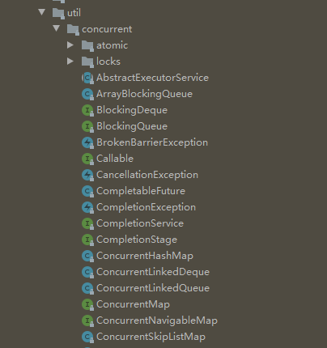

# JUC

`java.util.concurrent`(简称`JUC`)包。



包含`atomic`原子操作,`lock`锁,线程池等并发编程中很常用的工具类

## AQS 框架

`AQS框架`是`JUC`中`实现锁及同步机制`的基础，其底层是通过调用 LockSupport .unpark()和 LockSupport .park()实现线程的阻塞和唤醒。

`AbstractQueuedSynchronizer`是一个抽象类，主要是维护了一个 int 类型的 state 属性和一个非阻塞、先进先出的线程等待队列；其中 state 是用`volatile`修饰的，保证线程之间的可见性，队列的入队和出对操作都是无锁操作，基于自旋锁和 CAS 实现；另外 AQS 分为两种模式：`独占模式和共享模式`，像`ReentrantLock`是基于独占模式模式实现的，`CountDownLatch`、`CyclicBarrier`等是基于共享模式。

```java
public abstract class AbstractQueuedSynchronizer
    extends AbstractOwnableSynchronizer
    implements java.io.Serializable {
    /**
     * Head of the wait queue, lazily initialized.  Except for
     * initialization, it is modified only via method setHead.  Note:
     * If head exists, its waitStatus is guaranteed not to be
     * CANCELLED.
     */
    private transient volatile Node head;

    /**
     * Tail of the wait queue, lazily initialized.  Modified only via
     * method enq to add new wait node.
     */
    private transient volatile Node tail;

    /**
     * The synchronization state.
     */
    private volatile int state;

    protected final boolean compareAndSetState(int expect, int update) {
        // See below for intrinsics setup to support this
        return unsafe.compareAndSwapInt(this, stateOffset, expect, update);
    }
}
```

`JUC`中的同步器主要用于协助线程同步，有以下四种：

- 闭锁 `CountDownLatch`
- 栅栏 `CyclicBarrier`
- 信号量 `Semaphore`
- 交换器 `Exchanger`
