# Mermaid 简介

`Mermaid` 是一个用于画流程图、状态图、时序图、甘特图的库，使用 JS 进行本地渲染，广泛集成于许多 Markdown 编辑器中。

- [https://github.com/mermaid-js/mermaid](https://github.com/mermaid-js/mermaid)
- [https://mermaid-js.github.io/mermaid/#/](https://mermaid-js.github.io/mermaid/#/)

## Vscode 安装插件`Markdown Preview Mermaid Support`

## 饼图

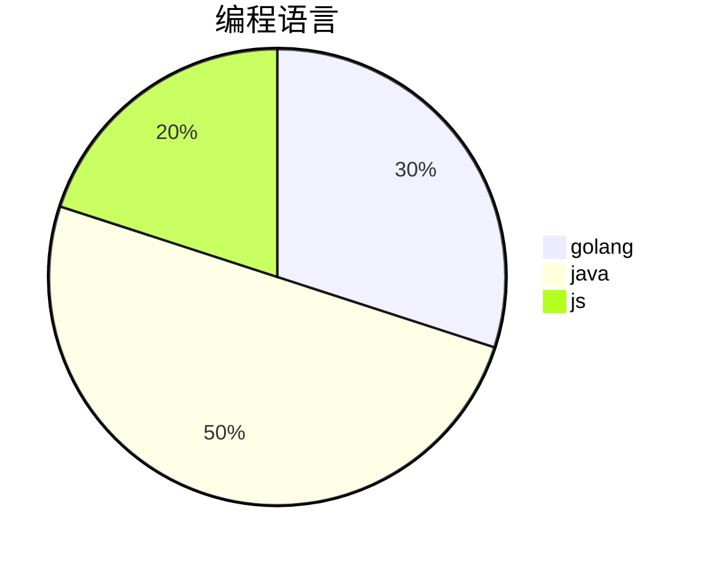

## 时序图

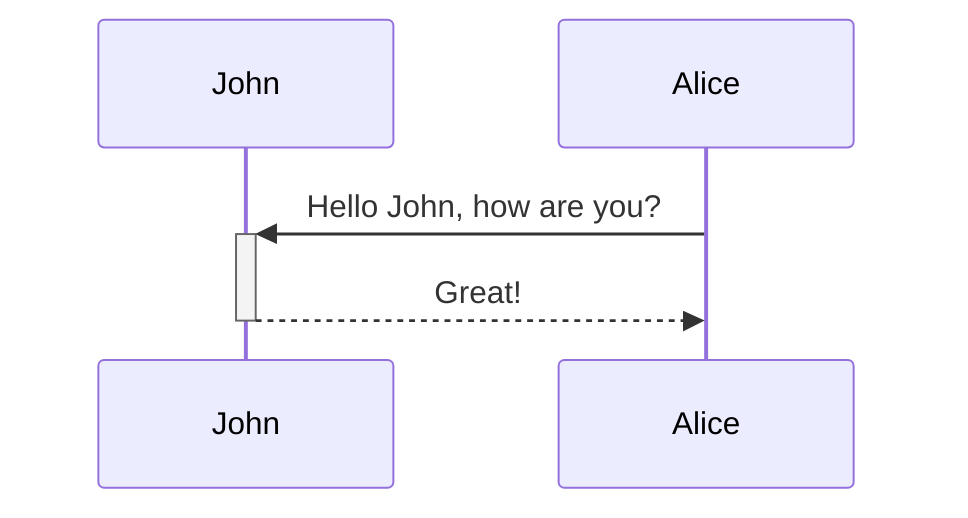

### Messages

Messages can be of two displayed either solid or with a dotted line.

`[Actor][arrow][Actor]:Message text`

There are six types of arrows currently supported:

| Type | Description                                 |
| ---- | ------------------------------------------- |
| ->   | Solid line without arrow                    |
| -->  | Dotted line without arrow                   |
| ->>  | Solid line with arrowhead                   |
| -->> | Dotted line with arrowhead                  |
| -x   | Solid line with a cross at the end (async)  |
| --x  | Dotted line with a cross at the end (async) |

## 类图

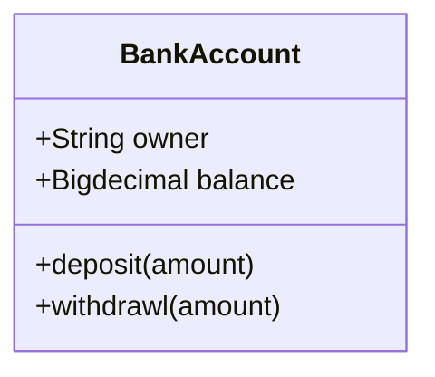

## 状态图

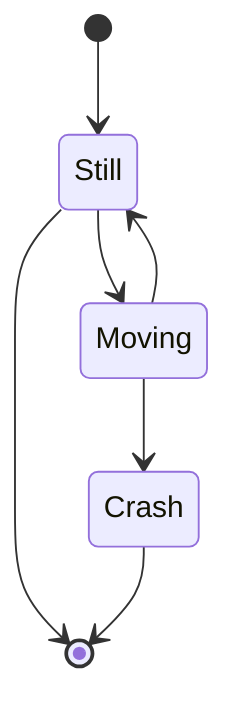

## 流程图

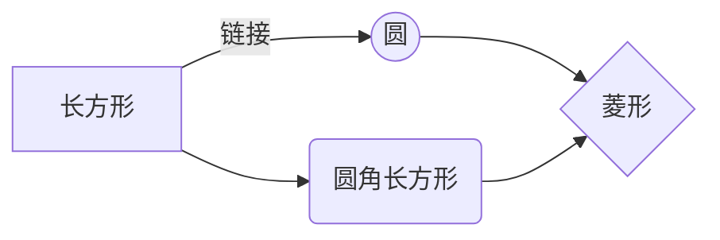

### 流程图方向

流程图方向有下面几个值

- `TB` 从上到下(TopBottom)
- `BT` 从下到上(BottomTop)
- `RL` 从右到左(RightLeft)
- `LR` 从左到右(LeftRight)
- `TD` 同 `TB`(TopDown)

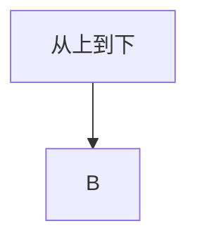

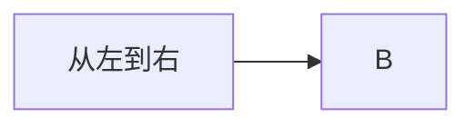

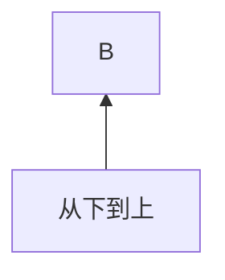

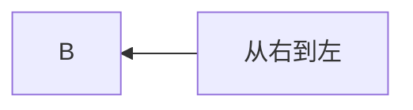

### 基本图形

- `id + [文字描述]`矩形
- `id + (文字描述`)圆角矩形
- `id + >文字描述]`不对称的矩形
- `id + {文字描述}`菱形
- `id + ((文字描述))`圆形

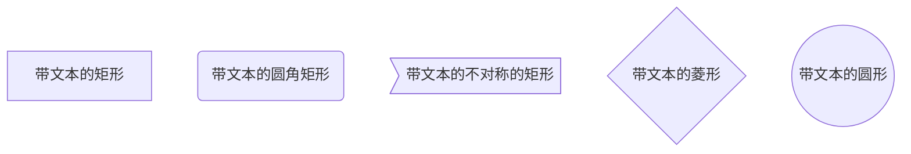

### 节点之间的连接

- `A --> B` A 带箭头指向 B
- `A — B` A 不带箭头指向 B
- `A -.- B` A 用虚线指向 B
- `A -.->` B A 用带箭头的虚线指向 B
- `A ==>` B A 用加粗的箭头指向 B
- `A – 描述 — B` A 不带箭头指向 B 并在中间加上文字描述
- `A – 描述 --> B` A 带箭头指向 B 并在中间加上文字描述
- `A -. 描述 .-> B` A 用带箭头的虚线指向 B 并在中间加上文字描述
- `A == 描述 ==> B` A 用加粗的箭头指向 B 并在中间加上文字描述

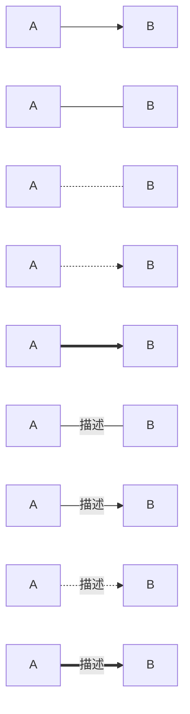

### 绘制一个流程图,找出 A、 B、 C 三个数中最大的一个数

```bash
mermaid
graph LR
    start[开始] --> input[输入A,B,C]
    input --> conditionA{A是否大于B}
    conditionA -- YES --> conditionC{A是否大于C}
    conditionA -- NO --> conditionB{B是否大于C}
    conditionC -- YES --> printA[输出A]
    conditionC -- NO --> printC[输出C]
    conditionB -- YES --> printB[输出B]
    conditionB -- NO --> printC[输出C]
    printA --> stop[结束]
    printC --> stop
    printB --> stop
```

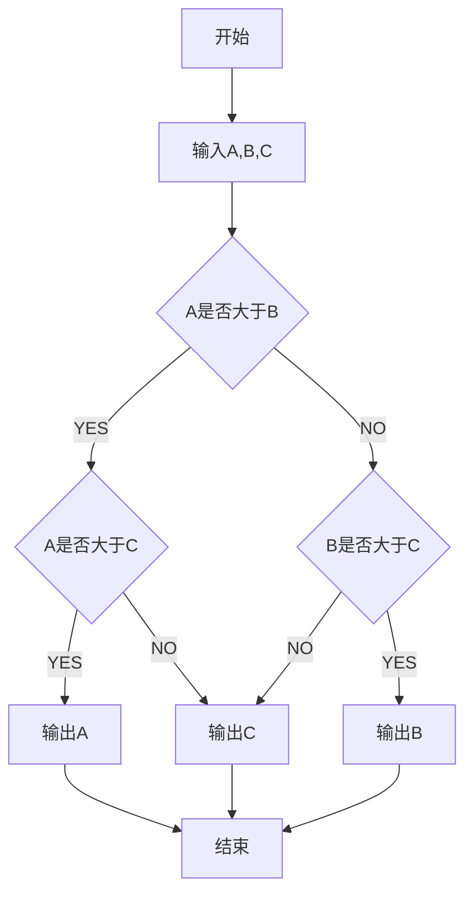
