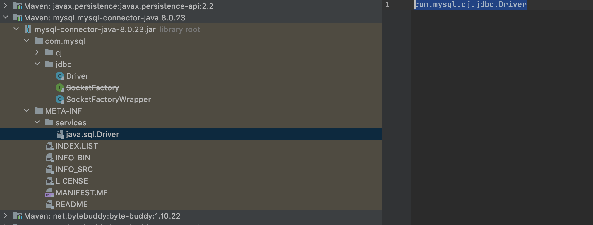

# springboot SPI机制

- [springboot中SPI机制](https://www.jianshu.com/p/0d196ad23915)

`SPI(Service Provider Interface)`服务提供接口，简单来说就是用来解耦，实现插件的自由插拔

## 从java类加载机制说起

java中的类加载器负载加载来自文件系统、网络或者其他来源的类文件。jvm的类加载器默认使用的是双亲委派模式。三种默认的类加载器`Bootstrap ClassLoader`、`Extension ClassLoader`和`System ClassLoader（Application ClassLoader）`每一个中类加载器都确定了从哪一些位置加载文件。于此同时我们也可以通过继承`java.lang.classloader`实现自己的类加载器。

- `Bootstrap ClassLoader`：负责加载JDK自带的`rt.jar`包中的类文件，是所有类加载的父类
- `Extension ClassLoader`：负责加载java的扩展类库从`jre/lib/ect`目录或者j`ava.ext.dirs`系统属性指定的目录下加载类，是`System ClassLoader`的父类加载器
- `System ClassLoader`：负责从`classpath环境变量`中加载类文件

## spi示例

```java
public interface Phone {
    /**
     * 获取手机名称
     * @return
     */
    public String getPhoneName();
}
public class HuaweiPhone implements Phone {
    @Override
    public String getPhoneName() {
        return "华为";
    }
}
public class IPhone implements Phone{
    @Override
    public String getPhoneName() {
        return "苹果";
    }
}
```

约定配置：新建 `META-INF/services` 目录

新增`com.github.springbootjunittest.springboot.spi.Phone`文件,里面填写Phone实现类

```java
com.github.springbootjunittest.springboot.spi.HuaweiPhone
com.github.springbootjunittest.springboot.spi.IPhone
```

编写单元测试

```java
@Slf4j
public class SpringBootSPITest {
    @Test
    public void testJavaSpi() {
        ServiceLoader<Phone> phoneServiceLoader = ServiceLoader.load(Phone.class);
        phoneServiceLoader.forEach(provider -> {
            log.info("{} {}", provider.getClass().getName(), provider.getPhoneName());
        });
    }
}
```

```log
10:25:06.979 [main] INFO com.github.springbootjunittest.springboot.SpringBootSPITest - com.github.springbootjunittest.springboot.spi.HuaweiPhone 华为
10:25:06.987 [main] INFO com.github.springbootjunittest.springboot.SpringBootSPITest - com.github.springbootjunittest.springboot.spi.IPhone 苹果
```

## 通过mysql驱动看SPI

通过idea查看`mysql-connector-java`包

`META-INF/services`目录下`com.mysql.cj.jdbc.Driver`文件



```java
package com.mysql.cj.jdbc;

import java.sql.DriverManager;
import java.sql.SQLException;

public class Driver extends NonRegisteringDriver implements java.sql.Driver {
    public Driver() throws SQLException {
    }

    static {
        try {
            DriverManager.registerDriver(new Driver());
        } catch (SQLException var1) {
            throw new RuntimeException("Can't register driver!");
        }
    }
}
```

## springboot中的类SPI扩展机制

在springboot的自动装配过程中，最终会加载`META-INF/spring.factories`文件，而加载的过程是由`SpringFactoriesLoader`加载的。从CLASSPATH下的每个Jar包中搜寻所有`META-INF/spring.factories`配置文件，然后将解析`properties`文件，找到指定名称的配置后返回

```java
@Test
public void testSpringBootSpi() {
    ClassLoader classLoader = SpringApplication.class.getClassLoader();
    Set<String> names = new LinkedHashSet(SpringFactoriesLoader.loadFactoryNames(ApplicationContextInitializer.class, classLoader));
    names.forEach(item -> log.info(item));
}

org.springframework.boot.context.ConfigurationWarningsApplicationContextInitializer
org.springframework.boot.context.ContextIdApplicationContextInitializer
org.springframework.boot.context.config.DelegatingApplicationContextInitializer
org.springframework.boot.rsocket.context.RSocketPortInfoApplicationContextInitializer
org.springframework.boot.web.context.ServerPortInfoApplicationContextInitializer
org.springframework.boot.autoconfigure.SharedMetadataReaderFactoryContextInitializer
org.springframework.boot.autoconfigure.logging.ConditionEvaluationReportLoggingListener
```

```java
public final class SpringFactoriesLoader {
    public static final String FACTORIES_RESOURCE_LOCATION = "META-INF/spring.factories";

    private static final Map<ClassLoader, MultiValueMap<String, String>> cache = new ConcurrentReferenceHashMap();

    public static List<String> loadFactoryNames(Class<?> factoryType, @Nullable ClassLoader classLoader) {
        String factoryTypeName = factoryType.getName();
        return (List)loadSpringFactories(classLoader).getOrDefault(factoryTypeName, Collections.emptyList());
    }

    private static Map<String, List<String>> loadSpringFactories(@Nullable ClassLoader classLoader) {
        MultiValueMap<String, String> result = (MultiValueMap)cache.get(classLoader);
        if (result != null) {
            return result;
        } else {
            try {
                Enumeration<URL> urls = classLoader != null ? classLoader.getResources("META-INF/spring.factories") : ClassLoader.getSystemResources("META-INF/spring.factories");
                LinkedMultiValueMap result = new LinkedMultiValueMap();
                cache.put(classLoader, result);
                return result;
            } catch (IOException var13) {
                throw new IllegalArgumentException("Unable to load factories from location [META-INF/spring.factories]", var13);
            }
        }
    }
}

```