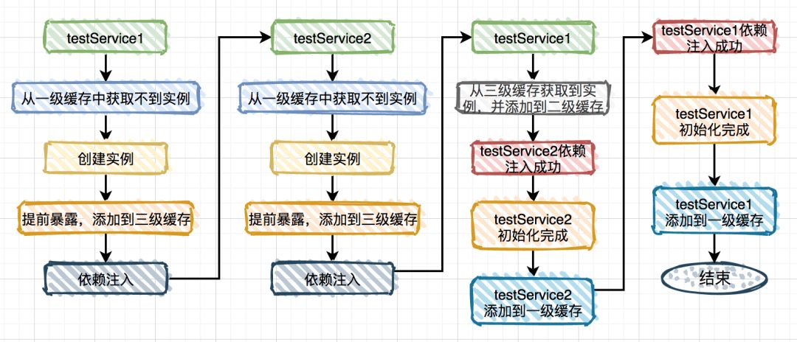

# springboot 如何解决循环依赖

- [高频面试题：Spring 如何解决循环依赖？](https://zhuanlan.zhihu.com/p/84267654)
- [Spring 是如何解决循环依赖的？](https://www.zhihu.com/question/438247718)

关于`Spring bean`的创建，其本质上还是一个对象的创建，既然是对象，读者朋友一定要明白一点就是，一个完整的对象包含两部分：`当前对象实例化和对象属性的实例化`。

## spring内部有三级缓存

- `Map<String, Object> singletonObjects` 一级缓存，用于保存实例化、注入、初始化完成的bean实例
- `Map<String, Object> earlySingletonObjects` 二级缓存，用于保存实例化完成的bean实例,`Bean`的生命周期未结束（属性还未填充完）
- `Map<String, ObjectFactory<?>> singletonFactories` 三级缓存，用于保存bean创建工厂，以便于后面扩展有机会创建代理对象。

`DefaultSingletonBeanRegistry`类的三个成员变量命名如下：

```java
/** 一级缓存 这个就是我们大名鼎鼎的单例缓存池 用于保存我们所有的单实例bean */
private final Map<String, Object> singletonObjects = new ConcurrentHashMap<>(256);


/** 三级缓存 该map用户缓存 key为 beanName  value 为ObjectFactory(包装为早期对象) */
private final Map<String, ObjectFactory<?>> singletonFactories = new HashMap<>(16);


/** 二级缓存 ，用户缓存我们的key为beanName value是我们的早期对象(对象属性还没有来得及进行赋值) */
private final Map<String, Object> earlySingletonObjects = new HashMap<>(16);
```

## Spring中`Bean`的生命周期

指的就是 `Bean`从创建到销毁的一系列生命活动。

那么由 Spring 来管理 Bean，要经过的主要步骤有：

- Spring 根据开发人员的配置，扫描哪些类由 Spring 来管理，并为每个类生成一个 `BeanDefintion`，里面封装了类的一些信息，如全限定类名、哪些属性、是否单例等等
- 根据 `BeanDefintion` 的信息，通过反射，去实例化`Bean`（此时就是实例化但未初始化 的 Bean）
- 填充上述未初始化对象中的属性（`依赖注入`）
- 如果上述未初始化对象中的方法被`AOP拦截` 了，那么就需要生成代理类（也叫包装类）
- 最后将完成初始化的对象存入缓存中（此处缓存 Spring 里叫： singletonObjects）

我们先看看当时出问题的代码片段：
```java
@Service
public class TestService1 {

    @Autowired
    private TestService2 testService2;
}

@Service
public class TestService2 {

    @Autowired
    private TestService1 testService1;
}
```

这是一个经典的循环依赖，但是它能正常运行，得益于spring的内部机制，让我们根本无法感知它有问题，因为spring默默帮我们解决了。




细心的朋友可能会发现在这种场景中第二级缓存作用不大。

那么问题来了，为什么要用第二级缓存呢？
