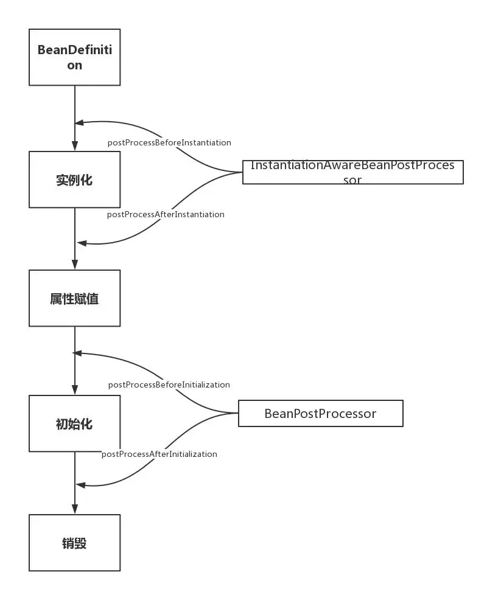

### 参考

- [一文看懂 Spring Bean 的生命周期！](https://mp.weixin.qq.com/s/XR3HAt5M4A508T9QgHK8iw)

Spring Bean的生命周期是Spring面试热点问题。这个问题即考察对Spring的微观了解，又考察对Spring的宏观认识，想要答好并不容易！本文希望能够从源码角度入手，帮助面试者彻底搞定Spring Bean的生命周期。

### 只有四个

是的，Spring Bean的生命周期只有这四个阶段。把这四个阶段和每个阶段对应的扩展点糅合在一起虽然没有问题，但是这样非常凌乱，难以记忆。要彻底搞清楚Spring的生命周期，首先要把这四个阶段牢牢记住。实例化和属性赋值对应构造方法和setter方法的注入，初始化和销毁是用户能自定义扩展的两个阶段。在这四步之间穿插的各种扩展点，稍后会讲。

- 实例化 Instantiation
- 属性赋值 Populate
- 初始化 Initialization
- 销毁 Destruction

`实例化 -> 属性赋值 -> 初始化 -> 销毁`

主要逻辑都在doCreate()方法中，逻辑很清晰，就是顺序调用以下三个方法，这三个方法与三个生命周期阶段一一对应，非常重要，在后续扩展接口分析中也会涉及。

- createBeanInstance() -> 实例化
- populateBean() -> 属性赋值
- initializeBean() -> 初始化

源码如下，能证明实例化，属性赋值和初始化这三个生命周期的存在。关于本文的Spring源码都将忽略无关部分，便于理解：

```java
// 忽略了无关代码
protected Object doCreateBean(final String beanName, final RootBeanDefinition mbd, final @Nullable Object[] args)
      throws BeanCreationException {

   // Instantiate the bean.
   BeanWrapper instanceWrapper = null;
   if (instanceWrapper == null) {
       // 实例化阶段！
      instanceWrapper = createBeanInstance(beanName, mbd, args);
   }

   // Initialize the bean instance.
   Object exposedObject = bean;
   try {
       // 属性赋值阶段！
      populateBean(beanName, mbd, instanceWrapper);
       // 初始化阶段！
      exposedObject = initializeBean(beanName, exposedObject, mbd);
   }


   }
```

### 常用扩展点

Spring生命周期相关的常用扩展点非常多，所以问题不是不知道，而是记不住或者记不牢。其实记不住的根本原因还是不够了解，这里通过源码+分类的方式帮大家记忆。

### 第一大类：影响多个Bean的接口

实现了这些接口的Bean会切入到多个Bean的生命周期中。正因为如此，这些接口的功能非常强大，Spring内部扩展也经常使用这些接口，例如自动注入以及AOP的实现都和他们有关。

- `BeanPostProcessor`
- `InstantiationAwareBeanPostProcessor`

这两兄弟可能是Spring扩展中最重要的两个接口！`InstantiationAwareBeanPostProcessor`作用于实例化阶段的前后，
`BeanPostProcessor`作用于初始化阶段的前后。正好和第一、第三个生命周期阶段对应。通过图能更好理解：



`InstantiationAwareBeanPostProcessor`实际上继承了`BeanPostProcessor`接口，严格意义上来看他们不是两兄弟，而是两父子。

```java
InstantiationAwareBeanPostProcessor extends BeanPostProcessor
```

#### InstantiationAwareBeanPostProcessor源码分析

postProcessBeforeInstantiation调用点，忽略无关代码:

```java
@Override
protected Object createBean(String beanName, RootBeanDefinition mbd, @Nullable Object[] args)
        throws BeanCreationException {

    try {
        // Give BeanPostProcessors a chance to return a proxy instead of the target bean instance.
        // postProcessBeforeInstantiation方法调用点，这里就不跟进了，
        // 有兴趣的同学可以自己看下，就是for循环调用所有的InstantiationAwareBeanPostProcessor
        Object bean = resolveBeforeInstantiation(beanName, mbdToUse);
        if (bean != null) {
            return bean;
        }
    }

    try {
        // 上文提到的doCreateBean方法，可以看到
        // postProcessBeforeInstantiation方法在创建Bean之前调用
        Object beanInstance = doCreateBean(beanName, mbdToUse, args);
        if (logger.isTraceEnabled()) {
            logger.trace("Finished creating instance of bean '" + beanName + "'");
        }
        return beanInstance;
    }

}
```

可以看到，postProcessBeforeInstantiation在doCreateBean之前调用，也就是在bean实例化之前调用的，英文源码注释解释道该方法的返回值会替换原本的Bean作为代理，这也是Aop等功能实现的关键点。

#### postProcessAfterInstantiation调用点，忽略无关代码:

```java
protected void populateBean(String beanName, RootBeanDefinition mbd, @Nullable BeanWrapper bw) {

   // Give any InstantiationAwareBeanPostProcessors the opportunity to modify the
   // state of the bean before properties are set. This can be used, for example,
   // to support styles of field injection.
   boolean continueWithPropertyPopulation = true;
    // InstantiationAwareBeanPostProcessor#postProcessAfterInstantiation()
    // 方法作为属性赋值的前置检查条件，在属性赋值之前执行，能够影响是否进行属性赋值！
   if (!mbd.isSynthetic() && hasInstantiationAwareBeanPostProcessors()) {
      for (BeanPostProcessor bp : getBeanPostProcessors()) {
         if (bp instanceof InstantiationAwareBeanPostProcessor) {
            InstantiationAwareBeanPostProcessor ibp = (InstantiationAwareBeanPostProcessor) bp;
            if (!ibp.postProcessAfterInstantiation(bw.getWrappedInstance(), beanName)) {
               continueWithPropertyPopulation = false;
               break;
            }
         }
      }
   }

   // 忽略后续的属性赋值操作代码
}
```
可以看到该方法在属性赋值方法内，但是在真正执行赋值操作之前。其返回值为boolean，返回false时可以阻断属性赋值阶段（continueWithPropertyPopulation = false;）。

关于BeanPostProcessor执行阶段的源码穿插在下文Aware接口的调用时机分析中，因为部分Aware功能的就是通过他实现的!只需要先记住BeanPostProcessor在初始化前后调用就可以了。

### 第二大类：只调用一次的接口

这一大类接口的特点是功能丰富，常用于用户自定义扩展。

第二大类中又可以分为两类：

- Aware类型的接口
- 生命周期接口

#### 无所不知的Aware

Aware类型的接口的作用就是让我们能够拿到Spring容器中的一些资源。基本都能够见名知意，Aware之前的名字就是可以拿到什么资源，例如BeanNameAware可以拿到BeanName，以此类推。调用时机需要注意：所有的Aware方法都是在初始化阶段之前调用的！

#### Aware Group1

- `BeanNameAware`
- `BeanClassLoaderAware`
- `BeanFactoryAware`

#### Aware Group2

- `EnvironmentAware`
- `ApplicationContextAware`(`ResourceLoaderAware`\`ApplicationEventPublisherAware`\`MessageSourceAware`) 这几个接口可能让人有点懵，实际上这几个接口可以一起记，其返回值实质上都是当前的`ApplicationContext`对象，因为`ApplicationContext`是一个复合接口

```java
public interface ApplicationContext extends EnvironmentCapable, ListableBeanFactory, HierarchicalBeanFactory,
        MessageSource, ApplicationEventPublisher, ResourcePatternResolver
```

#### Aware调用时机源码分析

详情如下，忽略了部分无关代码。代码位置就是我们上文提到的initializeBean方法详情，这也说明了Aware都是在初始化阶段之前调用的！

```java
// 见名知意，初始化阶段调用的方法
protected Object initializeBean(final String beanName, final Object bean, @Nullable RootBeanDefinition mbd) {

    // 这里调用的是Group1中的三个Bean开头的Aware
    invokeAwareMethods(beanName, bean);

    Object wrappedBean = bean;

    // 这里调用的是Group2中的几个Aware，
    // 而实质上这里就是前面所说的BeanPostProcessor的调用点！
    // 也就是说与Group1中的Aware不同，这里是通过BeanPostProcessor（ApplicationContextAwareProcessor）实现的。
    wrappedBean = applyBeanPostProcessorsBeforeInitialization(wrappedBean, beanName);
    // 下文即将介绍的InitializingBean调用点
    invokeInitMethods(beanName, wrappedBean, mbd);
    // BeanPostProcessor的另一个调用点
    wrappedBean = applyBeanPostProcessorsAfterInitialization(wrappedBean, beanName);

    return wrappedBean;
}
```

### 扩展阅读: BeanPostProcessor 注册时机与执行顺序

#### 注册时机

我们知道`BeanPostProcessor`也会注册为Bean，那么Spring是如何保证`BeanPostProcessor`在我们的业务Bean之前初始化完成呢？

```java
@Override
public void refresh() throws BeansException, IllegalStateException {
    synchronized (this.startupShutdownMonitor) {
        // Prepare this context for refreshing.
        prepareRefresh();

        // Tell the subclass to refresh the internal bean factory.
        ConfigurableListableBeanFactory beanFactory = obtainFreshBeanFactory();

        // Prepare the bean factory for use in this context.
        prepareBeanFactory(beanFactory);

        try {
            // Allows post-processing of the bean factory in context subclasses.
            postProcessBeanFactory(beanFactory);

            // Invoke factory processors registered as beans in the context.
            invokeBeanFactoryPostProcessors(beanFactory);

            // Register bean processors that intercept bean creation.
            registerBeanPostProcessors(beanFactory);

            // Initialize message source for this context.
            initMessageSource();

            // Initialize event multicaster for this context.
            initApplicationEventMulticaster();

            // Initialize other special beans in specific context subclasses.
            onRefresh();

            // Check for listener beans and register them.
            registerListeners();

            // Instantiate all remaining (non-lazy-init) singletons.
            finishBeanFactoryInitialization(beanFactory);

            // Last step: publish corresponding event.
            finishRefresh();
        }

        catch (BeansException ex) {
            if (logger.isWarnEnabled()) {
                logger.warn("Exception encountered during context initialization - " +
                        "cancelling refresh attempt: " + ex);
            }

            // Destroy already created singletons to avoid dangling resources.
            destroyBeans();

            // Reset 'active' flag.
            cancelRefresh(ex);

            // Propagate exception to caller.
            throw ex;
        }

        finally {
            // Reset common introspection caches in Spring's core, since we
            // might not ever need metadata for singleton beans anymore...
            resetCommonCaches();
        }
    }
}
```
