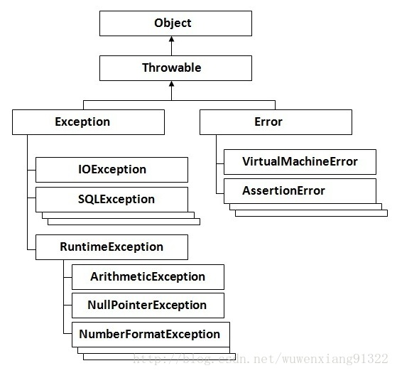

# Spring 事务

`@Transactional`注解有两个，一个是spring提供的`@org.springframework.transaction.annotation.Transactional` 另一个是jdk提供`@javax.transaction.Transactional`。在回滚的设置上，spring提供的是`rollbackFor`，jdk提供的是`rollbackOn`，在使用方法上是一致的。

## springboot 事务传播行为

| 事务传播类型                       | 说明                                                                                                                                                                                                                     |
| ---------------------------------- | ------------------------------------------------------------------------------------------------------------------------------------------------------------------------------------------------------------------------ |
| Transactional.TxType.REQUIRED      | 代表当前方法支持当前的事务，且与调用者处于同一事务上下文中，回滚统一回滚（如果当前方法是被其他方法调用的时候，且调用者本身即有事务），如果没有事务，则自己新建事务                                                       |
| Transactional.TxType.SUPPORTS      | 代表当前方法支持当前的事务，且与调用者处于同一事务上下文中，回滚统一回滚（如果当前方法是被其他方法调用的时候，且调用者本身即有事务），如果没有事务，则该方法在非事务的上下文中执行                                       |
| Transactional.TxType.MANDATORY     | 代表当前方法支持当前的事务，且与调用者处于同一事务上下文中，回滚统一回滚（如果当前方法是被其他方法调用的时候，且调用者本身即有事务）,如果没有事务，则抛出异常                                                            |
| Transactional.TxType.REQUIRES_NEW  | 创建一个新的事务上下文，如果当前方法的调用者已经有了事务，则挂起调用者的事务，这两个事务不处于同一上下文，如果各自发生异常，各自回滚                                                                                     |
| Transactional.TxType.NOT_SUPPORTED | 该方法以非事务的状态执行，如果调用该方法的调用者有事务则先挂起调用者的事务                                                                                                                                               |
| Transactional.TxType.NEVER         | 该方法以非事务的状态执行，如果调用者存在事务，则抛出异常                                                                                                                                                                 |
| Transactional.TxType.NESTED        | 如果当前上下文中存在事务，则以嵌套事务执行该方法，也就说，这部分方法是外部方法的一部分，调用者回滚，则该方法回滚，但如果该方法自己发生异常，则自己回滚，不会影响外部事务，如果不存在事务，则与 PROPAGATION_REQUIRED 一样 |

## 事务隔离级别

SQL 标准定义了四个隔离级别：

- **READ-UNCOMMITTED(读取未提交)**： 最低的隔离级别，允许读取尚未提交的数据变更，可能会导致脏读、幻读或不可重复读。
- **READ-COMMITTED(读取已提交)**： 允许读取并发事务已经提交的数据，可以阻止脏读，但是幻读或不可重复读仍有可能发生。
- **REPEATABLE-READ(可重复读)**： 对同一字段的多次读取结果都是一致的，除非数据是被本身事务自己所修改，可以阻止脏读和不可重复读，但幻读仍有可能发生。
- **SERIALIZABLE(可串行化)**： 最高的隔离级别，完全服从 ACID 的隔离级别。所有的事务依次逐个执行，这样事务之间就完全不可能产生干扰，也就是说，该级别可以防止脏读、不可重复读以及幻读。

| 隔离级别         | 脏读 | 不可重复读 | 幻影读 |
| ---------------- | ---- | ---------- | ------ |
| READ-UNCOMMITTED | √    | √          | √      |
| READ-COMMITTED   | ×    | √          | √      |
| REPEATABLE-READ  | ×    | ×          | √      |
| SERIALIZABLE     | ×    | ×          | ×      |

`MySQL InnoDB` 存储引擎的默认支持的隔离级别是 `REPEATABLE-READ`（可重读）。我们可以通过`SELECT @@tx_isolation;`命令来查看,MySQL 8.0 该命令改为`SELECT @@transaction_isolation`;

```sql
MariaDB [(none)]> SELECT @@transaction_isolation;
+-----------------+
| @@transaction_isolation  |
+-----------------+
| REPEATABLE-READ |
+-----------------+
1 row in set (0.00 sec)
```

## @Transactional

```java
@Transactional(rollbackOn = Exception.class)
```

```java
public @interface Transactional {
    Transactional.TxType value() default Transactional.TxType.REQUIRED;

    @Nonbinding
    Class[] rollbackOn() default {};

    @Nonbinding
    Class[] dontRollbackOn() default {};

    public static enum TxType {
        REQUIRED,
        REQUIRES_NEW,
        MANDATORY,
        SUPPORTS,
        NOT_SUPPORTED,
        NEVER;

        private TxType() {
        }
    }
}
```

## Exception 异常

```java
public class Throwable implements Serializable {}
public class Error extends Throwable {}
public class Exception extends Throwable {}
public class IOException extends Exception {}
public class SQLException extends java.lang.Exception {}
public class RuntimeException extends Exception {}
public class MathRuntimeException extends RuntimeException {}
```



在项目中，`@Transactional(rollbackOn=Exception.class)`，如果类加了这个注解，那么这个类里面的方法抛出异常，就会回滚，数据库里面的数据也会回滚。

在`@Transactional`注解中如果不配置`rollbackOn`属性,那么事物只会在遇到`RuntimeException`的时候才会回滚,加上`rollbackOn=Exception.class`,可以让事物在遇到非运行时异常时也回滚
