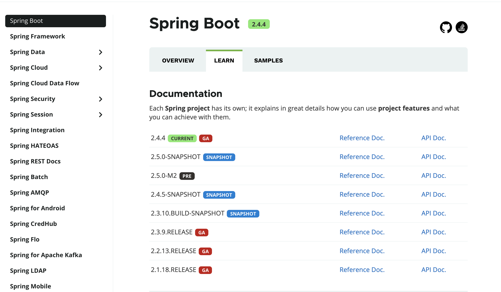
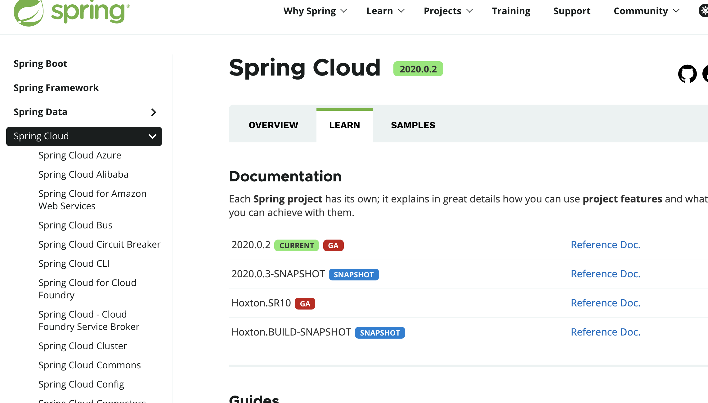
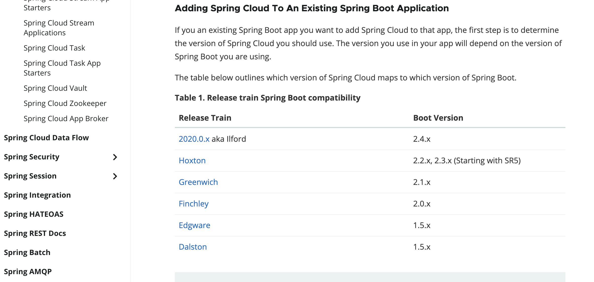

# springcloud 和 springboot 对应版本

- `GA`(`General Availability`),正式发布的版本，官方推荐使用该版本，国外很多项目都是使用 GA 来表示正式发布版本的
- `SNAPSHOT`: 快照版，可以稳定使用，且该版本会一直进行小量的优化和改进
- `PRE`:预览版，主要是用来内部开发人员和测试人员测试使用，因此不建议使用

## 查看 springboot 最新的稳定版本

[https://spring.io/projects/spring-boot#learn](https://spring.io/projects/spring-boot#learn)

## 查看 springcloud 最新的稳定版本

[https://spring.io/projects/spring-cloud#learn](https://spring.io/projects/spring-cloud#learn)

## 查看 springcloud 和 springboot 对应的版本

[https://spring.io/projects/spring-cloud#overview](https://spring.io/projects/spring-cloud#overview)

