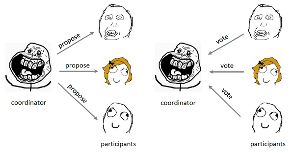
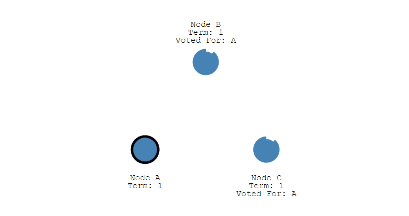
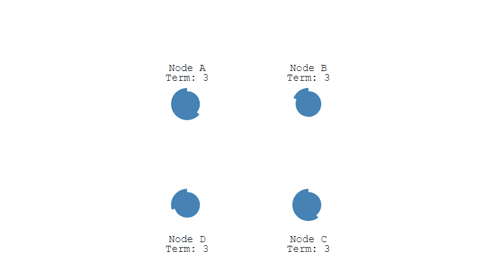

# 分布式一致性算法

## 参考

- [https://raft.github.io/raftscope/index.html](https://raft.github.io/raftscope/index.html)
- [分布式一致性协议介绍（Paxos、Raft）](https://www.cnblogs.com/zhang-qc/p/8688258.html)
- [分布式一致性算法-Paxos、Raft、ZAB、Gossip](https://zhuanlan.zhihu.com/p/130332285)
- [分布式一致性算法](https://www.jianshu.com/p/40dbe406d2f4)
- [一致性算法](https://www.cnblogs.com/qmillet/p/12487412.html)
- [分布式系统的经典基础理论](https://github.com/Snailclimb/JavaGuide/blob/6e6d9da410d5cac35a2339b1debfbe2782b5f85a/docs/system-design/website-architecture/%E5%88%86%E5%B8%83%E5%BC%8F.md)
- [理解分布式一致性与 Raft 算法](https://www.cnblogs.com/mokafamily/p/11303534.html)
- [Raft 一致性算法论文的中文翻译](https://github.com/maemual/raft-zh_cn)
- [分布式.md](https://github.com/CyC2018/CS-Notes/blob/f84b14041830ea38f1f2eb6061c3722aedc0e836/docs/notes/%E5%88%86%E5%B8%83%E5%BC%8F.md)

## `CAP`理论

一个分布式系统不可能同时满足一致性`C:Consistency`，可用性`A: Availability`和分区容错性`P：Partition tolerance`这三个基本需求，`最多只能同时满足其中的 2 个`。

| 选项                      | 描述                                                                                                                         |
| ------------------------- | ---------------------------------------------------------------------------------------------------------------------------- |
| `C(Consistence)`          | 一致性，指数据在多个副本之间能够保持一致的特性（严格的一致性）。                                                             |
| `A(Availability)`         | 可用性，指系统提供的服务必须一直处于可用的状态，每次请求都能获取到非错的响应——但是不保证获取的数据为最新数据。               |
| `P(Network partitioning)` | 分区容错性，分布式系统在遇到任何网络分区故障的时候，仍然能够对外提供满足一致性和可用性的服务，除非整个网络环境都发生了故障。 |

## `Base`理论

`BASE` 是 `Basically Available`(基本可用)，`Soft state`（软状态）,和`Eventually consistent`（最终一致性）三个短语的缩写。

`BASE`理论是对`CAP`中一致性和可用性权衡的结果，其来源于对大规模互联网系统分布式实践的总结，是基于`CAP`定理逐步演化而来的，它大大降低了我们对系统的要求。

### 基本可用

基本可用是指分布式系统在出现不可预知故障的时候，允许损失部分可用性。但是，这绝不等价于系统不可用。

- `响应时间上的损失`:正常情况下，一个在线搜索引擎需要在 0.5 秒之内返回给用户相应的查询结果，但由于出现故障，查询结果的响应时间增加了 1~2 秒
- `系统功能上的损失`：在一些节日大促购物高峰的时候，由于消费者的购物行为激增，为了保护购物系统的稳定性，部分消费者可能会被引导到一个降级页面

### 软状态

软状态指允许系统中的数据存在中间状态，并认为该中间状态的存在不会影响系统的整体可用性，即允许系统在不同节点的数据副本之间进行数据同步的过程存在延时

### 最终一致性

最终一致性强调的是系统中所有的数据副本，在经过一段时间的同步后，最终能够达到一个一致的状态。因此，最终一致性的本质是需要系统保证最终数据能够达到一致，而不需要实时保证系统数据的强一致性。

## 一致性的分类

### 强一致性

说明：保证系统改变提交以后立即改变集群的状态。
模型：

- Paxos
- Raft（muti-paxos）
- ZAB（muti-paxos）

### 弱一致性

说明：也叫最终一致性，系统不保证改变提交以后立即改变集群的状态，但是随着时间的推移最终状态是一致的。
模型：

- DNS 系统
- Gossip 协议

### 一致性算法实现举例

Google 的 Chubby 分布式锁服务，采用了 Paxos 算法
`etcd`和`consul`分布式键值数据库，采用了`Raft`算法
`ZooKeeper`分布式应用协调服务，Chubby 的开源实现，采用 ZAB 算法

## 两阶段提交

`Two-phase Commit`（2PC）：保证一个事务跨越多个节点时保持 `ACID` 特性；

两类节点：协调者(`Coordinator`)和参与者(`Participants`)，协调者只有一个，参与者可以有多个。

过程：

准备阶段：`协调者询问参与者事务是否执行成功`.

提交阶段：如果事务在每个参与者上都执行成功，协调者发送通知让参与者提交事务；否则，协调者发送通知让参与者回滚事务。

存在问题: 协调者如果发起提议后宕机，那么参与者会进入阻塞状态，等待参与者回应完成此次决议。此时需要一个协调者备份角色解决此问题，协调者宕机一段时间后，协调者备份接替协调者的工作，通过问询参与者的状态决定阶段 2 是否提交事务。

## `Raft` 算法

`Raft`算法的论文题目是`《In Search of an Understandable Consensus Algorithm (Extended Version)》`（`《寻找一种易于理解的一致性算法（扩展版）》`）

很容易理解，Raft 算法的初衷就是设计一个相较于 Paxos 更易于理解的强一致性算法

Raft 算法中的三种角色

- `Leader`领导者节点，负责发出提案
- `Follower`追随者节点，负责同意`Leader`发出的提案
- `Candidate`候选人，负责争夺`Leader`

`Raft`算法将一致性问题分解为两个的子问题，`Leader选举`和`状态复制`

`raft` 最关键的一个概念是`任期(term)`，每一个 `leader` 都有自己的`任期(term)`，必须在任期内发送心跳信息给 `follower` 来延长自己的`任期`。

## 单个 Candidate 的竞选

`Leader` 会周期性的发送心跳包给 `Follower`。每个 `Follower` 都设置了一个随机的竞选超时时间，一般为 `150ms~300ms`，如果在这个时间内没有收到 `Leader` 的心跳包，就会变成 `Candidate`，进入竞选阶段。

### 分布式系统的最初阶段

此时只有 `Follower`，没有 `Leader`。`Follower A` 等待一个随机的竞选超时时间之后，没收到 `Leader` 发来的心跳包，因此进入竞选阶段。

此时 Node A 发送投票请求给其它所有节点。

- 其它节点会对请求进行回复，如果超过一半的节点回复了，那么该 Candidate 就会变成 Leader。

- 之后 Leader 会周期性地发送心跳包给 Follower，Follower 接收到心跳包，会重新开始计时。

## 多个 Candidate 竞选

- 如果有多个 `Follower` 成为 `Candidate`，并且所获得票数相同，那么就需要重新开始投票。例如下图中 Node B 和 Node D 都获得两票，需要重新开始投票。

- 由于每个节点设置的随机竞选超时时间不同，因此下一次再次出现多个 Candidate 并获得同样票数的概率很低。

## 数据同步

- 来自客户端的修改都会被传入 Leader。注意该修改还未被提交，只是写入日志中。

- Leader 会把修改复制到所有 Follower。

- Leader 会等待大多数的 Follower 也进行了修改，然后才将修改提交。

- 此时 Leader 会通知的所有 Follower 让它们也提交修改，此时所有节点的值达成一致。

