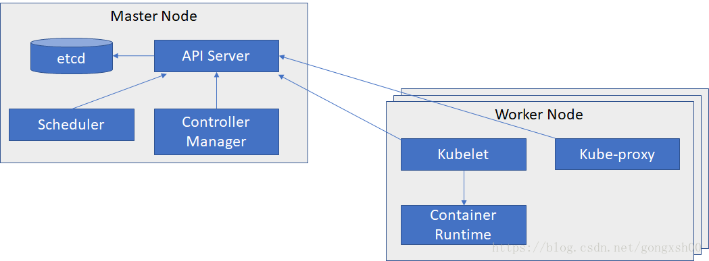

# 参考[Kubernetes 中文文档](http://docs.kubernetes.org.cn/)

## Kubernetes 主要由以下几个核心组件组成

- etcd 保存了整个集群的状态；
- apiserver 提供了资源操作的唯一入口，并提供认证、授权、访问控制、API 注册和发现等机制；
- controller manager 负责维护集群的状态，比如故障检测、自动扩展、滚动更新等；
- scheduler 负责资源的调度，按照预定的调度策略将 Pod 调度到相应的机器上；
- kubelet 负责维护容器的生命周期，同时也负责 Volume（CVI）和网络（CNI）的管理；
- Container runtime 负责镜像管理以及 Pod 和容器的真正运行（CRI）；
- kube-proxy 负责为 Service 提供 cluster 内部的服务发现和负载均衡；

除了核心组件，还有一些推荐的 Add-ons：

- kube-dns 负责为整个集群提供 DNS 服务
- Ingress Controller 为服务提供外网入口
- Heapster 提供资源监控
- Dashboard 提供 GUI

## 1.Pod

K8s 有很多技术概念，同时对应很多 API 对象，最重要的也是最基础的是微服务 Pod。
Pod 是在 K8s 集群中运行部署应用或服务的最小单元，它是可以支持多容器的。
Pod 的设计理念是支持多个容器在一个 Pod 中共享网络地址和文件系统，可以通过进程间通信和文件共享这种简单高效的方式组合完成服务。

## 2.复制控制器（Replication Controller，RC）

RC 是 K8s 集群中最早的保证 Pod 高可用的 API 对象。通过监控运行中的 Pod 来保证集群中运行指定数目的 Pod 副本。
指定的数目可以是多个也可以是 1 个；少于指定数目，RC 就会启动运行新的 Pod 副本；多于指定数目，RC 就会杀死多余的 Pod 副本。
即使在指定数目为 1 的情况下，通过 RC 运行 Pod 也比直接运行 Pod 更明智，因为 RC 也可以发挥它高可用的能力，保证永远有 1 个 Pod 在运行。

## 3.副本集（Replica Set，RS）

RS 是新一代 RC，提供同样的高可用能力，区别主要在于 RS 后来居上，能支持更多种类的匹配模式。
副本集对象一般不单独使用，而是作为 Deployment 的理想状态参数使用。

## 4.服务（Service）

RC、RS 和 Deployment 只是保证了支撑服务的微服务 Pod 的数量，但是没有解决如何访问这些服务的问题。
一个 Pod 只是一个运行服务的实例，随时可能在一个节点上停止，在另一个节点以一个新的 IP 启动一个新的 Pod，因此不能以确定的 IP 和端口号提供服务。
要稳定地提供服务需要服务发现和负载均衡能力。服务发现完成的工作，是针对客户端访问的服务，找到对应的的后端服务实例。
在 K8s 集群中，客户端需要访问的服务就是 Service 对象。每个 Service 会对应一个集群内部有效的虚拟 IP，集群内部通过虚拟 IP 访问一个服务。
在 K8s 集群中微服务的负载均衡是由 Kube-proxy 实现的。Kube-proxy 是 K8s 集群内部的负载均衡器。
它是一个分布式代理服务器，在 K8s 的每个节点上都有一个；这一设计体现了它的伸缩性优势，
需要访问服务的节点越多，提供负载均衡能力的 Kube-proxy 就越多，高可用节点也随之增多。

## 5.存储卷（Volume）

K8s 集群中的存储卷跟 Docker 的存储卷有些类似，只不过 Docker 的存储卷作用范围为一个容器，
而 K8s 的存储卷的生命周期和作用范围是一个 Pod。每个 Pod 中声明的存储卷由 Pod 中的所有容器共享。

## 6.节点（Node）

K8s 集群中的计算能力由 Node 提供，最初 Node 称为服务节点 Minion，后来改名为 Node。
K8s 集群中的 Node 也就等同于 Mesos 集群中的 Slave 节点，是所有 Pod 运行所在的工作主机，可以是物理机也可以是虚拟机。
不论是物理机还是虚拟机，工作主机的统一特征是上面要运行 kubelet 管理节点上运行的容器。

## 7.密钥对象（Secret）

Secret 是用来保存和传递密码、密钥、认证凭证这些敏感信息的对象。
使用 Secret 的好处是可以避免把敏感信息明文写在配置文件里。

## 8.用户帐户（User Account）和服务帐户（Service Account）

顾名思义，用户帐户为人提供账户标识，而服务账户为计算机进程和 K8s 集群中运行的 Pod 提供账户标识。
用户帐户和服务帐户的一个区别是作用范围；用户帐户对应的是人的身份，人的身份与服务的 namespace 无关，所以用户账户是跨 namespace 的；
而服务帐户对应的是一个运行中程序的身份，与特定 namespace 是相关的。

## 9.名字空间（Namespace）

名字空间为 K8s 集群提供虚拟的隔离作用，K8s 集群初始有两个名字空间，
分别是默认名字空间 default 和系统名字空间 kube-system，除此以外，管理员可以可以创建新的名字空间满足需要。

## 10.RBAC 访问授权

K8s 在 1.3 版本中发布了 alpha 版的基于角色的访问控制（Role-based Access Control，RBAC）的授权模式。
相对于基于属性的访问控制（Attribute-based Access Control，ABAC），
RBAC 主要是引入了角色（Role）和角色绑定（RoleBinding）的抽象概念。
在 ABAC 中，K8s 集群中的访问策略只能跟用户直接关联；而在 RBAC 中，访问策略可以跟某个角色关联，具体的用户在跟一个或多个角色相关联。
显然，RBAC 像其他新功能一样，每次引入新功能，都会引入新的 API 对象，从而引入新的概念抽象，而这一新的概念抽象一定会使集群服务管理和使用更容易扩展和重用。
