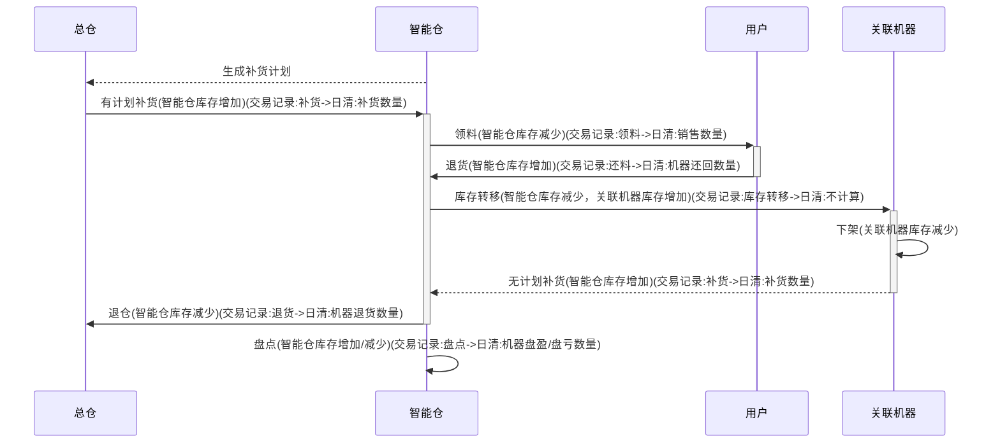

# mermaid 流程图

```mermaid
sequenceDiagram
    participant 总仓
    participant 智能仓
    participant 用户
    participant 关联机器
    智能仓-->>总仓: 生成补货计划
    总仓->>+智能仓: 有计划补货(智能仓库存增加)(交易记录:补货->日清:补货数量)
    智能仓->>+用户: 领料(智能仓库存减少)(交易记录:领料->日清:销售数量)
    用户->>-智能仓: 退货(智能仓库存增加)(交易记录:还料->日清:机器还回数量)
    智能仓->>+关联机器: 库存转移(智能仓库存减少，关联机器库存增加)(交易记录:库存转移->日清:不计算)
    关联机器->>关联机器:下架(关联机器库存减少)
    关联机器-->>-智能仓: 无计划补货(智能仓库存增加)(交易记录:补货->日清:补货数量)
    智能仓->>-总仓: 退仓(智能仓库存减少)(交易记录:退货->日清:机器退货数量)
    智能仓->>智能仓: 盘点(智能仓库存增加/减少)(交易记录:盘点->日清:机器盘盈/盘亏数量)
```
