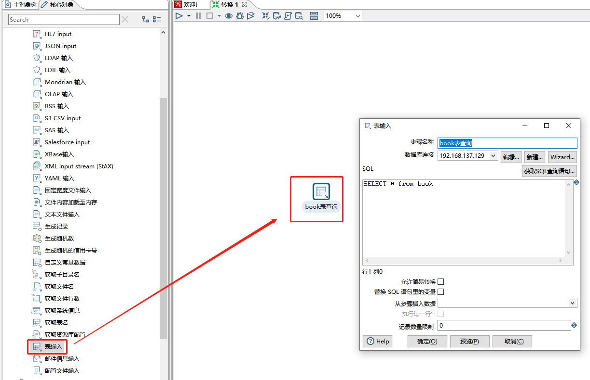
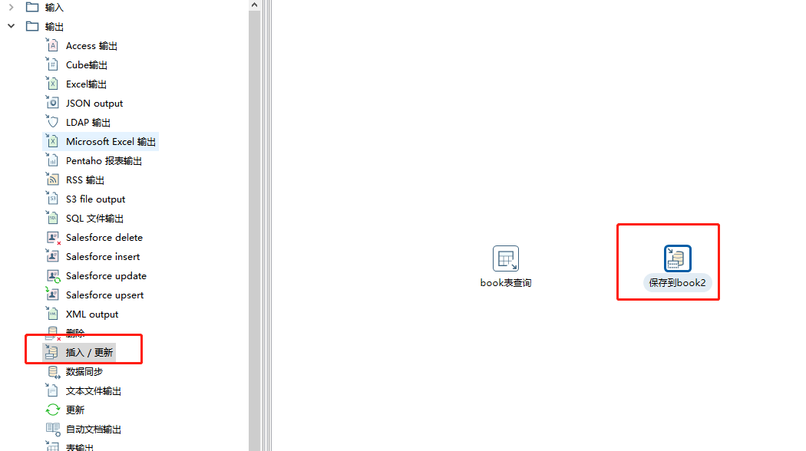
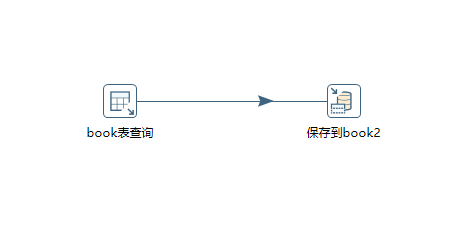
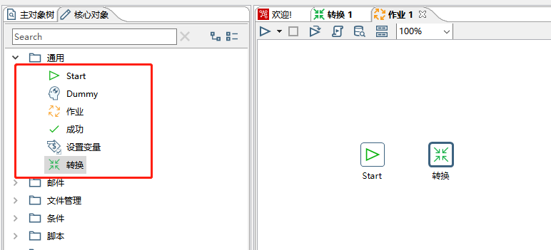
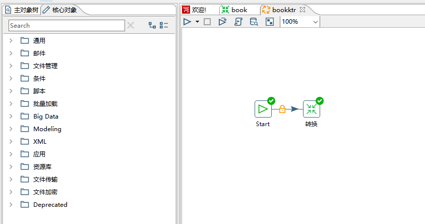

# kettle 数据迁移

`Kettle`是一款国外开源的 ETL 工具，纯 java 编写，可以在 Window、Linux、Unix 上运行，数据抽取高效稳定。

`Kettle` 中文名称叫水壶, 希望把各种数据放到一个壶里，然后以一种指定的格式流出。

`Kettle`中有两种脚本文件，`transformation`和`job`，`transformation`完成针对数据的基础转换，`job`则完成整个工作流的控制。

## Kettle安装

- 北京理工大学镜像[http://mirror.bit.edu.cn/pentaho/Data%20Integration/](http://mirror.bit.edu.cn/pentaho/Data%20Integration/)
- [http://community.pentaho.com/projects/data-integration/](http://community.pentaho.com/projects/data-integration/)

首先解压下载下来的压缩包如:`pdi-ce-8.3.0.0-371.zip`

然后打开`Spoon.bat`

## 创建转换

### `新建转换 -> 主对象树 -> DB连接 ->新建数据库连接`

### `核心对象 -> 输入 -> 表输入`

### `核心对象 -> 输出 -> 插入/更新`

### `选中表输入 -> 按住shift键 ->拖向插入/更新`

### 使用作业控制上面装换执行

新建一个作业。并从左边面板拖入`start`和`转换`

双击`start`可以编辑，可以设置执行时间等等

设置转换任务,选择刚才

