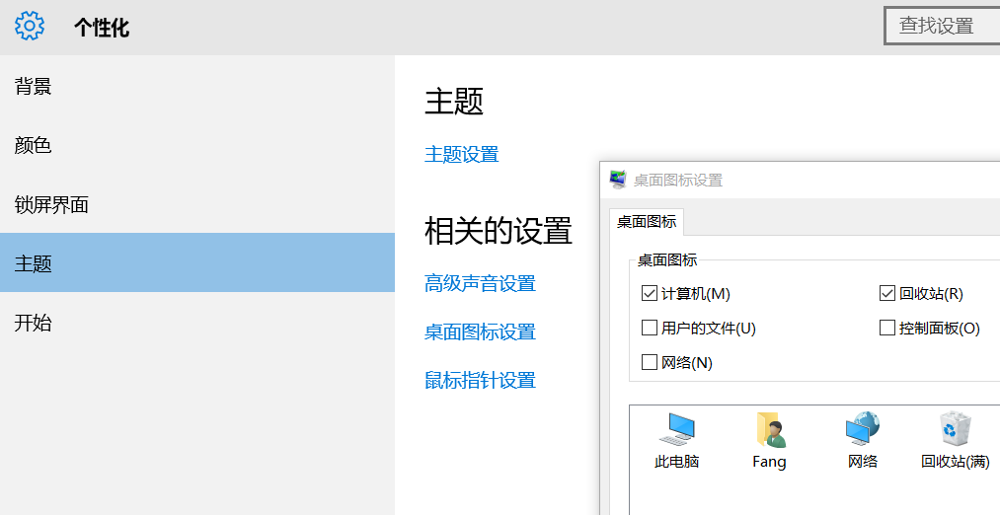
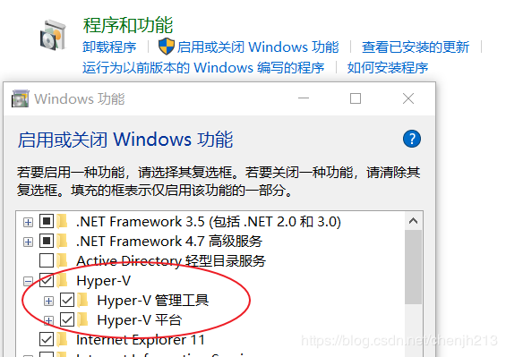
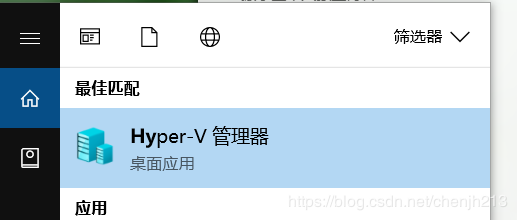
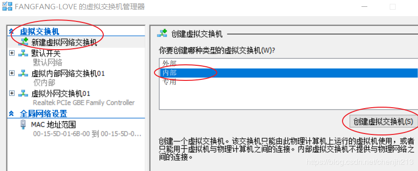
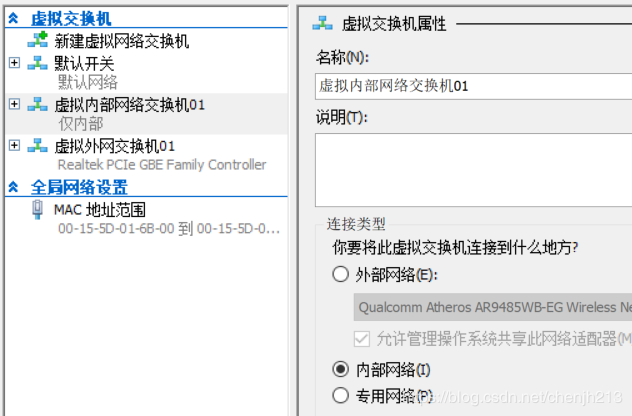
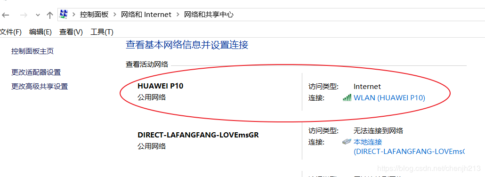
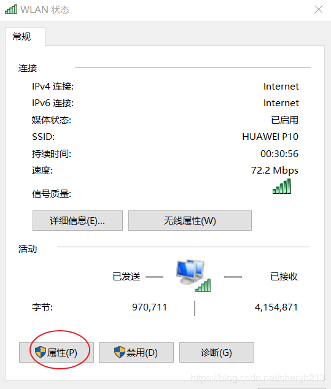
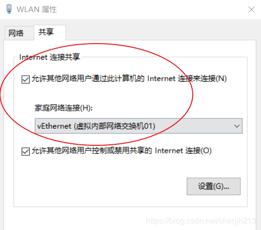
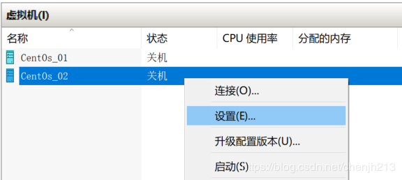
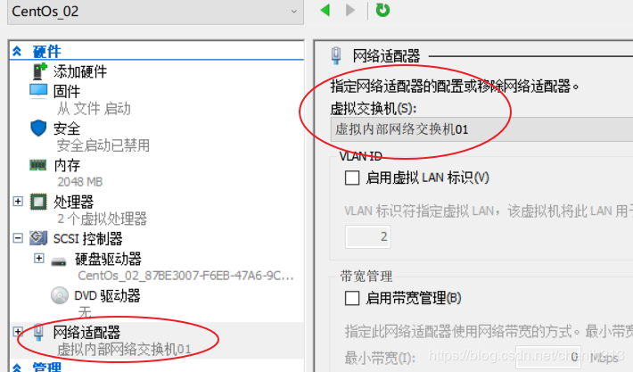

# 桌面显示计算机

`个性化 -> 主题 -> 桌面图标设置`

Hyper-V 是基于 64 位系统，在 Windows10 自带的虚拟化工具。



## 1.Hyper-V 的启动和管理

`控制面板->程序->打开或关闭Windows功能中启用Hyper-V`，第一次设置后需要重启电脑



## 2.打开`Hyper-V管理器`



## 3.打开虚拟交换机管理器


## 4.新建虚拟网络交换机

如果电脑连接的是`Wifi`,只能和主机主机共享无线网卡,连接内网了。

在左侧菜单栏中点击`新建虚拟网络交换机`，并且在右侧的类型选项中选择`内部`，然后点击创建虚拟交换机：



- `外部网络`可以直接连外网，和宿主机的网络一样，此外和其他虚拟机和可以互相通信。
- `内部网络`则只能在虚拟机之间或者虚拟机和宿主机之间进行网络通信，不能上外网。
- `专用网络`就相当于虚拟机之间构建的一个局域网，连宿主机都无法进行网络连接。

## 5.设置虚拟交换机属性


在`网络与共享中心`下面点击现有的`网络连接`：

在弹出的对话框中选择`属性`：

切换到“共享”标签下，勾选“允许其他网络用户通过此计算机的 Internet 连接选择刚刚创建的虚拟交换机 vEthernet (虚拟内部网络交换机 01)


共享的虚拟机名称必须和设置的虚拟机名称对应上

## 6.虚拟机网络设置

右键打开虚拟机设置

修改虚拟机网络适配器


## 7.修改虚拟机 DNS

```conf
#修改对应网卡的DNS的配置文件
vi /etc/resolv.conf
#添加域名服务器
nameserver 223.5.5.5 #阿里的DNS
nameserver 223.6.6.6
nameserver 8.8.8.8 #google的DNS
nameserver 8.8.4.4
#如果resolv.conf文件Generated by NetworkManager
#在/etc/sysconfig/network-scripts/ifcfg-eth0添加DNS1、DNS2
```

## 8.设置网卡

```bash
vi /etc/sysconfig/network-scripts/ifcfg-eth0
```

```conf
DEVICE=eth0  #网卡对应的设备别名
HWADDR=00:50:56:B6:C1:3A #网卡Mac地址
ONBOOT=yes   #系统启动时是否激活此设备
BOOTPROTO=dhcp  #网卡获得ip地址的方式
#dhcp 通过dhcp协议自动获取ip
```

### 8.2 设置静态 IP

```conf
DEVICE=eth0  #网卡对应的设备别名
ONBOOT=yes   #系统启动时是否激活此设备
BOOTPROTO=static  #网卡获得ip地址的方式
IPADDR=192.168.137.89
GATEWAY=192.168.137.1
DNS1=223.5.5.5
DNS2=223.6.6.6
DNS3=8.8.8.8
NETMASK=255.255.255.0
```

### 8.3 重启虚拟机

```bash
reboot
```

## 9.获取虚拟机 IP

```bash
$ ip addr
1: lo: <LOOPBACK,UP,LOWER_UP> mtu 65536 qdisc noqueue state UNKNOWN group defaul                                                                              t qlen 1000
    link/loopback 00:00:00:00:00:00 brd 00:00:00:00:00:00
    inet 127.0.0.1/8 scope host lo
       valid_lft forever preferred_lft forever
    inet6 ::1/128 scope host
       valid_lft forever preferred_lft forever
2: eth0: <BROADCAST,MULTICAST,UP,LOWER_UP> mtu 1500 qdisc mq state UP group defa                                                                              ult qlen 1000
    link/ether 00:15:5d:01:6b:04 brd ff:ff:ff:ff:ff:ff
    inet 192.168.137.90/24 brd 192.168.137.255 scope global noprefixroute dynami                                                                              c eth0
       valid_lft 604668sec preferred_lft 604668sec
    inet6 fe80::df6f:ef76:7414:e74c/64 scope link noprefixroute
       valid_lft forever preferred_lft forever
```
