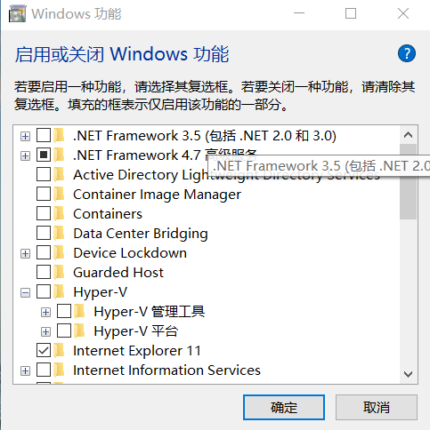
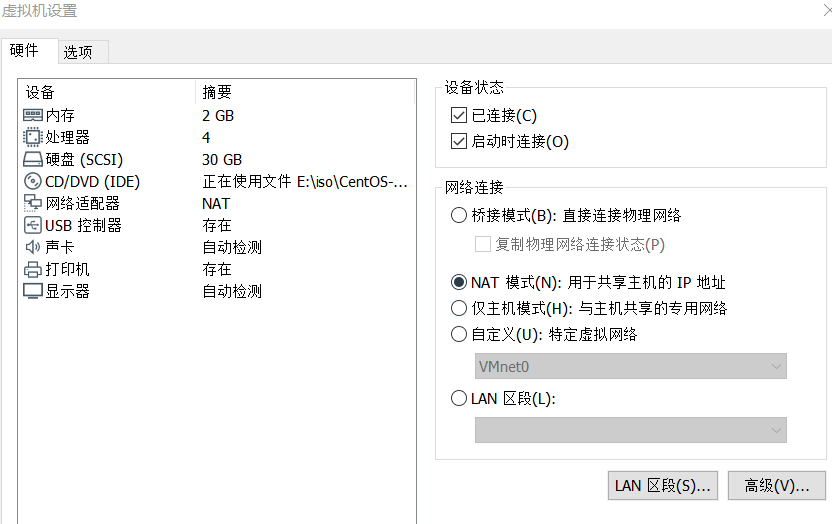
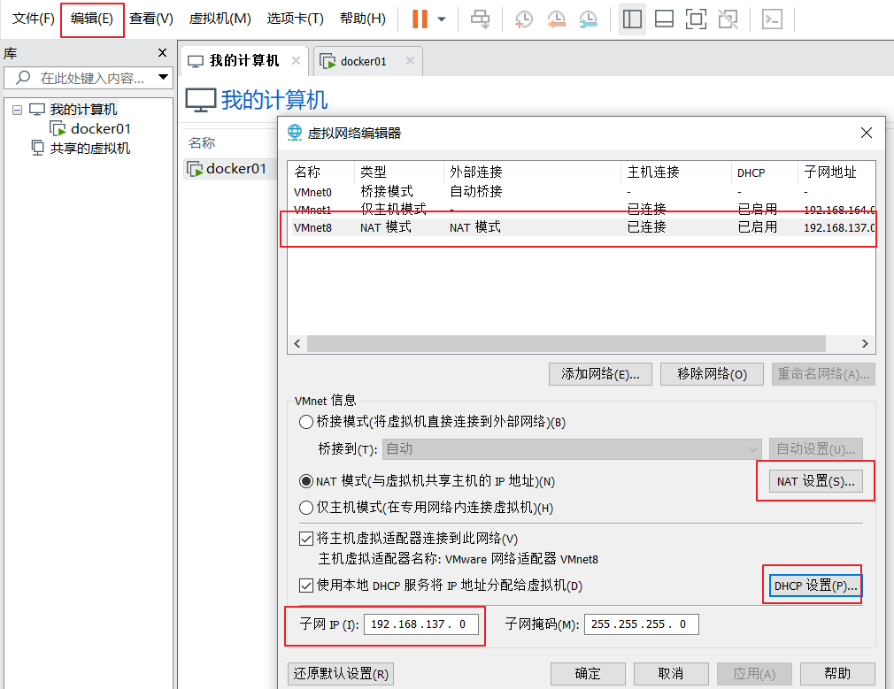
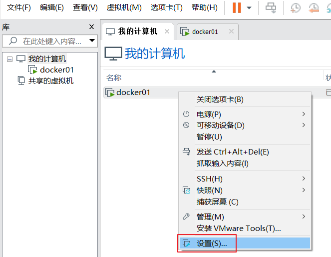
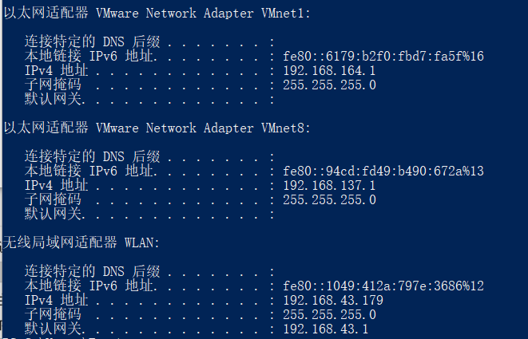

# 1.下载`VMware Workstation`

## 2.关掉`Hyper-v`

`控制面板->程序->打开或关闭Windows功能中关闭Hyper-V`



### 3.vmware网络模式

vmware有三种网络模式

- Bridged（桥接模式）
- NAT（网络地址转换模式）
- Host-Only（仅主机模式）



### 3.1 Bridged（桥接模式）

> 桥接模式就是将主机网卡与虚拟机虚拟的网卡利用虚拟网桥进行通信
在桥接模式下，虚拟机ip地址需要与主机在同一个网段，如果需要联网，则网关与DNS需要与主机网卡一致。


### 3.2 NAT（网络地址转换模式）

> 如果你的网络ip资源紧缺，但是你又希望你的虚拟机能够联网，这时候NAT模式是最好的选择。
NAT模式借助虚拟NAT设备和虚拟DHCP服务器，使得虚拟机可以联网。其网络结构如下图所示：


### 3.2.1 打开vmware，点击`编辑`下的`虚拟网络编辑器`



### 3.2.2 将虚拟机的网络连接模式修改成`NAT模式`，点击`编辑虚拟机设置`



### 3.2.3 查看主机VMnet8的ip

`ipconfig`



### 3.2.4 启动系统，编辑网卡配置文件

```bash
[root@docker01 ~]# ip addr
1: lo: <LOOPBACK,UP,LOWER_UP> mtu 65536 qdisc noqueue state UNKNOWN group default qlen 1000
    link/loopback 00:00:00:00:00:00 brd 00:00:00:00:00:00
    inet 127.0.0.1/8 scope host lo
       valid_lft forever preferred_lft forever
    inet6 ::1/128 scope host
       valid_lft forever preferred_lft forever
2: ens33: <BROADCAST,MULTICAST,UP,LOWER_UP> mtu 1500 qdisc pfifo_fast state UP group default qlen 1000
    link/ether 00:0c:29:d8:01:04 brd ff:ff:ff:ff:ff:ff
    inet 192.168.137.128/24 brd 192.168.137.255 scope global noprefixroute dynamic ens33
       valid_lft 1648sec preferred_lft 1648sec
    inet6 fe80::b64d:79e6:43de:fbe3/64 scope link noprefixroute
       valid_lft forever preferred_lft forever

vi /etc/sysconfig/network-scripts/ifcfg-ens33

BOOTPROTO="dhcp"
NAME="ens33"
DEVICE="ens33"
ONBOOT="yes"
```

### 3.2.5 测试网络

```bash
[root@docker01 ~]# ping www.baidu.com
PING www.a.shifen.com (183.232.231.172) 56(84) bytes of data.
64 bytes from 183.232.231.172 (183.232.231.172): icmp_seq=1 ttl=128 time=37.0 ms
64 bytes from 183.232.231.172 (183.232.231.172): icmp_seq=2 ttl=128 time=44.2 ms
64 bytes from 183.232.231.172 (183.232.231.172): icmp_seq=3 ttl=128 time=42.5 ms
64 bytes from 183.232.231.172 (183.232.231.172): icmp_seq=4 ttl=128 time=35.9 ms
```

### 3.2.6 `ping`通网络之后可以下载`ifconfig`命令

```bash
#查看哪个包提供了ifconfig命令,显示net-tools
yum provides ifconfig

#安装提供ifconfig的包
yum install net-tools
```

### 4.Host-Only（仅主机模式）

> 主机模式和NAT模式很相似，只不过不能上网，相当于VMware虚拟一个局域网，但是这个局域网没有连互联网。


## host-only 模式连接外网

### 第一张网卡设置为`host-only`


### 开启网络共享


`右击可以连接外网的网卡-->属性-->共享-->勾选Internet连接共享-->选择共享的网卡`


