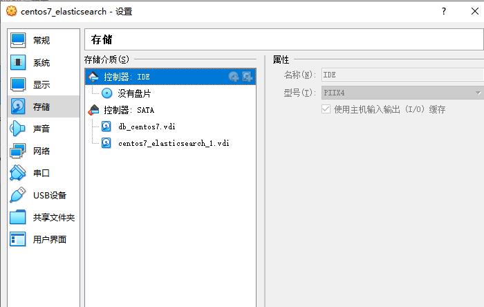

# elasticSearh提示high disk watermark [90%] exceeded

## 1.添加新硬盘

在`virtualbox`中选中要添加虚拟硬盘的虚机，`设置 -> 存储 -> 控制器:SATA -> 添加虚拟硬盘`



## 查看现有系统的磁盘空间

```bash
➜  ~ fdisk -l

磁盘 /dev/sdb：32.2 GB, 32212254720 字节，62914560 个扇区
Units = 扇区 of 1 * 512 = 512 bytes
扇区大小(逻辑/物理)：512 字节 / 512 字节
I/O 大小(最小/最佳)：512 字节 / 512 字节


磁盘 /dev/sda：32.2 GB, 32212254720 字节，62914560 个扇区
Units = 扇区 of 1 * 512 = 512 bytes
扇区大小(逻辑/物理)：512 字节 / 512 字节
I/O 大小(最小/最佳)：512 字节 / 512 字节
磁盘标签类型：dos
磁盘标识符：0x000aa8bb

   设备 Boot      Start         End      Blocks   Id  System
/dev/sda1   *        2048     2099199     1048576   83  Linux
/dev/sda2         2099200    62914559    30407680   8e  Linux LVM

磁盘 /dev/mapper/centos-root：29.0 GB, 28982640640 字节，56606720 个扇区
Units = 扇区 of 1 * 512 = 512 bytes
扇区大小(逻辑/物理)：512 字节 / 512 字节
I/O 大小(最小/最佳)：512 字节 / 512 字节


磁盘 /dev/mapper/centos-swap：2147 MB, 2147483648 字节，4194304 个扇区
Units = 扇区 of 1 * 512 = 512 bytes
扇区大小(逻辑/物理)：512 字节 / 512 字节
I/O 大小(最小/最佳)：512 字节 / 512 字节
```

## 给新加的硬盘分区

```bash
➜  ~ fdisk /dev/sdb
欢迎使用 fdisk (util-linux 2.23.2)。

更改将停留在内存中，直到您决定将更改写入磁盘。
使用写入命令前请三思。

Device does not contain a recognized partition table
使用磁盘标识符 0xfa9e98c0 创建新的 DOS 磁盘标签。

命令(输入 m 获取帮助)：m
命令操作
   a   toggle a bootable flag
   b   edit bsd disklabel
   c   toggle the dos compatibility flag
   d   delete a partition
   g   create a new empty GPT partition table
   G   create an IRIX (SGI) partition table
   l   list known partition types
   m   print this menu
   n   add a new partition
   o   create a new empty DOS partition table
   p   print the partition table
   q   quit without saving changes
   s   create a new empty Sun disklabel
   t   change a partition's' system id
   u   change display/entry units
   v   verify the partition table
   w   write table to disk and exit
   x   extra functionality (experts only)

命令(输入 m 获取帮助)：n
Partition type:
   p   primary (0 primary, 0 extended, 4 free)
   e   extended
Select (default p): p
分区号 (1-4，默认 1)：1
起始 扇区 (2048-62914559，默认为 2048)：
将使用默认值 2048
Last 扇区, +扇区 or +size{K,M,G} (2048-62914559，默认为 62914559)：
将使用默认值 62914559
分区 1 已设置为 Linux 类型，大小设为 30 GiB
命令(输入 m 获取帮助)：w
The partition table has been altered!

Calling ioctl() to re-read partition table.
正在同步磁盘。
```

## 格式化磁盘分区

```bash
➜  ~ mkfs.ext4 /dev/sdb1
mke2fs 1.42.9 (28-Dec-2013)
文件系统标签=
OS type: Linux
块大小=4096 (log=2)
分块大小=4096 (log=2)
Stride=0 blocks, Stripe width=0 blocks
1966080 inodes, 7864064 blocks
393203 blocks (5.00%) reserved for the super user
第一个数据块=0
Maximum filesystem blocks=2155872256
240 block groups
32768 blocks per group, 32768 fragments per group
8192 inodes per group
Superblock backups stored on blocks:
        32768, 98304, 163840, 229376, 294912, 819200, 884736, 1605632, 2654208,
        4096000

Allocating group tables: 完成
正在写入inode表: 完成
Creating journal (32768 blocks): 完成
Writing superblocks and filesystem accounting information: 完成
```

## 挂载分区

```bash
# 创建新的挂载点
➜  ~ mkdir /es-data
# 将新磁盘分区挂载到/es-data目录下
➜  ~ mount -t ext4 /dev/sdb1 /es-data
# 查看挂载
➜  ~ df -h
文件系统                 容量  已用  可用 已用% 挂载点
devtmpfs                 2.4G     0  2.4G    0% /dev
tmpfs                    2.4G     0  2.4G    0% /dev/shm
tmpfs                    2.4G  8.9M  2.4G    1% /run
tmpfs                    2.4G     0  2.4G    0% /sys
/dev/sdb1                 30G   45M   28G    1% /es-data
```

## 开机自动挂载

```bash
vi /etc/fstab
/dev/sdb1 /es-data ext4 errors=remount-ro 0 1
```
