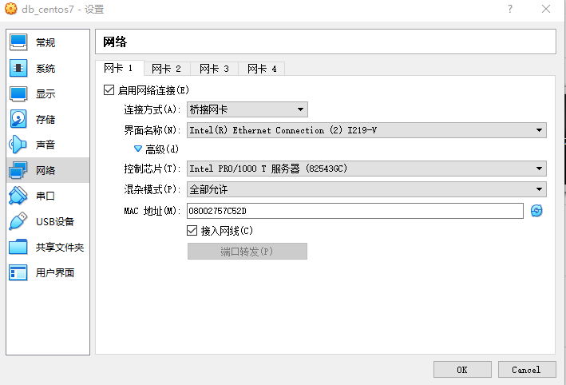
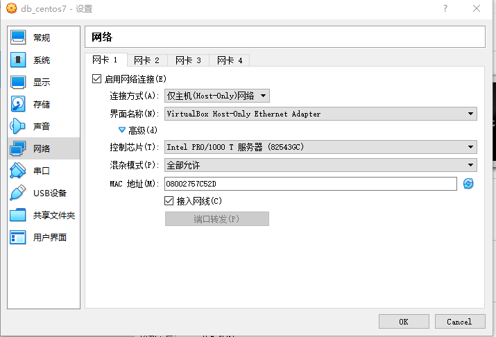
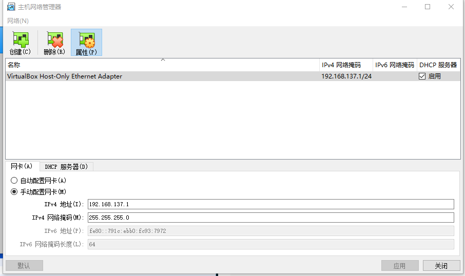
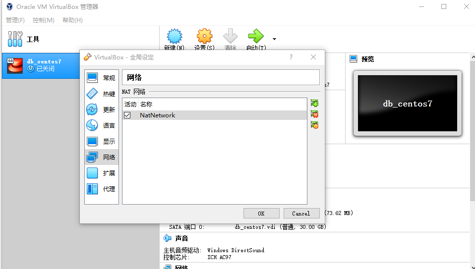
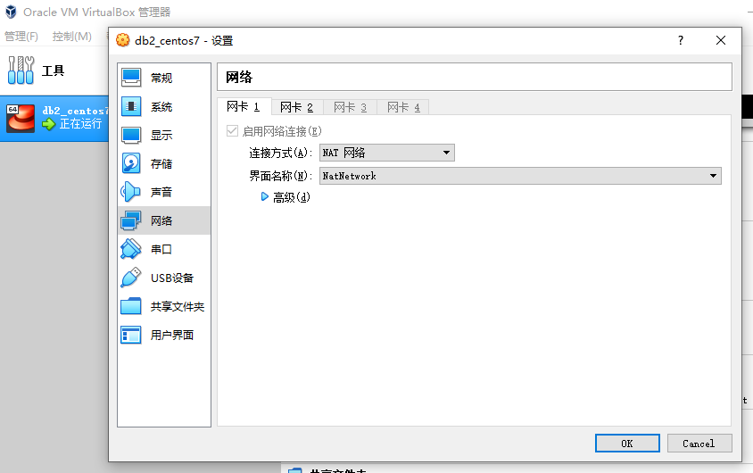
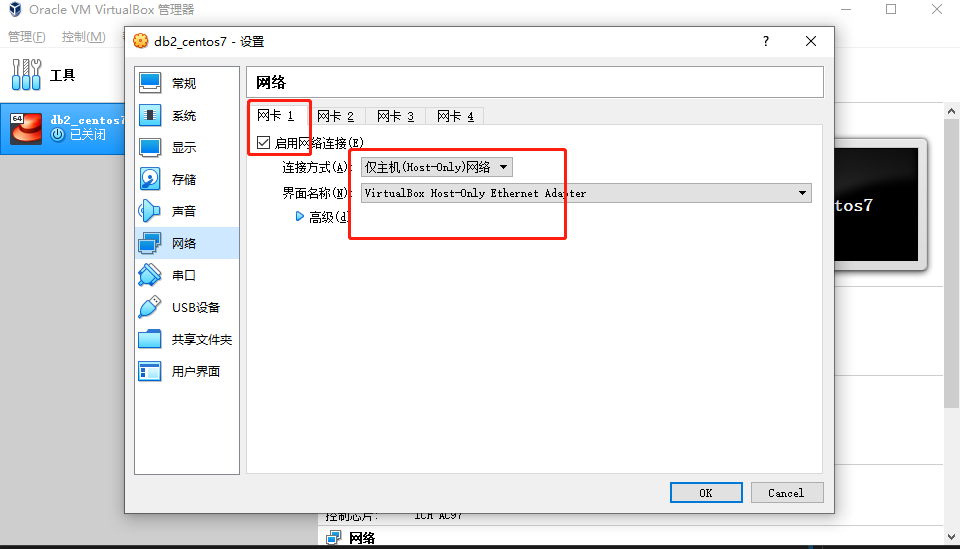
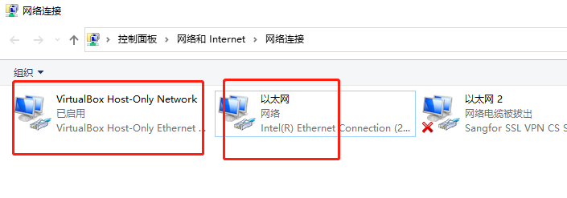
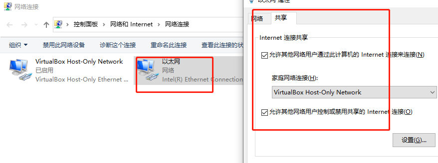

# VirtualBox 的提供了四种网络接入模式

- `NAT` 网络地址转换模式(NAT,Network Address Translation)
- `Bridged Adapter` 桥接模式
- `Internal` 内部网络模式
- `Host-only Adapter` 主机模式

## NAT 模式

NAT 模式是最简单的实现虚拟机上网的方式

- 如果主机可以上网，虚拟机可以上网
- 虚拟机之间不能 ping 通
- 虚拟机可以 ping 通主机（此时 ping 虚拟机的网关，即是 ping 主机）
- 主机不能 ping 通虚拟机

## Bridged Adapter 模式（桥接模式）

它使得虚拟机能被分配到一个网络中独立的 IP，所有网络功能完全和在网络中的真实机器一样

虚拟机与主机关系

> 可以相互访问，因为虚拟机在真实网络段中有独立 IP，主机与虚拟机处于同一网络段中，彼此可以通过各自 IP 相互访问

虚拟机于网络中其他主机关系

> 可以相互访问，同样因为虚拟机在真实网络段中有独立 IP，虚拟机与所有网络其他主机处于同一网络段中，彼此可以通过各自 IP 相互访问

虚拟机于虚拟机关系

可以相互访问



## Host-only Adapter 模式

我们可以理解为 Vbox 在主机中模拟出一张专供虚拟机使用的网卡，所有虚拟机都是连接到该网卡上的，我们可以通过设置这张网卡来实现上网及其他很多功能，比如（网卡共享、网卡桥接等）。

虚拟机与主机关系

> 默认不能相互访问，双方不属于同一 IP 段，host-only 网卡默认 IP 段为 192.168.56.X 子网掩码为 255.255.255.0，
> 后面的虚拟机被分配到的也都是这个网段。通过网卡共享、网卡桥接等，可以实现虚拟机于主机相互访问。

虚拟机与网络主机关系

> 默认不能相互访问，原因同上，通过设置，可以实现相互访问

虚拟机与虚拟机关系

> 默认可以相互访问，都是同处于一个网段



## 让虚拟机又能访问外网又可以与主机对话

要满足虚拟机能访问外网，又能与主机沟通，就需要两块网卡。所以我们要在 Virtualbox 中给它设置两个 Adapter（网卡），然后设置为：

> NAT + Host-only

### Host-only 网络设置

`管理 -> 主机网络管理`



### NAT 网络设置

`管理 -> 全局设定 -> 网络 -> 添加Nat`




### 虚拟机设置

`第一块网卡为Nat,第二块网卡为Host-only`



## 查看机器信息

```bash
[root@fangfang ~]# hostnamectl status
   Static hostname: fangfang.love
         Icon name: computer-vm
           Chassis: vm
        Machine ID: e1d2af59e87443a9b8f539da1f9b533b
           Boot ID: f4918a503c8541e0bd40b22916ae38c3
    Virtualization: kvm
  Operating System: CentOS Linux 7 (Core)
       CPE OS Name: cpe:/o:centos:centos:7
            Kernel: Linux 3.10.0-1062.el7.x86_64
      Architecture: x86-64
```

### 查看路由信息和网卡信息

```bash
[root@fangfang ~]# ip route show
default via 10.0.2.1 dev enp0s3 proto dhcp metric 100
10.0.2.0/24 dev enp0s3 proto kernel scope link src 10.0.2.15 metric 100
192.168.137.0/24 dev enp0s8 proto kernel scope link src 192.168.137.130 metric 101

[root@fangfang ~]# nmcli
enp0s3: 已连接 to enp0s3
        "Intel 82540EM"
        ethernet (e1000), 08:00:27:53:25:F8, 硬件, mtu 1500
        ip4 默认
        inet4 10.0.2.15/24
        route4 0.0.0.0/0
        route4 10.0.2.0/24
        inet6 fe80::99b:e937:38f:24b4/64
        route6 fe80::/64
        route6 ff00::/8

enp0s8: 已连接 to 有线连接 1
        "Intel 82540EM"
        ethernet (e1000), 08:00:27:75:67:D9, 硬件, mtu 1500
        inet4 192.168.137.130/24
        route4 192.168.137.0/24
        inet6 fe80::fd46:5dd8:1f8b:6318/64
        route6 fe80::/64
        route6 ff00::/8
```

### 配置网卡

```conf
cd /etc/sysconfig/network-scripts/
# 复制网卡配置
cp ifcfg-enp0s3 ifcfg-enp0s8

# 修改BOOTPROTO为static,删除UUID,修改网卡名称
TYPE="Ethernet"
PROXY_METHOD="none"
BROWSER_ONLY="no"
BOOTPROTO="static"
IPADDR=192.168.137.128
NETMASK=255.255.255.0
# 虚拟网卡地址
GATEWAY=192.168.137.1
DEFROUTE="yes"
NAME="enp0s8"
DEVICE="enp0s8"
ONBOOT="yes"

# 重启虚拟机
reboot
```

## host-only 模式连接外网

### 第一张网卡设置为`host-only`



### 开启网络共享



`右击可以连接外网的网卡-->属性-->共享-->勾选Internet连接共享-->选择共享的网卡`



```bash
[root@fangfang ~]# ip route show
default via 192.168.137.2 dev enp0s3 proto static metric 100
192.168.137.0/24 dev enp0s3 proto kernel scope link src 192.168.137.128 metric 100

[root@fangfang ~]# nmcli
enp0s3: 已连接 to enp0s3
        "Intel 82540EM"
        ethernet (e1000), 08:00:27:53:25:F8, 硬件, mtu 1500
        ip4 默认
        inet4 192.168.137.128/24
        route4 192.168.137.0/24
        route4 0.0.0.0/0
        inet6 fe80::99b:e937:38f:24b4/64
        route6 fe80::/64
        route6 ff00::/8
```
