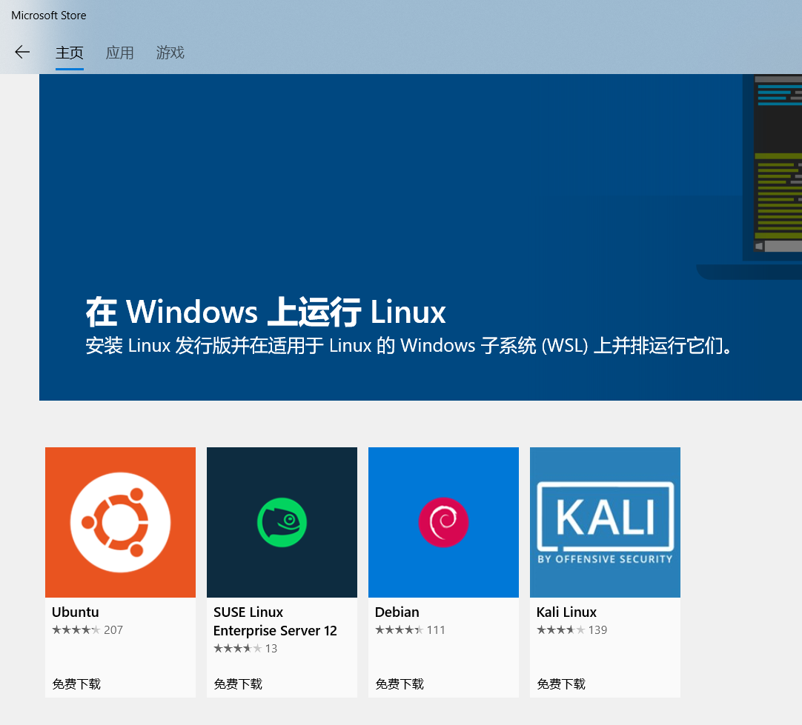
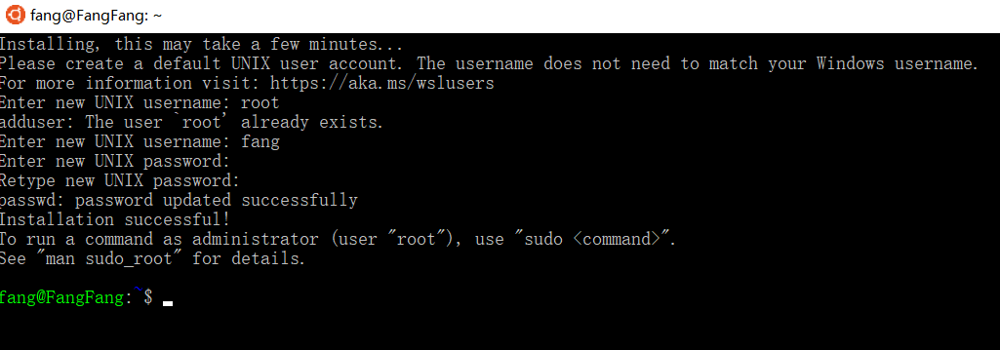
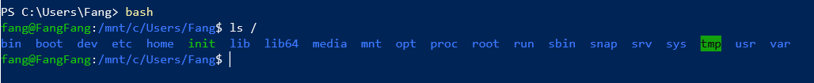
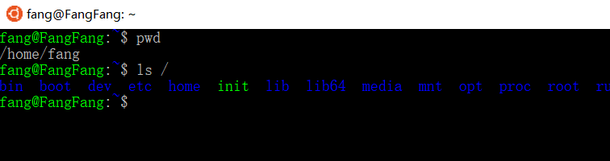
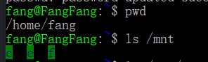

# 参考

- [Linux 安装指南适用于 Windows 10 的 Windows 子系统](https://docs.microsoft.com/zh-cn/windows/wsl/install-win10)

## 1. 安装`Windows 10`的 Linux 子系统组件

`控制面板 -> 程序 -> 启动或关闭Windows功能 -> 适用于Linux的windows子系统`


## 2. 安装 Linux 子系统

`Windows Store -> 应用 -> 搜索Linux`



然后点击启动，第一次会进行初始化安装。



```bash
fang@FangFang:~$ sudo passwd root
Enter new UNIX password:
Retype new UNIX password:
passwd: password updated successfully
```

## 3. 进入 Ubuntu 子系统

进入子系统的方法，直接输入 bash 就可以了，貌似无需密码直接进入系统了



使用子系统 ubuntu 自带客户端



## 4. Linux 子系统与 Windows 的交互

可通过网络端口 和 文件系统来交互操作，

在 bash 中通过指定/mnt/c /mnt/d … /mnt/盘符
可以直接操作对应的 windows 中的 C 盘，D 盘等


