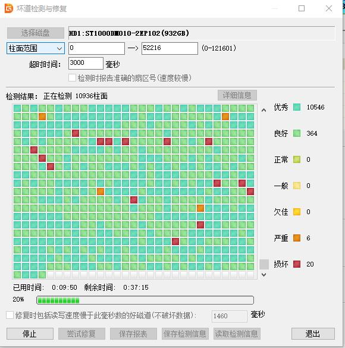
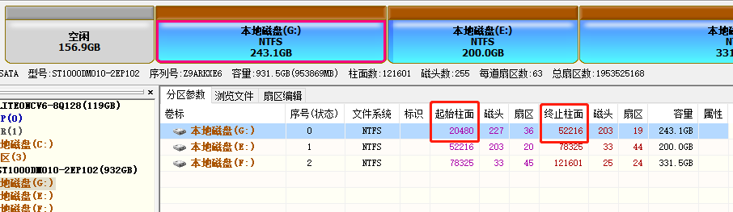
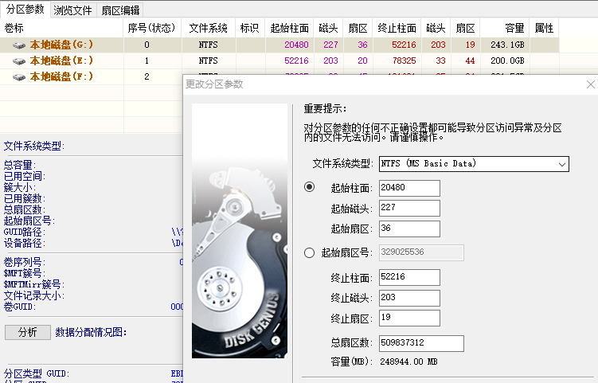
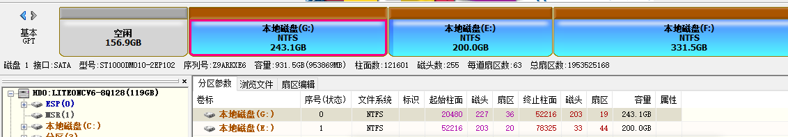

# 由于进程经常被系统关闭

`Windows + R` 输入 `EventVwr.msc`查看系统日志

```txt
由于下列某个原因，Windows 无法访问文件 : 网络连接、存储文件的磁盘或安装在此计算机上的存储 驱动程序有问题；或者磁盘丢失。 由于上述错误，Windows 关闭了程序 Visual Studio Code。

程序: Visual Studio Code
文件:

该错误值列于“其他数据”部分。
用户操作
1. 再次打开文件。 这种情况可能是一个临时问题，程序再次运行时可能会自行更正。
2. 如果仍然无法访问该文件，并且
     - 如果该文件位于网络上， 网络管理员应该验证网络是否存在问题并且验证是否可以与服务器联系。
     - 如果该文件位于可移动磁盘上(例如软盘或 CD-ROM)，请验证磁盘已完全插入计算机。
3. 通过运行 CHKDSK 检查并修复文件系统。若要运行 CHKDSK，请单击「开始」，单击“运行”，键入“CMD”，然后单击“确定”。在命令提示符处，键入 CHKDSK /F，然后按 Enter。
```

## 下载DiskGenius

## `磁盘 -> 坏道检测与修复`



## 导出磁盘检测结果

```txt
DiskGenius 磁盘检测结果：

被检测磁盘：HD1:ST1000DM010-2EP102(932GB)
检测范围：柱面 0 - 52216 (该磁盘柱面总数：121601)
完成时间：2019-10-29 10:37:17

共检测到 43 个坏道区域。详细坏道信息如下：

      柱面号     磁头号       扇区号     扇区数目     柱面耗时(ms)     修复情况   当前错误信息


       10295     未检测       未检测     未检测         4907       未处理   IO Device Timeout.

       10302     未检测       未检测     未检测         4875       未处理   IO Device Timeout.

       10321     未检测       未检测     未检测         4938       未处理   IO Device Timeout.

       10329     未检测       未检测     未检测        14610       未处理   IO Device Timeout.

       10336     未检测       未检测     未检测         4844       未处理   IO Device Timeout.

       10447     未检测       未检测     未检测         4938       未处理   IO Device Timeout.
```

## 修改磁盘分区

根据磁盘检测结果中的`柱面号`右键修改分区`起始柱面号`



`右键 -> 更改分区参数`



## 空闲的是隔离坏道


