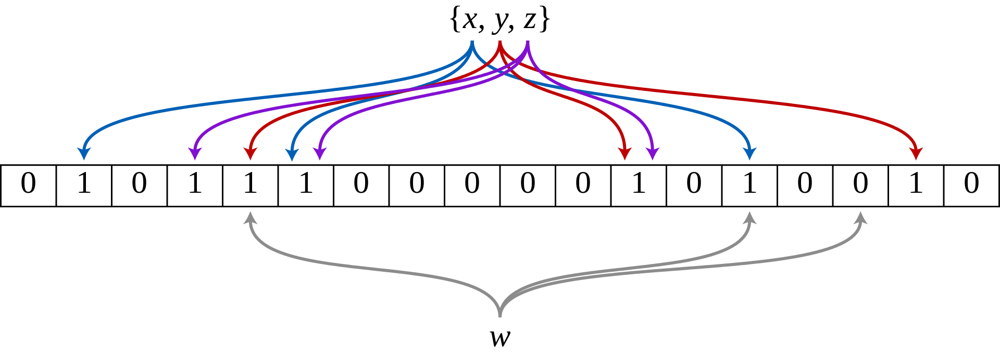

# 布隆过滤器

日常生活中，经常要判断一个元素是否在一个集合中。布隆过滤器是计算机工程中解决这个问题最好的数学工具。

> （Bloom Filter）是由布隆（Burton Howard Bloom）在1970年提出的。它实际上是由一个很长的二进制向量和一系列随机映射函数组成，布隆过滤器可以用于检索一个元素是否在一个集合中。它的优点是空间效率和查询时间都远远超过一般的算法，缺点是有一定的误识别率和删除困难
>
> 布隆过滤器存储空间和插入/查询时间都是常数。另外, Hash 函数相互之间没有关系，方便由硬件并行实现。布隆过滤器不需要存储元素本身，在某些对保密要求非常严格的场合有优势。

## 设计思想

`Bloom Filter`是由一个长度为`m`比特的位数组（`bit array`）与`k`个哈希函数（`hash function`）组成的数据结构。位数组均`初始化为0`，所有哈希函数都可以分别把输入数据尽量均匀地散列。

当要插入一个元素时，将其数据`分别输入k个哈希函数，产生k个哈希值`。以哈希值作为位数组中的下标，`将所有k个对应的比特置为1`。

下图示出一个m=18, k=3的BF示例。集合中的x、y、z三个元素通过3个不同的哈希函数散列到位数组中。当查询元素w时，因为有一个比特为0，因此w不在该集合中。



## 布隆过滤器的误报概率

假设数组长度为`m`,并使用`k`个`hash`函数，`n`是要插入到过滤器中的元素个数，那么误报率的计算如下：


## 位数组的大小

如果过滤器中的元素数量已直，期望的误报率位`p`，那么二进制位数组大小计算公式如下：


## 最优哈希函数数量

如果`m`是数组长度，`n`是插入的元素个数，`k`是`hash`函数的个数，k计算公式如下：


## Guava提供的布隆过滤器

```java
public class BloomFilterTest {
    private final static int size = 100 * 10000;
    private final static String fang = "fang";
    private final static double fpp = 0.0001;

    @Test
    public void test() {
        //布隆过滤器,fpp:期望的误判的概率
        BloomFilter<String> bloomFilter = BloomFilter.create(Funnels.stringFunnel(StandardCharsets.UTF_8), size, fpp);

        IntStream.range(0, size).forEach(item -> {
            bloomFilter.put(fang + item);
        });

        IntStream.range(0, size).forEach(item -> {
            assertTrue(bloomFilter.mightContain(fang + item));
        });

        List<String> list = new ArrayList<>(2000);
        IntStream.range(size, size * 2).forEach(item -> {
            if (bloomFilter.mightContain(fang + item)) {
                list.add(fang + item);
            }
        });
        log.info("误判数量:{}", list.size());
    }
}
```
