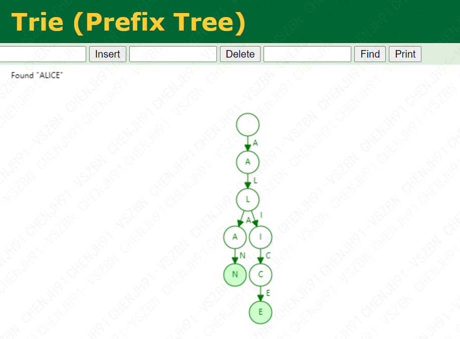
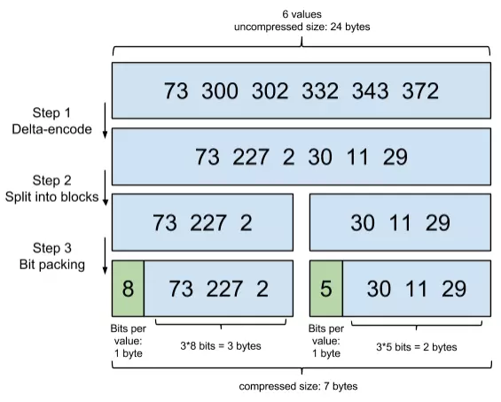
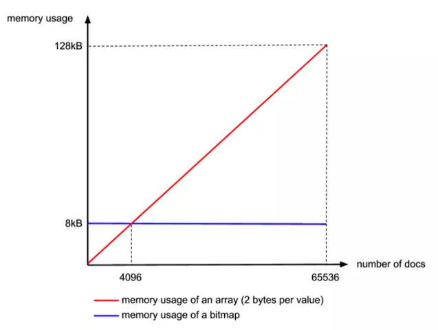
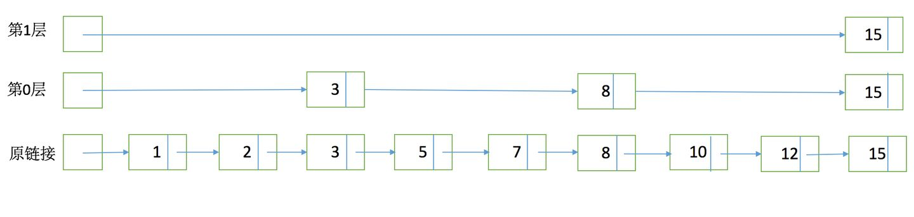
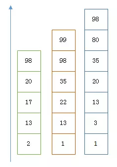
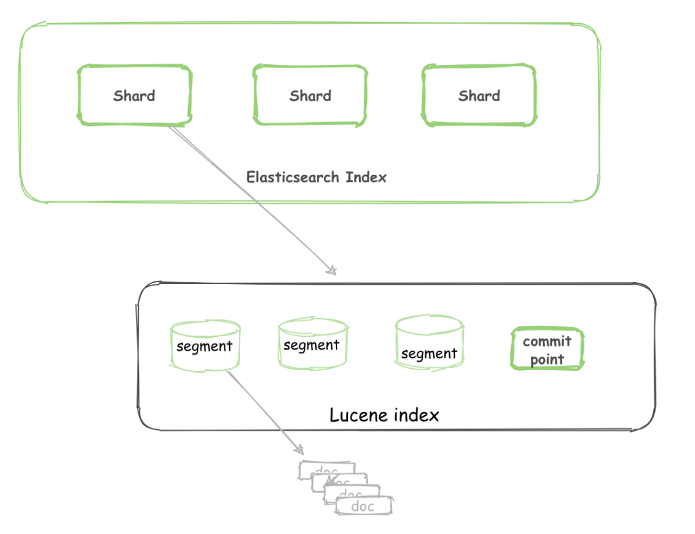
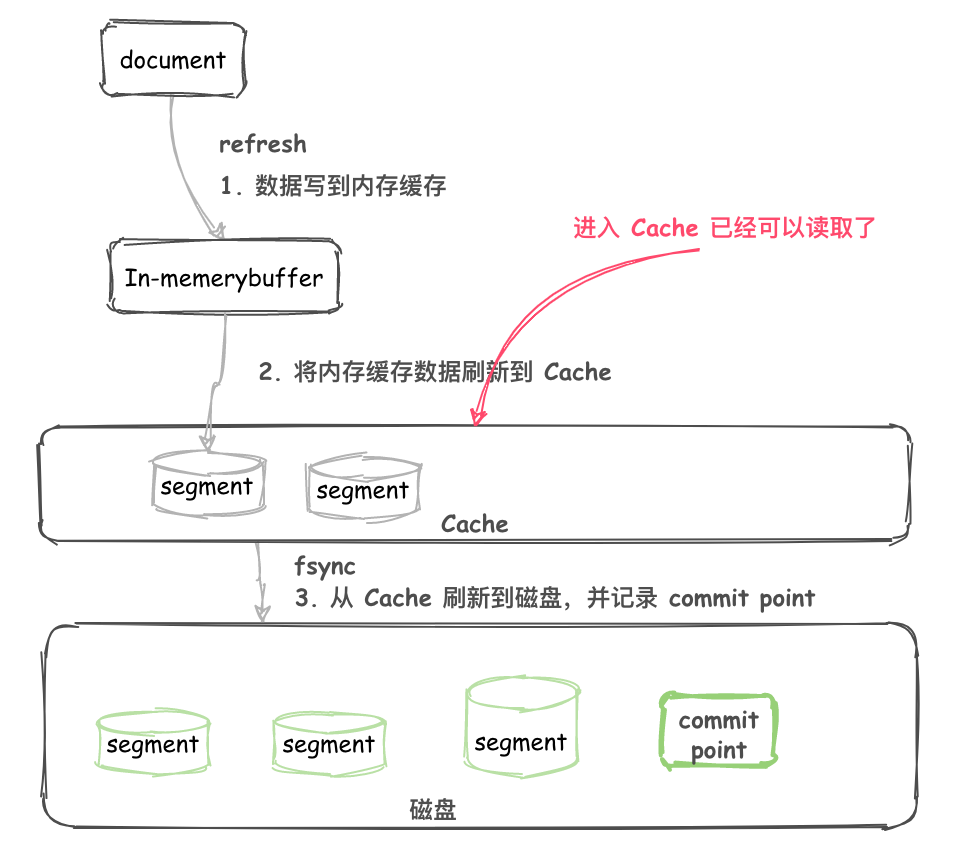

[TOC]

# elasticsearch

`ES`是`Elasticsearch`的简称，`Elasticsearch`是一个分布式可扩展的实时搜索和分析引擎，一个建立在全文搜索引擎`Apache Lucene`基础上的搜索引擎。`Lucene`只是一个框架，要充分利用它的功能，需要使用JAVA，并且在程序中集成`Lucene`，学习成本高，且`Lucene`确实非常复杂。

相对于数据库，Elasticsearch的强大之处就是可以**模糊查询**。

有的同学可能就会说：我数据库怎么就不能模糊查询了？？我反手就给你写一个SQL：

```javascript
select * from user where name like '%helloworld%'
```

的确，这样做的确可以。但是要明白的是：`name like %helloworld%`这类的查询是不走**索引**的，不走索引意味着：只要你的数据库的量很大（1亿条），你的查询肯定会是**秒**级别的

## 基本概念

我相信大家对关系型数据库（简称 RDBMS）应该比较了解，因此接下来拿关系型数据库和 ES 做一个类比，让大家更容易理解：

| RDBMS  | ElasticSearch |
| ------ | ------------- |
| Table  | Index         |
| Row    | Document      |
| Column | Filed         |
| Schema | Mapping       |
| SQL    | DSL           |

Lucene 中包含了四种基本数据类型，分别是：

`Index`：索引，由很多的 Document 组成。
`Document`：由很多的`Field`组成，是`Index`和`Search`的最小单位。
`Field`：由很多的`分词Term`组成，包括 Field Name 和`Field Value`。
`分词Term`：由很多的字节组成。一般将 Text 类型的 Field Value 分词之后的每个最小单元叫做`Term`。

## mapping

### 1. mapping字段类型

#### 1.1 字符串类型

在 ES 7.x 有两种字符串类型：`text`和`keyword`

> `text` 类型适用于非结构化人类可读的内容
> `keyword` 适合简短、结构化字符串，例如姓名、商品名称等，可以用于过滤、排序、聚合检索，也可以用于精确查询。
> `text` 类型字段默认是可以搜索的,`text` 类型会被 `Lucene` 分词器`Analyzer`处理为一个个词项，并使用 `Lucene` 倒排索引存储。但是不能被用于聚合、排序和脚本。如果尝试聚合、排序和脚本一个`text`类型字段，会有下面的异常:
> `text`类型是默认禁止`Fielddata `，设置 `fielddata=true`可以取消倒排索引加载字段数据到内存中。(请注意，这可能会占用大量内存)

> 在`text`字段上启用`fielddata`通常没有意义。字段数据与字段数据缓存一起存储在堆中，因为计算成本很高。计算字段数据可能会导致延迟峰值，而堆使用率的增加是集群性能问题的一个原因。
> 大多数希望对`text`字段进行更多操作的用户都使用[multi-field mappings](https://www.elastic.co/guide/en/elasticsearch/reference/current/multi-fields.html) ，包括用于全文搜索的文本字段和用于聚合的未分析[`keyword`](https://www.elastic.co/guide/en/elasticsearch/reference/current/keyword.html) 字段，如下所示：

```json
PUT my-index-000001
{
  "mappings": {
    "properties": {
      "my_field": {
        "type": "text",
        "fields": {
          "keyword": {
            "type": "keyword"
          }
        }
      }
    }
  }
}
```
- 用`my_field`字段进行搜索
- 用`my_field.keyword`字段进行聚合、排序和脚本处理

#### 1.2 [number](https://www.elastic.co/guide/en/elasticsearch/reference/current/number.html)

数字类型分为 `long、integer、short、byte、double、float、half_float、scaled_floa`t。

数字类型的字段在满足需求的前提下应当尽量选择范围较小的数据类型，字段长度越短，搜索效率越高，对于浮点数，可以优先考虑使用 `scaled_float` 类型，该类型可以通过缩放因子来精确浮点数，例如输入 `12.34` 可以转换为 `1234` 存储到ES中。

```json
PUT my-index-000001
{
  "mappings": {
    "properties": {
      "number_of_bytes": {
        "type": "integer"
      },
      "price": {
        "type": "scaled_float",
        "scaling_factor": 100
      }
    }
  }
}
```

#### 1.3 [date](https://www.elastic.co/guide/en/elasticsearch/reference/current/date.html)

在 es 内部，`date`被转为 UTC，并被存储为时间戳，代表从`1970年1月1号0点`到现在的毫秒数

`date`格式可以在 put mapping 的时候用 `format` 参数指定，如果不指定的话，则启用默认格式，是`strict_date_optional_time||epoch_millis`。这表明只接受符合`strict_date_optional_time(yyyy-MM-dd'T'HH:mm:ss.SSSZ)`格式的字符串值，或者`long`型数字。

支持`yyyy-MM-dd`、`yyyyMMdd`、`yyyyMMddHHmmss`、`yyyy-MM-ddTHH:mm:ss`、`yyyy-MM-ddTHH:mm:ss.SSS"`格式

如果保存`yyyy-MM-dd HH:mm:ss`格式,需要设置`format`格式`"format": "yyyy-MM-dd HH:mm:ss||yyyy-MM-dd||epoch_millis"`

```json
PUT book_index
{
  "mappings": {
    "properties": {
      "book_name": {
        "type": "keyword"
      },
      "book_date": {
        "type": "date",
        "format": "strict_date_optional_time||epoch_millis"
      }
    }
  }
}
```

#### 1.4 [boolean 类型](https://www.elastic.co/guide/en/elasticsearch/reference/current/boolean.html)

`ES`接收 json 中布尔类型`true`or`false`,也接受字符串类型`"true"`or`"false"`,布尔类型常用于检索中的过滤条件。

#### 1.5 [binary 类型](https://www.elastic.co/guide/en/elasticsearch/reference/current/binary.html)

二进制类型 `binary` 接受 `BASE64` 编码的字符串，默认 store 属性为 false，并且不可以被搜索。

#### 1.6 [object 类型](https://www.elastic.co/guide/en/elasticsearch/reference/current/object.html)

`JSON` 字符串允许嵌套对象，一个文档可以嵌套多个、多层对象。可以通过对象类型来存储二级文档，不过由于`Lucene`并没有内部对象的概念，ES 会将原 `JSON` 文档扁平化

```json
PUT my-index-000001/_doc/1
{
  "region": "US",
  "manager": {
    "age": 30,
    "name": {
      "first": "John",
      "last": "Smith"
    }
  }
}
```

实际上 ES 会将其转换为以下格式，并通过 Lucene 存储，即使 name 是 object 类型

```json
{
  "region": "US",
  "manager.age": 30,
  "manager.name.first": "John",
  "manager.name.last": "Smith"
}
```

#### 1.7 [Nested类型](https://www.elastic.co/guide/en/elasticsearch/reference/current/nested.html)

[数组对象是如何扁平化的](https://www.elastic.co/guide/en/elasticsearch/reference/current/nested.html#nested-arrays-flattening-objects)
>  Elasticsearch 没有内部对象概念，将复杂对象扁平化为包含names和values的简单列表

```json
PUT my-index-000001/_doc/1
{
  "group" : "fans",
  "user" : [ 
    {
      "first" : "John",
      "last" :  "Smith"
    },
    {
      "first" : "Alice",
      "last" :  "White"
    }
  ]
}
```

文档会内部转换为下面的文档

```json
{
  "group" :        "fans",
  "user.first" : [ "alice", "john" ],
  "user.last" :  [ "smith", "white" ]
}
```

> 文档扁平化成有多个值得字段，关联关系也丢失了。


```
GET my-index-000001/_search
{
  "query": {
    "bool": {
      "must": [
        { "match": { "user.first": "Alice" }},
        { "match": { "user.last":  "Smith" }}
      ]
    }
  }
}
```

> 如果你需要维护数组内对象的关系，可以使用`nested`类型。
>
> 在内部，嵌套对象索引的时候将数组中的每个对象作为单独的隐藏文档，这意味着每个嵌套对象可以独立于的其他对象进行[nested query](https://www.elastic.co/guide/en/elasticsearch/reference/current/query-dsl-nested-query.html)

```json
PUT my-index-000001
{
  "mappings": {
    "properties": {
      "user": {
        "type": "nested" 
      }
    }
  }
}

PUT my-index-000001/_doc/1
{
  "group" : "fans",
  "user" : [
    {
      "first" : "John",
      "last" :  "Smith"
    },
    {
      "first" : "Alice",
      "last" :  "White"
    }
  ]
}
GET my-index-000001/_search
{
  "query": {
    "nested": {
      "path": "user",
      "query": {
        "bool": {
          "must": [
            { "match": { "user.first": "Alice" }},
            { "match": { "user.last":  "White" }} 
          ]
        }
      }
    }
  }
}
```


### 2.[Dynamic Mapping](https://www.elastic.co/guide/en/elasticsearch/reference/current/dynamic-mapping.html)

`Dynamic Mapping` 机制使我们不需要手动定义 `Mapping`，`ES` 会自动根据文档信息来判断字段合适的类型，但是有时候也会推算的不对，比如地理位置信息有可能会判断为 `Text`

`date`类型推断需要`[ "strict_date_optional_time","yyyy/MM/dd HH:mm:ss Z||yyyy/MM/dd Z"]`类型字符串

### 3.[修改 Mapping](https://www.elastic.co/guide/en/elasticsearch/reference/current/indices-put-mapping.html)

#### 3.1 动态新增字段类型

如果是新增加的字段，根据 [`dynamic`](https://www.elastic.co/guide/en/elasticsearch/reference/current/dynamic.html) 的设置分为以下三种状况

- `dynamic` 默认为 `true` ，一旦有新增字段的文档写入，`mapping`也同时被更新。
- 当 `dynamic` 设置为 `false` 时，索引的`mapping`是不会被更新的，新增字段的数据无法被索引，也就是无法被搜索，但是信息会出现在`_source`中返回。
- 当 `dynamic` 设置为 `strict` 时，文档写入会失败。

#### 3.2 修改`mapping`中`dynamic`参数

```json
PUT my-index-000001/_mapping
{
  "dynamic":false
}
```

#### 3.3[手动新增字段](https://www.elastic.co/guide/en/elasticsearch/reference/current/indices-put-mapping.html)

```json
PUT /my-index-000001/_mapping
{
  "properties": {
    "email": {
      "type": "keyword"
    }
  }
}
```

#### 3.4 [修改已经存在字段类型](https://www.elastic.co/guide/en/elasticsearch/reference/current/indices-put-mapping.html#updating-field-mappings)

另外一种是字段已经存在，这种情况下，`ES` 是不允许直接修改字段的类型的，因为 ES 是根据 `Lucene` 实现的倒排索引，一旦生成后就不允许修改，如果希望改变字段类型，必须使用`_reindex`重建索引。

```yml
# 创建索引
PUT /my-index-000001
{
  "mappings" : {
    "properties": {
      "user_id": {
        "type": "long"
      }
    }
  }
}

# 推送一条数据
POST /my-index-000001/_doc
{
  "user_id" : 12345
}

# 创建新的索引
PUT /my-index-000002
{
  "mappings" : {
    "properties": {
      "user_id": {
        "type": "keyword"
      }
    }
  }
}

# 复制数据
POST /_reindex
{
  "source": {
    "index": "my-index-000001"
  },
  "dest": {
    "index": "my-index-000002"
  }
}
```

## [查询数据](https://www.elastic.co/guide/en/elasticsearch/reference/7.8/search-search.html#search-search-api-example)

### 2.1 基本查询

- `term`是代表完全匹配，也就是精确查询，搜索前不会再对搜索词进行分词
- `match`查询会先对搜索词进行分词,分词完毕后再逐个对分词结果进行匹配，因此相比于term的精确搜索，match是分词匹配搜索

#### 2.1.1 分页(以 match 为例)

默认查询`10`条结果

```json
GET jd-product/_search
{
    "from":0,
    "size":100,
    "query":{
        "match":{
            "productName":"牛奶"
        }
    }
}
```

#### 2.1.2 只返回指定字段(以 match 为例)

```json
GET jd-product/_search
{
   "_source":["productName"],
    "from":0,
    "size":100,
    "query":{
        "match":{
            "productName":"牛奶"
        }
    }
}
```

#### 2.1.3 搜索结果排序

默认是按照`_score`得分排序

```json
GET jd-product/_search
{
  "_source": [
    "productName"
  ],
  "from": 0,
  "size": 100,
  "query": {
    "match": {
      "productName": "牛奶"
    }
  },
  "sort": [
    {
      "syncTime": {
        "order": "desc"
      }
    }
  ]
}
```

影响一个词(Term)在一篇文档中的重要性主要有两个因素：

```
Term Frequency (tf)：即此Term在此文档中出现了多少次。tf 越大说明越重要。
Document Frequency (df)：即有多少文档包含次Term。df 越大说明越不重要。
```

### 2.2 `match`分词查询

`match`查询会先对搜索词进行分词，分词完毕后再逐个对分词结果进行匹配

```json
GET jd-product/_search
{
  "query": {
    "match": {
      "productName": "伊利牛奶"
    }
  }
}
```

`match_all`：查询所有文档

```json
{
  "query": {
    "match_all": {}
  }
}
```

### 2.3 `match_phrase`短语查询

`match_phrase` 称为短语搜索，要求所有的分词必须同时出现在文档中，同时位置必须紧邻一致。

```json
GET jd-product/_search
{
  "query": {
    "match_phrase": {
      "productName": "金典 纯牛奶"
    }
  }
}
```

### 2.4 `term`不分词精确查询

`term`代表完全匹配，也就是精确查询，搜索前不会再对搜索词进行分词，所以我们的`搜索词`必须是`文档分词集合`中的一个

```json
GET jd-product/_search
{
  "query": {
    "term": {
      "productName": "牛奶"
    }
  }
}
```

`terms`查询某个字段里含有多个关键词的文档

```json
GET jd-product/_search
{
  "query": {
    "terms": {
      "productName": ["牛奶","伊利"]
    }
  }
}
```

### 2.5 `range`范围查询

- `from`范围开始
- `include_lower`是否包含范围的左边界，默认是true
- `include_upper`是否包含范围的右边界，默认是true
- `time_zone`时区
- `format`时间格式

```json
GET jd-product/_search
{
  "query": {
    "range": {
      "syncTime": {
        "gte": "2021-09-01 00:00:00",
        "format": "yyyy-MM-dd HH:mm:ss"
      }
    }
  }
}
```

### 2.6 `prefix`前缀模糊查询

匹配`bookName`以`玉`为前缀的文档

```
GET jd-product/_search
{
  "query": {
    "prefix": {
      "productName": "牛奶"
    }
  }
}
```

### 2.7 `wildcard`通配符查询

wildcard 查询：允许你使用通配符 `*` 和 `?` 来进行查询

- `*`代表一个或多个字符
- `?`仅代表一个字符
- 注意：这个查询功能影响性能

```
GET jd-product/_search
{
  "query": {
    "wildcard": {
      "productName": "牛奶*"
    }
  }
}
```

### 2.8 `ids`主键查询

对 index`_id`查询

```json
GET jd-product/_search
{
  "query": {
    "ids": {
      "values": ["2693720"]
    }
  }
}
```

### 2.9 [Boolean query](https://www.elastic.co/guide/en/elasticsearch/reference/current/query-dsl-bool-query.html#query-dsl-bool-query)

`bool query`可以组合任意多个简单查询，各个简单查询之间的逻辑表示如下：

| 属性     | 说明                                                         |
| -------- | ------------------------------------------------------------ |
| must     | 文档必须匹配 must 选项下的查询条件，相当于逻辑运算的 AND     |
| should   | 文档可以匹配 should 选项下的查询条件，也可以不匹配，相当于逻辑运算的 OR |
| must_not | 与 must 相反，匹配该选项下的查询条件的文档不会被返回         |
| filter   | 和 must 一样，匹配 filter 选项下的查询条件的文档才会被返回，但是 filter 不评分，只起到过滤功能 |

```json
GET jd-product/_search
{
  "query": {
    "bool": {
      "must": [
        {
          "match": {
            "productName": "牛奶"
          }
        }
      ],
      "filter": [
        {
          "nested": {
            "path": "productTags",
            "query": {
              "term": {
                "productTags.tagName": {
                  "value": "秒杀"
                }
              }
            }
          }
        }
      ]
    }
  }
}
```

### 2.10 Query vs Filter

如果可以，尽量使用Filter来替代query。

在使用filter context时， ElasticSearch 不需要做 相关性的计算（打分）

Filter的搜索结果可以被缓存

### 2.11 脚本查询

Painless是专门为Elasticsearch设计的高性能，安全的脚本语言

Painless直接编译成JVM字节码，以利用JVM提供的所有可能的优化。

```
PUT my-index-000001/_doc/1
{
  "my_field": 5
}
GET my-index-000001/_search
{
  "script_fields": {
    "my_doubled_field": {
      "script": { 
        "source": "doc['my_field'].value * params['multiplier']", 
        "params": {
          "multiplier": 2
        }
      }
    }
  }
}
```


> Elasticsearch执行一个新的脚本的时候，会编译和存储在缓存中。编译是一个比较慢的过程，与其在脚本中硬编码值，不如将它们作为`params`传递。
>
> ```painless
> "source": "return doc['my_field'].value * 2"
> ```
>
> 虽然它是有效的，但这个解决方案是相当死板的。我们必须修改脚本源以更改乘数，而Elasticsearch必须在每次乘数更改时重新编译脚本。
>
> 不要硬编码值，而是使用`params`使脚本灵活，并在脚本运行时减少编译时间。您现在可以更改乘数参数，而无需Elasticsearch重新编译脚本。
>
> ```painless
> "source": "doc['my_field'].value * params['multiplier']",
> "params": {
> "multiplier": 2
> }
> ```
>
> 虽然它是有效的，但这个解决方案是相当死板的。

> 默认5分钟内最多编译75个不同脚本
>
> 如果短时间编译大量不同的脚本,Elasticsearch会报`circuit_breaking_exception`错误

## ES搜索原理

在全文检索当中，我们需要对文档进行分词处理，切好之后再将切出来的词和文档进行关联，并进行索引，那么这时候我们应该如何存储关键字和文档的对应关系呢？

### 正排索引

可能大家都知道，在全文检索中（比如：`Elasticsearch`）用的是倒排索引，那么既然有倒排索引，自然就有正排索引。

正排索引又称之为前向索引（`forward index`）。我们以一篇文档为例，那么正排索引可以理解成他是用文档 `id` 作为索引关键字，同时记录了这篇文档中有哪些词（经过分词器处理），每个词出现的次数已经每个词在文档中的位置。

但是我们平常在搜索的时候，都是输入一个词然后要得到文档，所以很显然，正排索引并不适合于做这种查询，所以一般我们的全文检索用的都是倒排索引，但是倒排索引却并不适合用于聚合运算，所以其实在 `es` 中的聚合运算用的是正排索引。

### 倒排索引

索引，初衷都是为了快速检索到你要的数据。

我相信你一定知道`mysql`的索引，如果对某一个字段加了索引，一般来说查询该字段速度是可以有显著的提升。
每种数据库都有自己要解决的问题（或者说擅长的领域），对应的就有自己的数据结构，而不同的使用场景和数据结构，需要用不同的索引，才能起到最大化加快查询的目的。
对 `Mysql` 来说，是 `B+树`，对 `Elasticsearch/Lucene` 来说，是`倒排索引`。

`ES的JSON文档中的每一个字段，都有自己的倒排索引`，当然你可以指定某些字段不做索引，优点是这样可以节省磁盘空间。但是不做索引的话字段无法被搜索到。

`Lucene`中最重要的就是它的几种数据结构，这决定了数据是如何被检索的，本文再简单描述一下几种数据结构：

- `Finite State Transducers(有限状态转换器)`：保存`分词term字典`，可以在`FST`上实现单 Term、Term 范围、Term 前缀和通配符查询等。
- `skipList倒排链`：保存了每个`term`对应的`docId`的列表，采用`skipList`的结构保存，用于`快速跳跃`。
- `DocValues`：基于`docId`的列式存储，由于列式存储的特点，可以有效提升排序聚合的性能。

为了方便大家理解，我们以人名字，年龄，学号为例，如何实现查某个名字（有重名）的列表。

| docId | name  | age  | id   |
| ----- | ----- | ---- | ---- |
| 1     | Alice | 18   | 101  |
| 2     | Alice | 20   | 102  |
| 3     | Alice | 21   | 103  |
| 4     | Alan  | 21   | 104  |
| 5     | Alan  | 18   | 105  |


在 `lucene` 中为了查询 name=XXX 的这样一个条件，会建立基于 name 的倒排链。以上面的数据为例，倒排链如下：
姓名

| 分词 Term | 倒排链skipList |
| --------- | -------------- |
| Alice     | [1,2,3]        |
| Alan      | [4,5]          |

如果我们还希望按照年龄查询，例如想查年龄=18 的列表，我们还可以建立另一个倒排链：

| 分词 Term | 倒排链skipList |
| --------- | -------------- |
| 18        | [1,5]          |
| 20        | [2]            |
| 21        | [3,4]          |

如果没有倒排索引`Inverted Index`，想要去找其中的分词，需要遍历整个文档，才能找到对应的文档的 id，这样做效率是十分低的，所以为了提高效率，我们就给输入的所有数据的都建立索引，并且把这样的索引和对应的文档建立一个关联关系，相当于一个词典。当我们在寻找`分词term`的时候就可以直接像查字典一样，直接找到所有包含这个数据的文档的 id，然后找到数据。

#### Term Dictionary

Elasticsearch为了能快速找到某个term，将所有的term排序，二分法查找term，logN的查找效率，就像通过字典查找一样，这就是Term Dictionary。类似于传统数据库的B-Tree的，但是Term Dictionary较B-Tree的查询快。

#### Term Index

`B-Tree`通过减少磁盘寻道次数来提高查询性能，Elasticsearch也是采用同样的思路，直接通过内存查找term，不读磁盘，但是如果term太多，`term dictionary`也会很大，放内存不现实，于是有了**Term Index**，就像字典里的索引页一样，A开头的有哪些term，分别在哪页，`term index`其实是一颗[前缀树(Tria Tree)](https://www.cs.usfca.edu/~galles/visualization/Trie.html)

字典树又称之为前缀树（`Prefix Tree`），是一种哈希树的变种，可以用于搜索时的自动补全、拼写检查、最长前缀匹配等。 

字典树有以下三个特点：

1. 根节点不包含字符，除根节点外的其余每个节点都只包含一个字符。
2. 从根节点到某一节点，将路径上经过的所有字符连接起来，即为该节点对应的字符串。
3. 每个节点的所有子节点包含的字符都不相同。




所以`term index`不需要存下所有的term，而仅仅是他们的一些前缀与`Term Dictionary`的block之间的映射关系，再结合`FST(Finite State Transducers)`的压缩技术，可以使`term index`缓存到内存中。从`term index`查到对应的`term dictionary`的block位置之后，再去磁盘上找term，大大减少了磁盘随机读的次数。

#### 压缩技巧

Elasticsearch里除了上面说到用FST压缩term index外，对posting list也有压缩技巧。如果Elasticsearch需要对人的性别进行索引，如果有上千万个人，而性别只分男/女，每个posting list都会有至少百万个文档id。Elasticsearch采用一定的压缩算法对这些文档id进行压缩：

**增量编码压缩，将大数变小数，按字节存储**

首先，Elasticsearch要求`posting list`是有序的(为了提高搜索的性能)，这样做的好处是方便压缩，看下面这个图例：



**Roaring bitmaps 压缩算法**(`RBM`)

`Roaring bitmaps`基于bitmap。`Bitmap`是一种数据结构，假设某个`posting list`：[1,3,4,7,10]，其对应的bitmap就是：[1,0,1,1,0,0,1,0,0,1]。
用0/1表示某个值是否存在，存在的值对应的bit值是1，即一个字节 (8位) 可以代表8个文档id，旧版本 (5.0之前) 的Lucene就是用这样的方式来压缩的，但这样的压缩方式仍然不够高效，如果有1亿个文档，那么需要12.5MB的存储空间，这仅仅是对应一个索引字段。于是衍生出了Roaring bitmaps这样更高效的数据结构。
将posting list按照65535为界限分块 (block) ，比如第一块所包含的文档id范围在0~65535之间，第二块的id范围是65536~131071，以此类推。再用<商，余数>的组合表示每一组id，这样每组里的id范围都在0~65535内了。

Bitmap的缺点是存储空间随着文档个数线性增长，`Roaring bitmaps`利用了某些指数特性来规避这一点：

”为什么是以65535为界限?”

65535=2^16-1，正好是2个字节能表示的最大数，一个short的存储单位，注意到上图里的最后一行“If a block has more than 4096 values, encode as a bit set, and otherwise as a simple array using 2 bytes per value”，如果是较大的 (block) 块，用`bitset`存，小块用一个`short[]`存储。

那为什么用4096来区分采用数组还是bitmap的阀值呢？

这个是从内存大小考虑的，当block块里元素超过4096后，用bitmap更省空间： 采用bitmap需要的空间是恒定的: 65536/8 = 8192bytes 而如果采用short[]，所需的空间是: 2*N(N为数组元素个数) N=4096刚好是边界：



#### 倒排合并

上述都是单field索引，如果是多个field索引的联合查询，倒排索引如何满足快速查询的要求呢？

利用跳表(Skip list)的数据结构快速做**与**运算，或者利用上面提到的bitset按位**与**。先看看跳表的数据结构：



1. 元素排序的，对应到我们的倒排链，lucene是按照docid进行排序，从小到大。
2. 跳跃有一个固定的间隔，这个是需要建立SkipList的时候指定好，例如上图的间隔是3
3. SkipList的层次，这个是指整个SkipList有几层

假设有下面三个`posting list`需要联合索引



如果使用跳表，对**最短的posting list**中的每个id，逐个在另外两个`posting list`中查找看是否存在，最后得到交集的结果。如果使用`bitset`，就很直观了，直接按位与，得到的结果就是最后的交集。

### Lucene 和 ES

`Lucene` 是 `Elasticsearch`所基于的 Java 库，它引入了按段搜索的概念。

`Segment`：也叫段，类似于倒排索引，相当于一个数据集。

`Commit point`：提交点，记录着所有已知的段。

`Lucene index`：“a collection of segments plus a commit point”。由一堆 Segment 的集合加上一个提交点组成。

一个 `Elasticsearch Index` 由一个或者`多个 shard （分片）` 组成



**Segment数据集**有着许多数据结构

#### Inverted Index

Inverted Index主要包括两部分：

1. 一个有序的数据字典Dictionary（包括单词Term和它出现的频率）。
2. 与单词Term对应的Postings（即存在这个单词的文件）。

当我们搜索的时候，首先将搜索的内容分词，然后在字典里找到对应Term，从而查找到与搜索相关的文件内容。

#### Stored Field

当我们想要查找包含某个特定标题内容的文件时，`Inverted Index`就不能很好的解决这个问题，所以Lucene提供了另外一种数据结构`Stored Fields`来解决这个问题。本质上，`Stored Fields`是一个简单的键值对`key-value`。默认情况下，ElasticSearch会存储整个文件的JSON source。


#### Document Values为了排序，聚合

即使这样，我们发现以上结构仍然无法解决诸如：排序、聚合，因为我们可能会要读取大量不需要的信息。

所以，另一种数据结构解决了此种问题：`Document Values`。这种结构本质上就是一个列式的存储，它高度优化了具有相同类型的数据的存储结构。


为了提高效率，`ElasticSearch`可以将索引下某一个`Document Value`全部读取到内存中进行操作，这大大提升访问速度，但是也同时会消耗掉大量的内存空间。

总之，这些数据结构`Inverted Index`、`Stored Fields`、`Document Values`及其缓存，都在`segment`内部。

### ES 写入的流程

1. 不断将 Document 写入到 In-memory buffer （内存缓冲区）。
2. 当满足一定条件后内存缓冲区中的 Documents 刷新到 高速缓存（**cache**）。
3. 生成新的 segment ，这个 segment 还在 cache 中。
4. 这时候还没有 commit ，但是已经可以被读取了。



### ES查询过程

在初始查询阶段，查询将广播到索引中每个分片的分片副本（主或副本分片）。每个分片在本地执行搜索，并建立一个匹配文档的优先级队列。

#### 优先队列

一个优先级队列仅仅是持有排序列表前 N 个匹配的文件。优先级队列的大小取决于分页参数 `from` 和 `size`。例如，以下搜索请求将需要一个足以容纳 `100` 个文档的优先级队列：

```json
GET / _search
{ "from": 90, "size": 10 }
```


#### 查询阶段

当一个节点接收到一个搜索请求，则这个节点就变成了协调节点。


每个分片将会在本地构建一个优先级队列。如果客户端要求返回结果排序中从第from名开始的数量为size的结果集，则每个节点都需要生成一个from+size大小的结果集，因此优先级队列的大小也是from+size。分片仅会返回一个轻量级的结果给协调节点，包含结果集中的每一个文档的ID和进行排序所需要的信息。

协调节点会将所有分片的结果汇总，并进行全局排序，得到最终的查询排序结果。此时查询阶段结束。

#### 取回阶段

查询过程得到的是一个排序结果，标记出哪些文档是符合搜索要求的，此时仍然需要获取这些文档返回客户端。

协调节点会确定实际需要返回的文档，并向含有该文档的分片发送get请求；分片获取文档返回给协调节点；协调节点将结果返回给客户端。


#### 深度分页

`query-then-fetch`流程支持使用`from`和`size` 参数分页，但限制在范围内。请记住，每个分片必须建立一个长度为优先级的队列`from + size`，所有这些队列都必须传递回协调节点。并且协调节点需要对 `number_of_shards * (from + size)`文档进行排序以找到正确的 `size`文档。

根据文档的大小，分片的数量以及所使用的硬件，完全可以分页`10,000`到`50,000`个结果（1,000到5,000页）。`但是使用足够大的from值，使用大量的CPU，内存和带宽`，排序过程的确会变得非常繁重。因此，我们`强烈建议您不要进行深度分页`。

实际上，`深度分页`很少是人类。人类将在两三页后停止分页，并将更改搜索条件。罪魁祸首通常是僵尸程序或网络蜘蛛，他们不知疲倦地不断一页一页地获取信息，直到您的服务器崩溃为止。

如果您确实需要从集群中获取大量文档，则可以通过没有排序的`scroll query`
