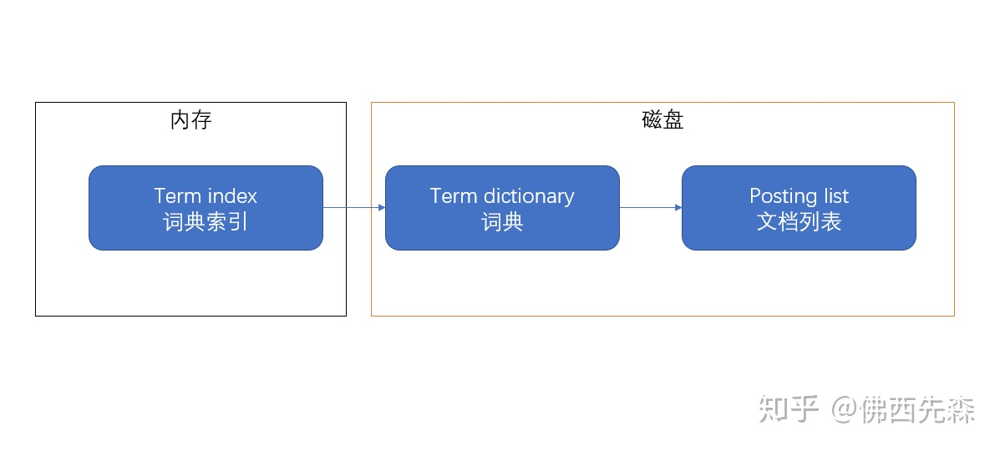

# elasticsearch

- [Lucene 查询原理](https://zhuanlan.zhihu.com/p/35814539)
- [ES底层原理解析](https://www.cnblogs.com/cangqiongbingchen/p/14139000.html)
- [Elasticsearch 中为什么选择倒排索引而不选择 B 树索引](https://www.cnblogs.com/lonely-wolf/p/15464556.html#字典树（tria-tree）)
- [Elasticsearch 如何做到快速检索 - 倒排索引的秘密](https://juejin.cn/post/6889020742366920712)
- [关于Lucene的词典FST深入剖析](https://www.shenyanchao.cn/blog/2018/12/04/lucene-fst/)
- [ElasticSearch 2 (9) - 在ElasticSearch之下（图解搜索的故事）](https://www.cnblogs.com/richaaaard/p/5226334.html)
- [ES索引存储原理](https://blog.csdn.net/guoyuguang0/article/details/76769184)

`ES`是`Elasticsearch`的简称，`Elasticsearch`是一个分布式可扩展的实时搜索和分析引擎，一个建立在全文搜索引擎`Apache Lucene`基础上的搜索引擎。`Lucene`只是一个框架，要充分利用它的功能，需要使用JAVA，并且在程序中集成`Lucene`，学习成本高，且`Lucene`确实非常复杂。

- 分布式实时文件存储，并将每一个字段都编入索引，使其可以被搜索
- 实时分析的分布式搜索引擎
- 可以扩展到上百台服务器，处理PB级别的结构化或非结构化数据

## RDBMS & ES

我相信大家对关系型数据库（简称 RDBMS）应该比较了解，因此接下来拿关系型数据库和 ES 做一个类比，让大家更容易理解：

| RDBMS  | ElasticSearch |
| ------ | ------------- |
| Table  | Index         |
| Row    | Document      |
| Column | Filed         |
| Schema | Mapping       |
| SQL    | DSL           |

Lucene 中包含了四种基本数据类型，分别是：

`Index`：索引，由很多的 Document 组成。
`Document`：由很多的`Field`组成，是`Index`和`Search`的最小单位。
`Field`：由很多的`分词Term`组成，包括 Field Name 和`Field Value`。
`分词Term`：由很多的字节组成。一般将 Text 类型的 Field Value 分词之后的每个最小单元叫做`Term`。

## 集群

ES 集群其实是一个分布式系统，要满足高可用性，高可用就是当集群中有节点服务停止响应的时候，整个服务还能正常工作，也就是`服务可用性`；或者说整个集群中有部分节点丢失的情况下，不会有数据丢失，即`数据可用性`。

当用户的请求量越来越高，数据的增长越来越多的时候，系统需要把数据分散到其他节点上，最后来实现`水平扩展`。当集群中有节点出现问题的时候，整个集群的服务也不会受到影响。

一个 ES 集群有三种颜色来表示健康程度：

`Green`：主分片与副本都正常分配
`Yellow`：主分片全部正常分配，有副本分片未能正常分配
`Red`：有主分片未能分配（例如，当服务器的磁盘容量超过 85% 时，去创建了一个新的索引）

## 倒排索引

索引，初衷都是为了快速检索到你要的数据。

我相信你一定知道`mysql`的索引，如果对某一个字段加了索引，一般来说查询该字段速度是可以有显著的提升。
每种数据库都有自己要解决的问题（或者说擅长的领域），对应的就有自己的数据结构，而不同的使用场景和数据结构，需要用不同的索引，才能起到最大化加快查询的目的。
对 `Mysql` 来说，是 `B+树`，对 `Elasticsearch/Lucene` 来说，是`倒排索引`。

`ES的JSON文档中的每一个字段，都有自己的倒排索引`，当然你可以指定某些字段不做索引，优点是这样可以节省磁盘空间。但是不做索引的话字段无法被搜索到。

`Lucene`中最重要的就是它的几种数据结构，这决定了数据是如何被检索的，本文再简单描述一下几种数据结构：

- `Finite State Transducers(有限状态转换器)`：保存`分词term字典`，可以在`FST`上实现单 Term、Term 范围、Term 前缀和通配符查询等。
- `Posting List倒排链`：保存了每个`term`对应的`docId`的列表，采用`skipList`的结构保存，用于`快速跳跃`。
- `DocValues`：基于`docId`的列式存储，由于列式存储的特点，可以有效提升排序聚合的性能。

为了方便大家理解，我们以人名字，年龄，学号为例，如何实现查某个名字（有重名）的列表。

| docId | name  | age  | id   |
| ----- | ----- | ---- | ---- |
| 1     | Alice | 18   | 101  |
| 2     | Alice | 20   | 102  |
| 3     | Alice | 21   | 103  |
| 4     | Alan  | 21   | 104  |
| 5     | Alan  | 18   | 105  |

在 `lucene` 中为了查询 name=XXX 的这样一个条件，会建立基于 name 的倒排链。以上面的数据为例，倒排链如下：
姓名

| 分词 Term | 倒排链Posting List |
| --------- | ------------------ |
| Alice     | [1,2,3]            |
| Alan      | [4,5]              |

如果我们还希望按照年龄查询，例如想查年龄=18 的列表，我们还可以建立另一个倒排链：

| 分词 Term | 倒排链Posting List |
| --------- | ------------------ |
| 18        | [1,5]              |
| 20        | [2]                |
| 21        | [3,4]              |

如果没有倒排索引`Inverted Index`，想要去找其中的分词，需要遍历整个文档，才能找到对应的文档的 id，这样做效率是十分低的，所以为了提高效率，我们就给输入的所有数据的都建立索引，并且把这样的索引和对应的文档建立一个关联关系，相当于一个词典。当我们在寻找`分词term`的时候就可以直接像查字典一样，直接找到所有包含这个数据的文档的 id，然后找到数据。

ES 通过`Finite State Transducers`，把`term dictionary`变成了`term index`
