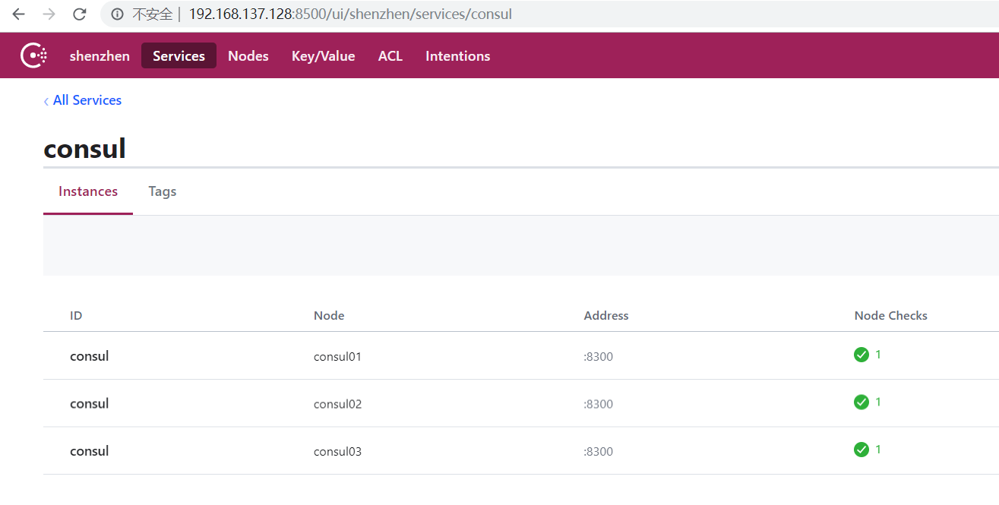
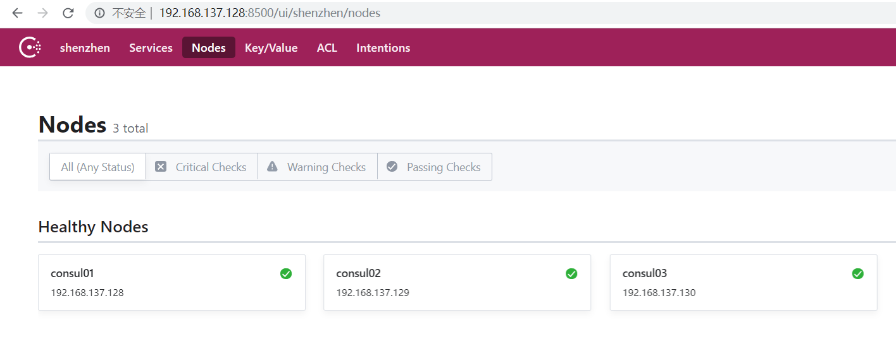

## 环境准备

|节点|地址|
|------|----------------|
|node1|192.168.137.128|
|node1|192.168.137.128|
|node1|192.168.137.128|

### 下载consul 二进制文件包

官网下载地址: [https://www.consul.io/downloads.html](https://www.consul.io/downloads.html)
选择对应系统的下载包

```bash
➜  consul unzip consul_1.5.2_linux_amd64.zip
Archive:  consul_1.5.2_linux_amd64.zip
  inflating: consul
➜  consul ls
consul  consul_1.5.2_linux_amd64.zip
➜  consul mv consul /usr/local/bin
```

### consul默认端口

|服务|默认端口|
|---------|---------|
|Raft|8300|
|HTTP server|8500|
|gRPC server|8502|
|DNS server|8600|
|LAN|8301|
|WAN|8302|


#### 2.2设置主机名

node01上执行

```bash
hostnamectl --static set-hostname consul01
```

consul02上执行

```bash
hostnamectl --static set-hostname consul02
```

consul03上执行

```bash
hostnamectl --static set-hostname consul03
```

### 创建数据目录

```bash
mkdir ~/consul/data
```

## 集群启动

```bash
#查看运行的后台进程
jobs -l

nohup consul agent -server -bootstrap-expect=3 -data-dir=~/consul/data -bind=192.168.137.128 -client=0.0.0.0 -node=consul01 -datacenter=shenzhen -ui > ~/consul/data/consul.log 2>&1 &

nohup consul agent -server -bootstrap-expect=3 -data-dir=~/consul/data -bind=192.168.137.129 -client=0.0.0.0 -node=consul02 -datacenter=shenzhen -ui > ~/consul/data/consul.log 2>&1 &

nohup consul agent -server -bootstrap-expect=3 -data-dir=~/consul/data -bind=192.168.137.130 -client=0.0.0.0 -node=consul03 -datacenter=shenzhen -ui > ~/consul/data/consul.log 2>&1 &
```

- `-server`以server身份启动。默认是`client`
- `-bootstrap-expect`集群要求的最少`server`数量，当低于这个数量，集群即失效。
- `-datacenter`指定数据中心名称，默认是`dc1`
- `-ui`启动web UI界面

#### 查看日志

```bash
==> Starting Consul agent...
           Version: 'v1.5.2'
           Node ID: '90641e3d-8144-3230-8113-6dc4f6b26c60'
         Node name: 'consul01'
        Datacenter: 'shenzhen' (Segment: '<all>')
            Server: true (Bootstrap: false)
       Client Addr: [0.0.0.0] (HTTP: 8500, HTTPS: -1, gRPC: -1, DNS: 8600)
      Cluster Addr: 192.168.137.128 (LAN: 8301, WAN: 8302)
           Encrypt: Gossip: false, TLS-Outgoing: false, TLS-Incoming: false, Auto-Encrypt-TLS: false

==> Log data will now stream in as it occurs:

    2019/07/20 16:59:12 [INFO]  raft: Initial configuration (index=0): []
    2019/07/20 16:59:12 [INFO]  raft: Node at 192.168.137.128:8300 [Follower] entering Follower state (Leader: "")
    2019/07/20 16:59:12 [INFO] serf: EventMemberJoin: consul01.shenzhen 192.168.137.128
    2019/07/20 16:59:12 [WARN] serf: Failed to re-join any previously known node
    2019/07/20 16:59:12 [INFO] serf: EventMemberJoin: consul01 192.168.137.128
    2019/07/20 16:59:12 [INFO] consul: Handled member-join event for server "consul01.shenzhen" in area "wan"
    2019/07/20 16:59:12 [WARN] serf: Failed to re-join any previously known node
    2019/07/20 16:59:12 [INFO] consul: Adding LAN server consul01 (Addr: tcp/192.168.137.128:8300) (DC: shenzhen)
    2019/07/20 16:59:12 [WARN] agent/proxy: running as root, will not start managed proxies
    2019/07/20 16:59:12 [INFO] agent: Started DNS server 0.0.0.0:8600 (udp)
    2019/07/20 16:59:12 [INFO] agent: Started DNS server 0.0.0.0:8600 (tcp)
    2019/07/20 16:59:12 [INFO] agent: Started HTTP server on [::]:8500 (tcp)
    2019/07/20 16:59:12 [INFO] agent: started state syncer
==> Consul agent running!
    2019/07/20 16:59:19 [ERR] agent: failed to sync remote state: No cluster leader
    2019/07/20 16:59:20 [WARN]  raft: no known peers, aborting election
```

此时三台机器还未join，不能算是一个集群，三台机器上的consul均不能正常工作，因为leader未选出。

#### 加入consul集群

consul集群:当一个consul agent启动后，它不知道任何其他节点,要学习到集群中的其他节点，agent必须加入一个已经存在的集群(cluster)。

要加入这样的集群，它只需要知道这个集群中的一个节点即可。它加入后，将会和这个member gossip（交谈）并迅速发现集群中的其他节点。

```bash
➜  ~ consul join -h
Usage: consul join [options] address ...

  Tells a running Consul agent (with "consul agent") to join the cluster
  by specifying at least one existing member.
```

执行如下命令，让consul加入集群:

```bash
➜  ~ consul join 192.168.137.128
Successfully joined cluster by contacting 1 nodes.
```

#### 查看集群日志

```bash
    2019/07/20 17:05:02 [INFO]  raft: Added peer fb6228df-1f62-fa4f-b4fd-18bc375cd5a5, starting replication
    2019/07/20 17:05:02 [INFO] consul: cluster leadership acquired
    2019/07/20 17:05:02 [INFO] consul: New leader elected: consul01
    2019/07/20 17:05:02 [WARN]  raft: AppendEntries to {Voter 0e199376-c447-a894-10ad-5e8ef1019f03 192.168.137.129:8300} rejected, sending older logs (next: 1)
    2019/07/20 17:05:02 [WARN]  raft: AppendEntries to {Voter fb6228df-1f62-fa4f-b4fd-18bc375cd5a5 192.168.137.130:8300} rejected, sending older logs (next: 1)
    2019/07/20 17:05:02 [INFO]  raft: pipelining replication to peer {Voter 0e199376-c447-a894-10ad-5e8ef1019f03 192.168.137.129:8300}
    2019/07/20 17:05:02 [INFO]  raft: pipelining replication to peer {Voter fb6228df-1f62-fa4f-b4fd-18bc375cd5a5 192.168.137.130:8300}
    2019/07/20 17:05:02 [INFO] consul: member 'consul01' joined, marking health alive
    2019/07/20 17:05:02 [INFO] consul: member 'consul02' joined, marking health alive
    2019/07/20 17:05:02 [INFO] consul: member 'consul03' joined, marking health alive
    2019/07/20 17:05:02 [INFO] agent: Synced node info
```

#### 查看consul集群

```bash
➜  ~ consul members -h
Usage: consul members [options]

  Outputs the members of a running Consul agent.
```

```bash
➜  ~ consul members
Node      Address               Status  Type    Build  Protocol  DC        Segment
consul01  192.168.137.128:8301  alive   server  1.5.2  2         shenzhen  <all>
consul02  192.168.137.129:8301  alive   server  1.5.2  2         shenzhen  <all>
consul03  192.168.137.130:8301  alive   server  1.5.2  2         shenzhen  <all>

```

### consul界面





### 加密

The key must be 16-bytes, Base64 encoded.

```bash
➜  ~ consul keygen
➜  ~ vi encrypt.json
{"encrypt": "cg8StVXbQJ0gPvMd9o7yrg=="}
➜  ~ consul agent -data-dir=/tmp/consul -config-file=encrypt.json
```
